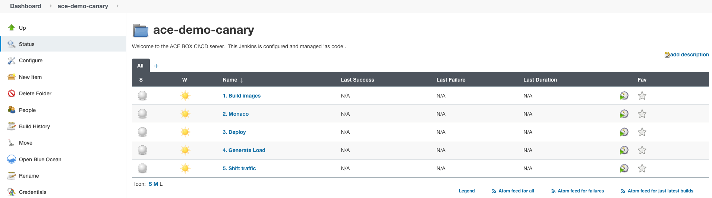

### Use case: Canary + auto remediation

# Prepare environment

Before we get started with the actual use case, we leverage a Jenkins pipeline to prepare our demo environment. All pipelines that we use as part of this use case can be found in Jenkins, project "ace-demo-canary".



## 1. Build images

In order to get started, go to the project overview in Jenkins and trigger the first pipeline, "1. Build images". This pipeline will do a couple of things:

- Two versions of *simplenodeapp* are built and pushed to the local registry, build version *1* and *4*. *Build 1* will be the currently deployed and healthy "live" version of the app. *Build 4* will become the app's new canary version, however introduces a response time degradation and failure rate increase. See app.js in git repo auto-remediation/ace-demo-canary for details.
- Two services are deployed, *simplenodeapp build 1* and *simplenodeapp build 4*. The deploying pipeline "3. Deploy" is triggered automatically after each successful build. For now, all traffic is routed to *build 1*.
- The Monaco pipeline is started which sets up use case relevant resources in your Dynatrace tenant.

Eventually, all pipelines should have run successfully which ycan be verified in the project overview:


At this point, the live version of your service should be available at:

```
http(s)://simplenodeservice.canary.<ingress domain>
```
