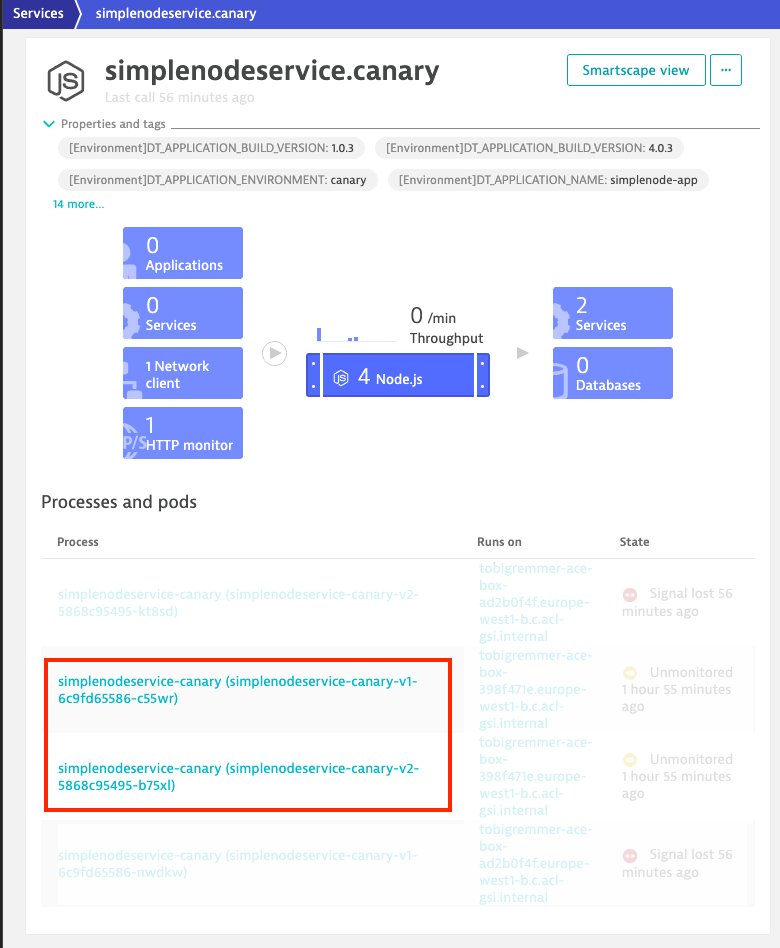
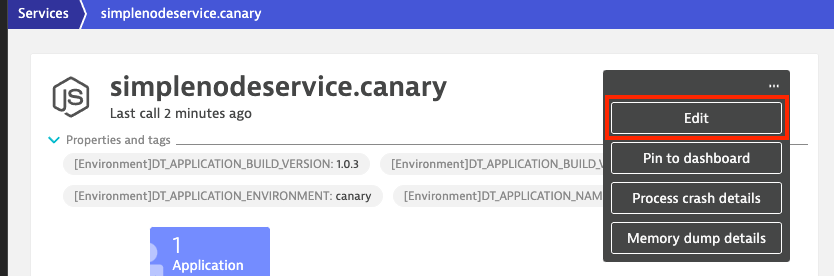
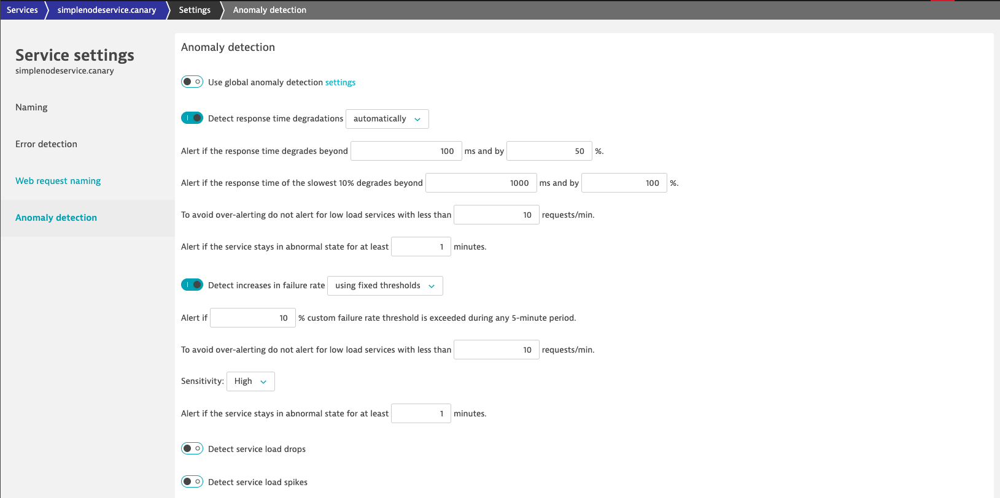

### Use case: Canary + auto remediation

# Inspect and configure Dynatrace

Once the first Jenkins pipeline ("1. Build") ran successful, a Monaco (Monitoring-As-Code) pipeline takes care of configuring most of the Dynatrace essentials. At this point Dynatrace recognizes services and understands how the performance baseline for our service should look like.

## 1. Inspect service processes

Let's take a look at the service in Dynatrace:

1) In your Dynatrace tenant, navigate to **Services** and select management zone "ace-demo-canary". This should filter for a single service "simplenodeservice.canary". If this doesn't work you can manually filter by `Tag:app:simplenodeservice` and `Tag:environment:canary`.
2) Select "simplenodeservice.canary"
3) Expand "Properties and tags" and inspect Kubernetes and environment metadata. You will find details about deployed versions, build, Kubernetes namespace and many more.
4) Inspect "Process and pods". Dynatrace detects both pods (processes) and associates them with the service "simplenodeservice.canary" based on the naming scheme the two processes share.

    

## 2. Inspect release inventory

In addition to the service being detected in Dynatrace, you can also get information about releases that are related to your service.

1) In your Dynatrace tenant, navigate to **Releases** and select management zone "ace-demo-canary". This should filter for a single service "simplenodeservice.canary". If this doesn't work you can manually filter by `Tag:app:simplenodeservice` and `Tag:environment:canary`.

    

    The release inventory shows both versions of your service and all events that are related to your service and occured in the selected timeframe.

## 3. Adjust service's anomaly detection

Both, problem and anomaly detection in Dynatrace, leverage AI technology. This means that the AI learns how each and every microservice behaves and baselines them. Therefore, in a demo scenario like we have right now, we have to override the AI engine with user-defined values to allow the creation of problems due to an artificial increase of a failure rate. (Please note if we would have the application running and simulate end-user traffic for a couple of days there would be no need for this step.)

1) In your Dynatrace tenant, navigate to **Services** and select management zone "ace-demo-canary". This should filter for a single service "simplenodeservice.canary". If this doesn't work you can manually filter by `Tag:app:simplenodeservice` and `Tag:environment:canary`.
2) Select "simplenodeservice.canary"
3) Click on the menu icon next to the service name and select "Edit".

    

4) Go to the "Anomaly Detection" settings
5) Disable "Use global anomaly detection"
6) Under "Detect increases in failure rate" select:
   - "using fixed thresholds"
   - Alert if 10% cursom failure rate threshold is exceeded
   - Sensitivity high

After leaving all other values as-is, the anomaly detection settings should look like:

## 4. Disable frequent issue detection

1. In your tenant's global settings go to "Anomaly detection"
2. Disable "Detect frequent issues within transactions and services"

Your global anomaly detection settings should look like:

