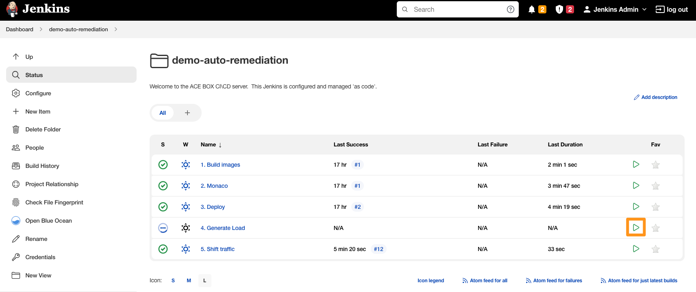

### Use case: Canary + auto remediation

# Generate Load

Before detecting an issue, an issue most occur. We therefore start a load generating script that simple calls our deployed service. Depending on the service's build version, some of the calls will result in an increased response time or even a failure.

## 1. Run Jenkins load generation pipeline

1. Go to Jenkins, Project *demo-auto-remediation*
2. Trigger "4. Generate Load"

    

> Note: "4. Generate Load" will start a never-ending loop which calls our service(s). If you wish to stop the loop, stop the Jenkins build.
