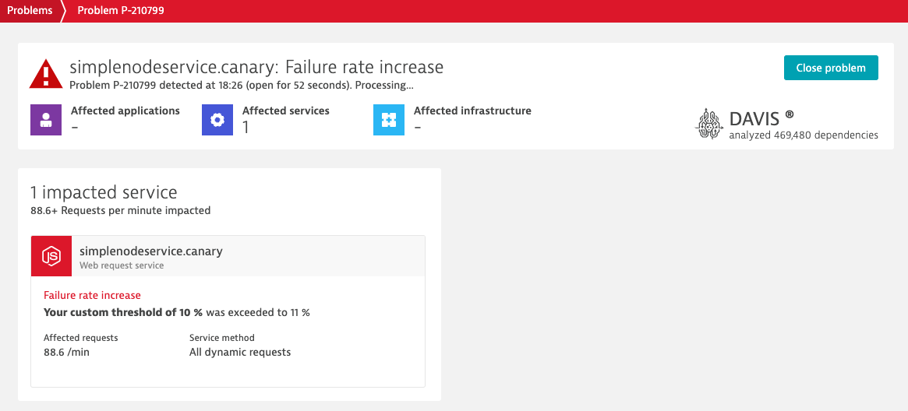

### Use case: Canary + auto remediation

# Remediation inspection

## 1. Auto remediation

What happens now? The canary deployment is underway. An increasing percentage of requests is directed to the service's canary version. *Build 4*, the canary version, introduces a decrease in response time and simultaneously an increase in failure rate.  Dynatrace will detect these anomalies and open a problem.

When the Monaco pipeline is run earlier, a problem notification integration was created that automatically reports problems affecting service "simplenodeservice.canary" to our AWX instance.

At this point, AWX receives a Problem notification with an identified root cause. AWX then asks Dynatrace to give it more information about the root cause and the associated remediation action.

Once an event and the corresponding remediation action were identified, the latter in form of a different AWX playbook is triggered. This playbook will revert the shift in traffic. 100% of the traffic is again routed to the healthy application version (*build 1*).

At this point, the service's failure rate will decrease and eventually the problem is closed by Dynatrace.

## 2. Root cause analysis

As soon as a problem is opened, Dynatrace's AI starts analysing and corelating entities and events. Which allows us to easily identify a root cause for our issue:

Note that Dynatrace ties the Configuration Change event that we have sent as part of our Canary Deployment as the root cause and has also linked the remediation action that AWX can execute.

When organizations make changes to their application it is imperative that a remediation action is specified in case of issues.
