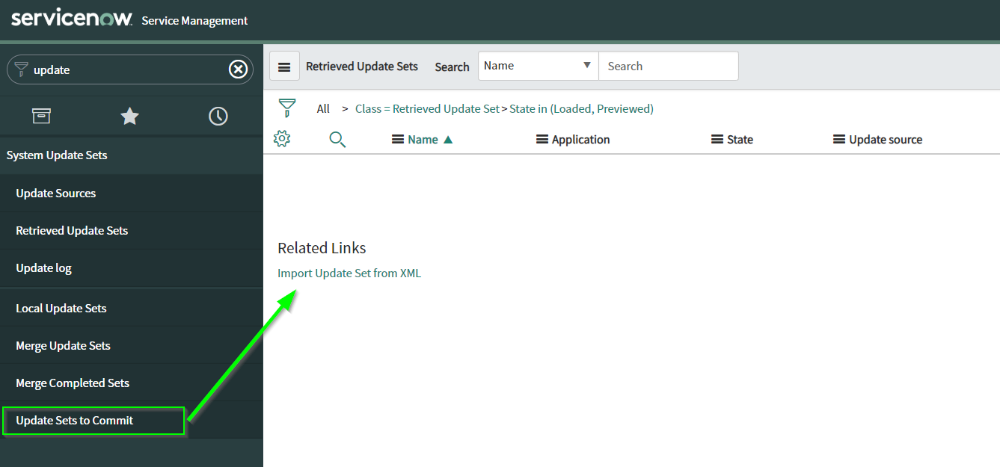
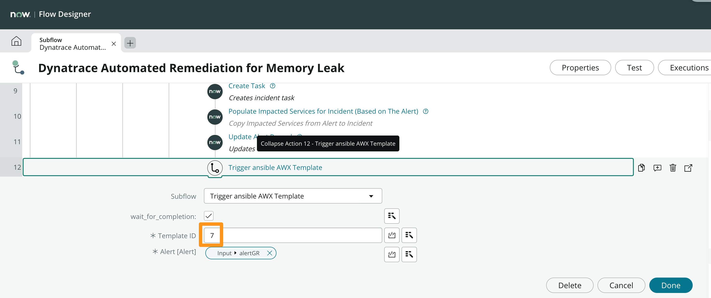

# Setting up the demo
In order to run the demo, a few extra steps need to be completed once the ACE-BOX has been provisioned

## ServiceNow Plugins

If you already have the plugins below activated you can skip this step.

To activate a plugin, go to your instance within the ServiceNow Developer portal, and click on `Activate Plugin` .

The following plugins must be enabled prior to this lab:

1. `Event Management` (com.glideapp.itom.snac) - Activation might take about 10-15 minutes, a confirmation email will be sent after it has been enabled. In the search, enter the text  `event management` and click on `Activate`

    

1. `ServiceNow IntegrationHub Installer` (com.glide.hub.integrations) Activation might take about 5 minutes, a confirmation email will be sent after it has been enabled.

    

## Configure ServiceNow

### Install ServiceNow Update Set

A ServiceNow Update Set is provided to run this tutorial. To install the Update Set follow these steps:

1. Download the update set xml file [hot_2021_auto_remediation_1.0.xml](./assets/hot_2021_auto_remediation_1.0.xml) to your computer.
1. Login to your ServiceNow instance.
1. Type `update` in the left filter navigator and go to `System Update Sets` -> `Update sets to Commit`:
    
1. Click on Import Update Set from XML
1. On the import update set screen click on the `choose` button and select the `hot_2021_auto_remediation_1.0.xml` file from its location on your computer.
1. Import and Upload the file [hot_2021_auto_remediation_1.0.xml] file.
1. Click the Upload button.
1. Open the `hot_2021_auto_remediation_1.0` Update Set.
    
1. In the right upper corner, click on Preview Update Set.
    
1. After successfully previewing the update set, click on `Commit Update Set` to add the required configurations required for this lab to your instance.
    
1. Review the newly imported subflow named `Trigger ansible AWX Template` by navigating to `Process Automation` -> `Flow Designer`. Click on the Subflows tab and then search for `Trigger ansible AWX Template` under the Name column.

### Create easyTravel support group

1. On your ServiceNow instance go to `User Administration` -> `Groups`.

1. Click `New`

1. Create a new group with the **Name** set to `easyTravel-Support` (Case Sensitive).

    

1. Click `Submit`.

### Verify Remediation subflow

1. In ServiceNow, navigate to `Process Automation` -> `Flow Designer`, after clicking on Flow designer a new tab will open on your browser.

1. Click on the `Subflows` tab and then search for `Dynatrace Automated Remediation for Memory Leak` under the Name column, click on the `Dynatrace Automated Remediation for Memory Leak` line to open the subflow.

1. Look for step **#12** `Trigger ansible AWX Template` and click on its name to expand it.

1. Ensure that the ansible AWX template ID for the `Dynatrace Automated Remediation for Memory Leak` ansible AWX template matches with the template ID on the `Trigger Ansible AWX` subflow step:
    

    **Note:** The template ID can be obtained by opening the template record on ansible AWX and obtaining it from the URL: `http://awx.ACEBOXDOMAIN/#/templates/job_template/<TEMPLATE_ID>/details`

    

1. If changes are needed, make sure to Save them and also to Publish them!

### Create Basic Auth Credential

1. Navigate to `Integration Hub -> Connections & Credentials -> Credential` and click on `New`:

    

1. Select `Basic Auth Credentials`

1. Set the following values for the credential fields:

    - **Name:** AWX Basic Auth
    - **User name:** dynatrace (unless when overwritten in acebox provisioning)
    - **Password:** dynatrace (unless when overwritten in acebox provisioning)

    

1. Click `Submit`.

### Create Ansible AWX Connection

1. Navigate to `Integration Hub -> Connections & Credentials -> Connection & Credential Aliases` and click on the `Ansible AWX` Connection Alias:

    

1. Under the `Connections` related list, click on `New`:

    

1. Set the `Connection` fields to these values:
    - **Name:** Ansible AWX Connection
    - **Credential:** AWX Basic Auth
    - **Connection alias:** Ansible_AWX
    - **Connection URL:** your ansible AWX url - `http://awx.ACEBOXDOMAIN/`

    

1. Click `Submit`.