# Auto Remediation using Dynatrace, ServiceNow and Ansible

> Note: Before running the demo, make sure to configure ServiceNow acordingly! Check out [Confiure ServiceNow](CONFIGURE_SERVICENOW.md)

## Launch EasyTravel
1. From the ACE Dashboard, open the EasyTravel Launcher from the `Links` section

    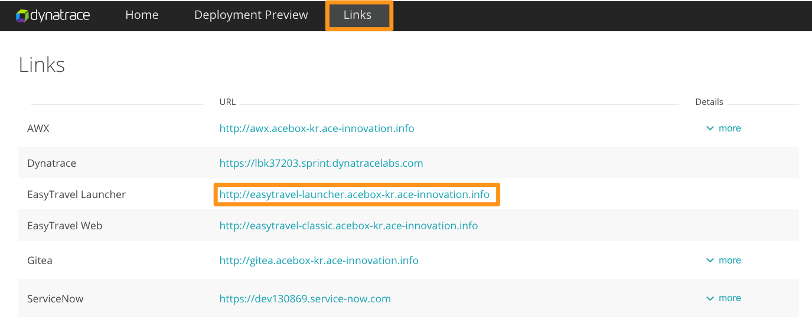

1. Within the EasyTravel Launcher, launch the `Standard` scenario by clicking on it

    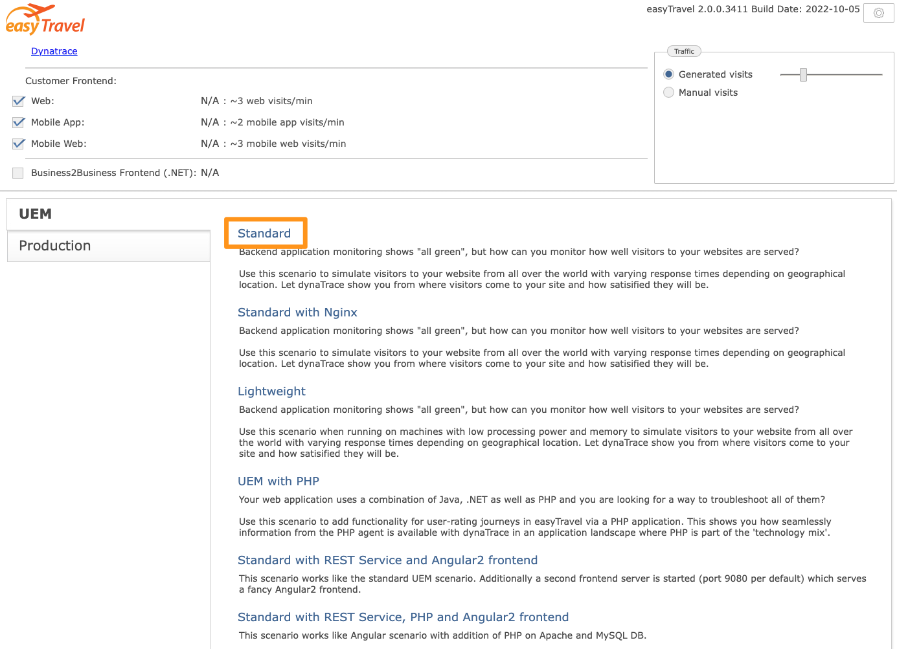

1. After a few minutes, all components will be in an `Operating` state and EasyTravel will become available for use

    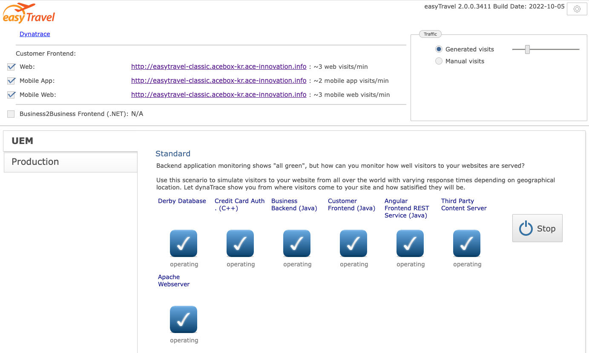

1. A few minutes after that, verify that in Dynatrace you have the EasyTravel services monitored under the `EasyTravel Classic` Management Zone

    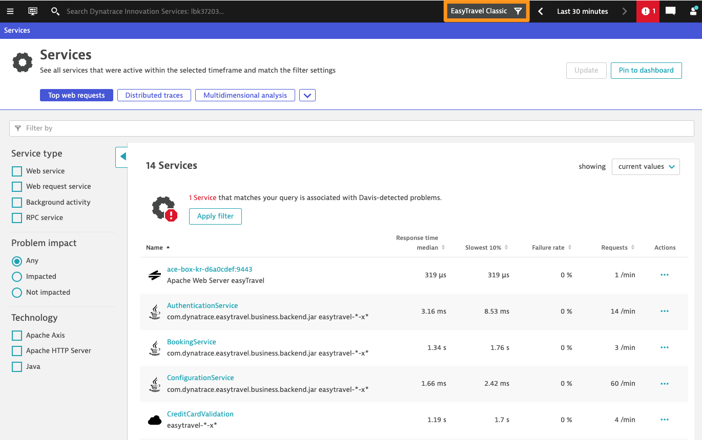

## Trigger problem

1. In Ansible AWX, navigate to `Templates` and click on the "rocket" icon next to the template named `Trigger Memory Leak on Backend`.

    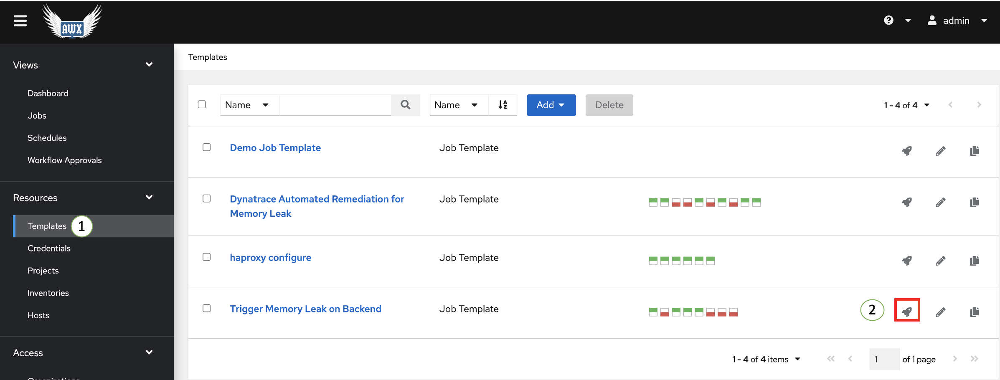

1. the `MediumMemnoryLeak` problem pattern should be enabled on the easyTravel management portal:

    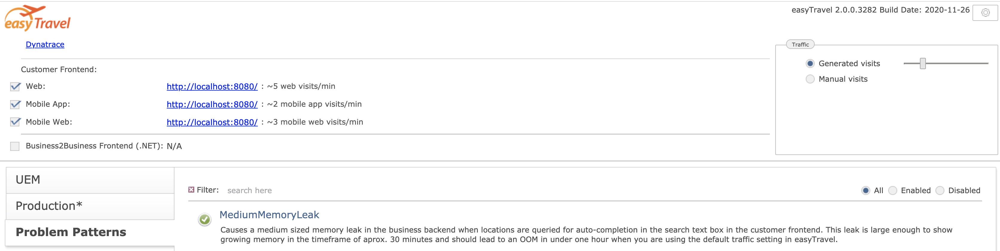

1. After a few minutes a new problem will be created on dynatrace:

    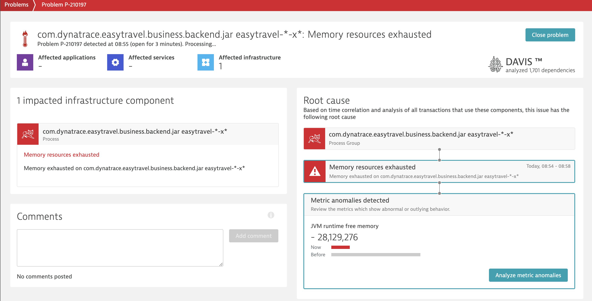

1. A new Alert will also be created on ServiceNow:

    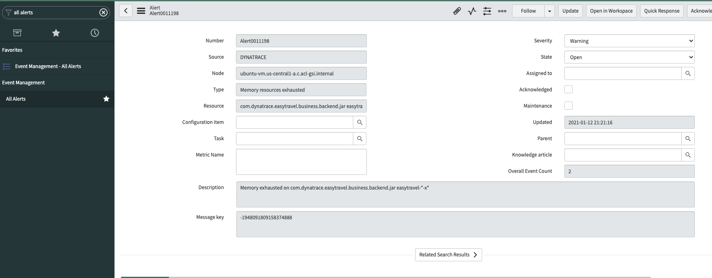

1. There will be an Incident attached to the alert with the `Assignment group` among other fields already populated:

    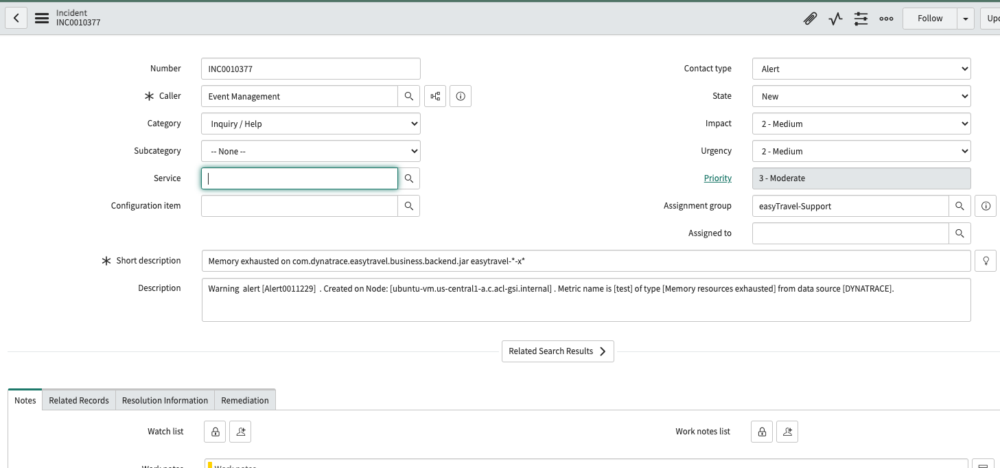

## Watch automated remediation trigger

1. You can check the status of the flow execution by going to the `alert executions tab` on the bottom of the alert and clicking on the triggered remediaton subflow:

    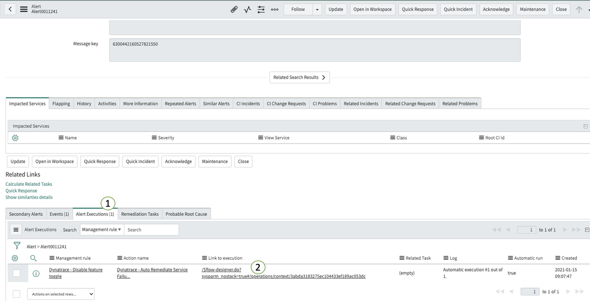

1. During he remediaton execution, ansible AWX will add comments to the dynatrace problem comments:

    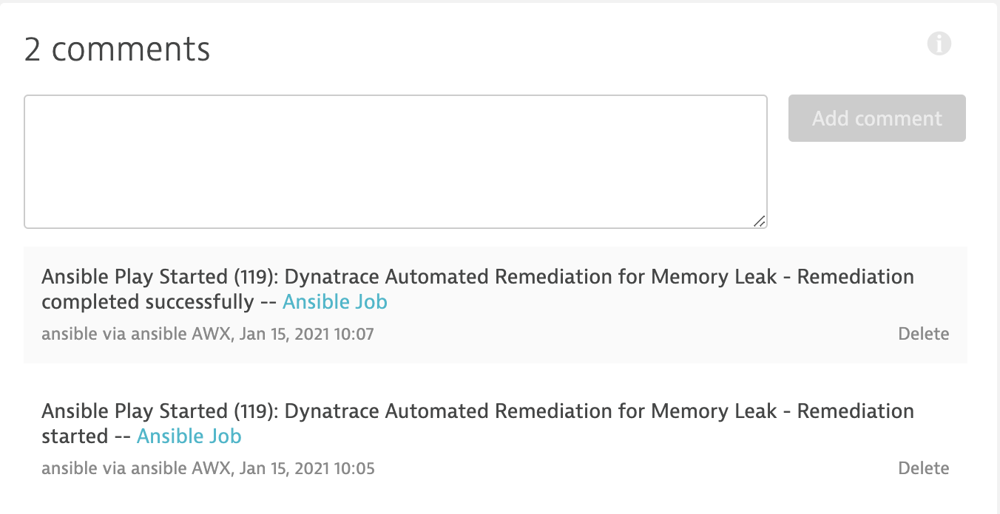

1. You can click on thea `Ansible Job` link to view the exexution of the template on ansible AWX.

    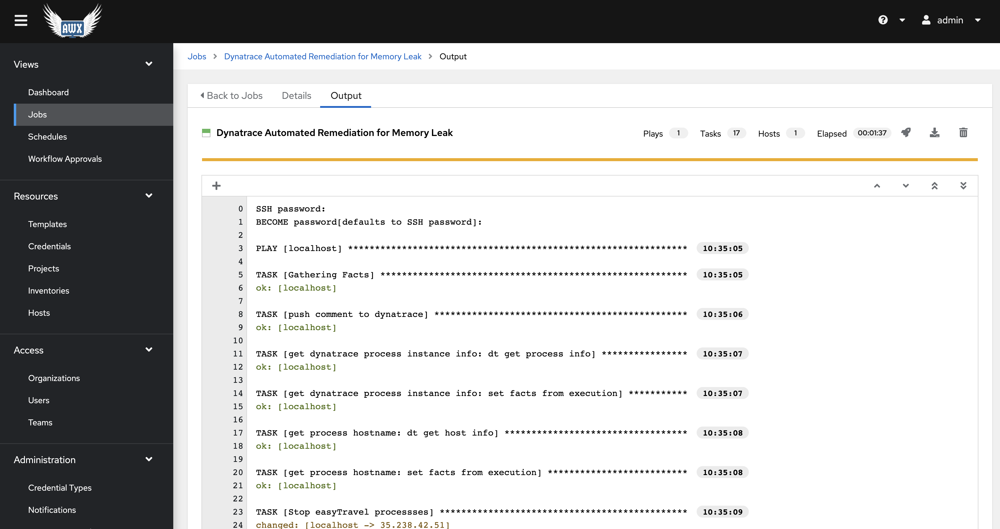

1. The ServiceNow Alert work notes will also be updated by the remediation subflow depending on the status of the remediaton executed by ansible AWX:

    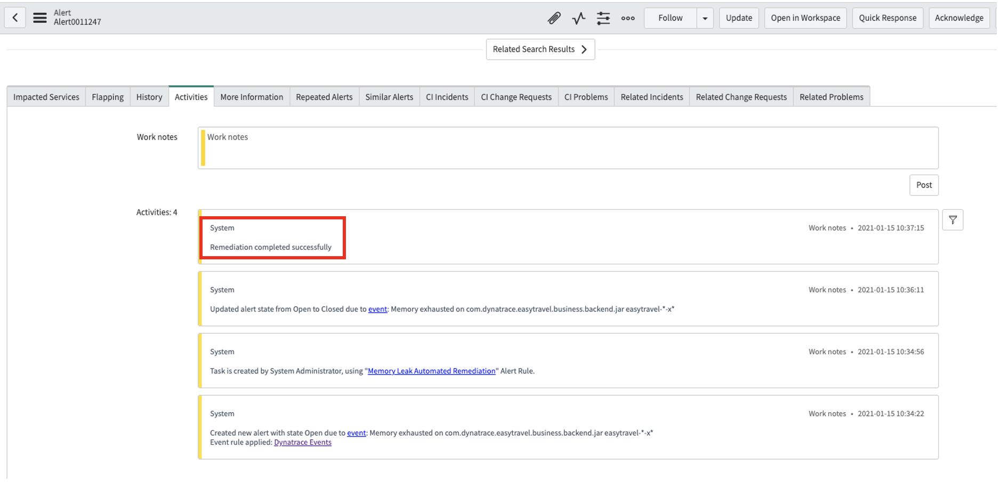

1. After a successful remediation execution, the problem should automatically close on dynatrace:

    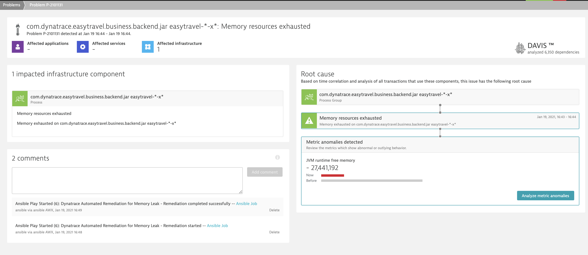