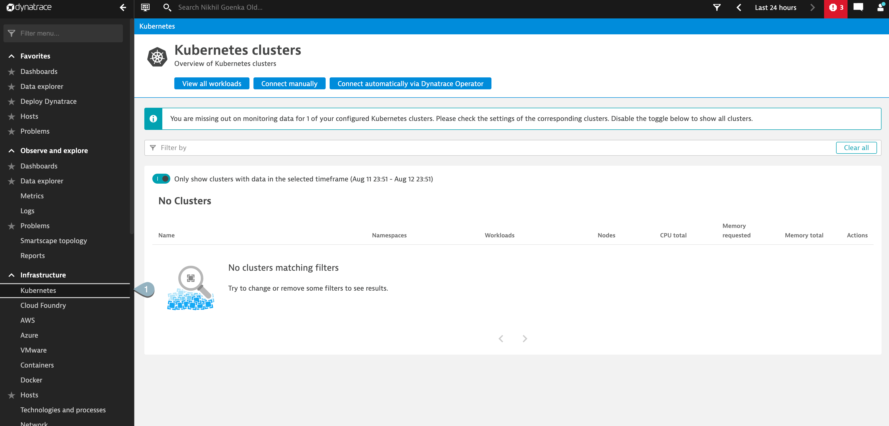

## Setting up Dynatrace on Kubernetes
In this step, install the Dynatrace Operator on your Kubernetes cluster so that the OneAgent can report and collect metrics from different pods.

Use PuTTy (Windows), PowerShell (Windows) or Terminal (Mac), ssh into the instance using the following credentials:
**Username**: `d1prumworkshop`
**Password**:  `dynatrace`

Alternatively, you can connect to the SSH terminal by clicking on the icon as below:


Further become root user by executing the below command:
```
$ sudo su
```
Note: Password for root is **dynatrace**

Let us install the Dynatrace Operator on your Kubernetes cluster so that the OneAgent can report and collect metrics from different pods. Dynatrace support multiple deployment strategies to install the Dynatrace Operator, for Kubernetes integration. In this tutorial, we will use the automated mode.

```bash
$ kubectl config view --raw > /home/ubuntu/.kube/config

$ kubectl config view --raw > ~/.kube/config

$ export CLUSTER_SERVER=$(microk8s config | grep "server:" | sed 's/^.*server: //')

$ kubectl config set-cluster microk8s-cluster --insecure-skip-tls-verify=true --server="$CLUSTER_SERVER"

```

Negative
:If you come across the following error


Please execute the following command to resolve the error
```bash
$ cd $HOME

$ mkdir .kube

$ cd .kube

$ microk8s config > config

$ export CLUSTER_SERVER=$(microk8s config | grep "server:" | sed 's/^.*server: //')

$ kubectl config set-cluster microk8s-cluster --insecure-skip-tls-verify=true --server="$CLUSTER_SERVER"

```

2. Within your tenant, navigate to **Kubernetes**


3. Select **Connect automatically via Dynatrace Operator**.


4. Enter the following details.

4. **Name**: Defines the display name of your Kubernetes cluster say `kubernetesintegration`. Additionally, this name will be used as a prefix for naming Dynatrace-specific resources inside the Kubernetes cluster, such as DynaKube (custom resource), ActiveGate (pod), OneAgents (pods), and as a name for the secret holding your tokens.

5. **Dynatrace Operator token**: Create token to have it automatically generated for the instrumentation.

6. Lastly, toggle **Skip SSL Certificate check** to yes.


7. Under **Kubernetes/OpenShift**, select **Download dynakube.yaml**, create a file dynakube.yaml by running a command as follow:

```
$ cd /home/ubuntu/k8s/

$ vim dynakube.yaml
```

Further, copy the contents of dynakube.yaml and paste it in dynakube.yaml of your terminal (by pressing `i` to enter Insert mode, followed by `CTRL + Shift + V`) and exit the dynakube.yaml by pressing `ESC` key followed by `:wqa`

8. Lastly, copy the code block generated based on our inputs earlier and  run it in your terminal.


> Note:
Be sure to execute the commands in the same directory where you downloaded the YAML, or adapt the commands to link to the location of the YAML.

This should enable the kubernetes intrumentation for your cluster. To view the integration, click on **Show deployment status**.

<!-- ------------------------ -->
