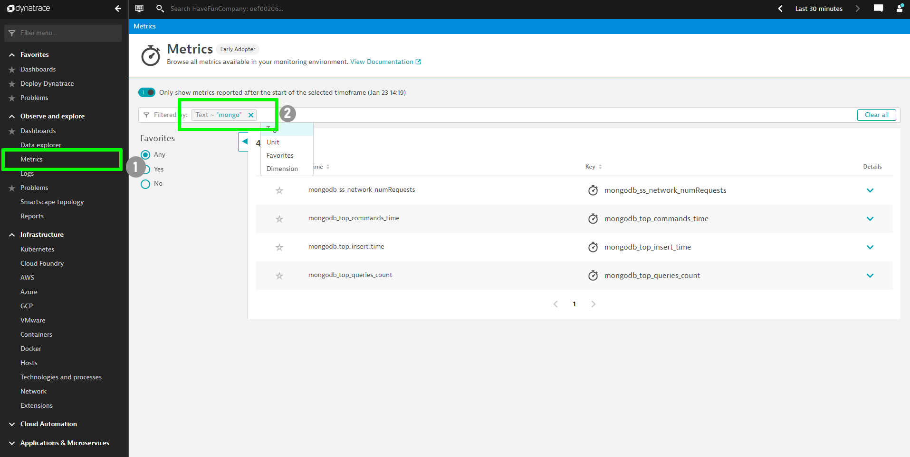

## Prometheus Metrics in Dynatrace

In this section, we will annotate the pods to start pushing the prometheus metrics to Dynatrace.
Identify the mongodb-exporter pod by running the following command:

```
kubectl get pod -n samplebank
```


## A) Annotate the pods

Next, we'll annotate the exporter so that oneagent running on the cluster will push prometheus metrics to dynatrace tenant.

Annotate the pod using the saved variable from previous section:

```bash
kubectl annotate pod $mongopod metrics.dynatrace.com/scrape=true --namespace=samplebank

kubectl annotate pod $mongopod metrics.dynatrace.com/port=9216 --namespace=samplebank

kubectl annotate pod $mongopod metrics.dynatrace.com/secure=false --namespace=samplebank
```

Once annotated, Oneagent will detect the metrics and automatically important them to Dynatrace.

To view these metrics, navigate to the **Metrics** screen within Dynatrace tenant.


## B) Apply metric filters

By default, all the metrics collected by the annotated exporter(s) will be pushed to Dynatrace. However, you can limit the metrics using a filter like:

**EXAMPLE ONLY**

```bash
metrics.dynatrace.com/filter: |
{
"mode": "include",
"names": [
"metrics-name-1",
"metrics-name-2",
"metrics-name...n"
]
}
```

> Tip
> : Replace the metrics-name-1, metrics-name-2, etc with the appropriate name which will ascertain only the configured metrics are pushed through.

We'll annotate the mongodb exporter to limit collection to "mongodb_network_metrics_num_requests_total" and "mongodb_asserts_total".

To do so, edit the pod configuration with:

```bash
kubectl edit pod $mongopod -n samplebank
```

Edit the manifest file

```YAML
    metrics.dynatrace.com/filter: |
      {
      "mode": "include",
      "names": [
      "mongodb_ss_network_numRequests", "mongodb_top_commands_time", "mongodb_top_insert_time","mongodb_top_queries_count"
      ]
      }

```


Once added, press ESC + :wq! to quit the editor. The pod would now be annotated with the configured metrics and you will receive **only** these in Dynatrace,thereby, reducing your DDU consumption.

- **Note**: mode supports both **include** and **exclude** keyword. Also, the names accept wild card like (_mongo) or (mongo_) or (_mongo_) should you have multiple metrics with similar text pattern.

## C) Confirm metric visibility in Dynatrace

In Dynatrace, Go to Metrics and search for `Mongo`

