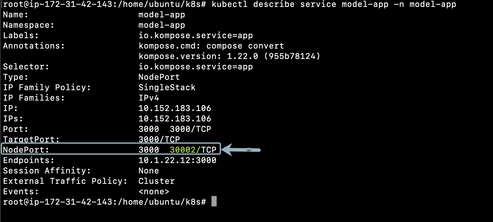

## Start the Sample-Application
Navigate to `/home/ubuntu/k8s` folder by using the following command:
```
$ cd /home/ubuntu/k8s
```

In that folder you will be able to view the yaml files for front-end and mongodb deployment. In order to deploy the services and deployment, run the following commands:
```
$ kubectl create namespace model-app

$ kubectl apply -n model-app -f app-deployment.yaml

$ kubectl apply -n model-app -f mongo-deployment.yaml

$ kubectl apply -n model-app -f mongo-service.yaml

$ kubectl apply -n model-app -f app-service.yaml
```

This will create the deployment and services for all components for the application. Further, your service will now be accessible via NodePort.

Verify the service is up and running as expected using command below.
```
$ kubectl describe service model-app -n model-app
```


Note down the Nodeport and connect to the application on browser using **Instance-ip:NodePort**

### ⚠️ Troubleshooting steps
* To **check status of pods**, run command below. You should get a **Running** as a return.
`$ kubectl get pods -n dynatrace`

* To **check the logs**, run command below.
`$ kubectl logs -f deployment/dynatrace-oneagent-operator -n dynatrace`

* To **delete secrets**, run command below. You might have included a wrong secret previously.
`$ kubectl delete secret --all -n dynatrace`

* To **delete all pods**, run command below. This will cycle through the pods and you will have new pod instances.
`$ kubectl delete --all pods -n dynatrace`

* To **check status of deployments**, run command below. You should get a **Running** as a return.
`$ kubectl get deployments -n dynatrace`

* To **check status of services**, run command below. You should get a **Running** as a return.
`$ kubectl get services -n dynatrace`

* To **delete a service**, run command below.
`$ kubectl delete service <serviceName> -n dynatrace`

* If the pods are not running run `microk8s stop` and then `microk8s start` to restart the node.

* Official troubleshooting page could be found [here](https://www.dynatrace.com/support/help/technology-support/cloud-platforms/google-cloud-platform/google-kubernetes-engine/installation-and-operation/full-stack/troubleshoot-oneagent-on-google-kubernetes-engine/)

<!-- ------------------------ -->
