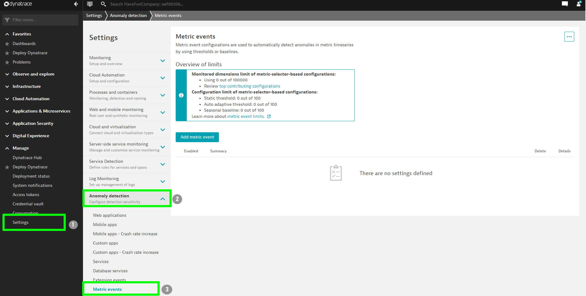
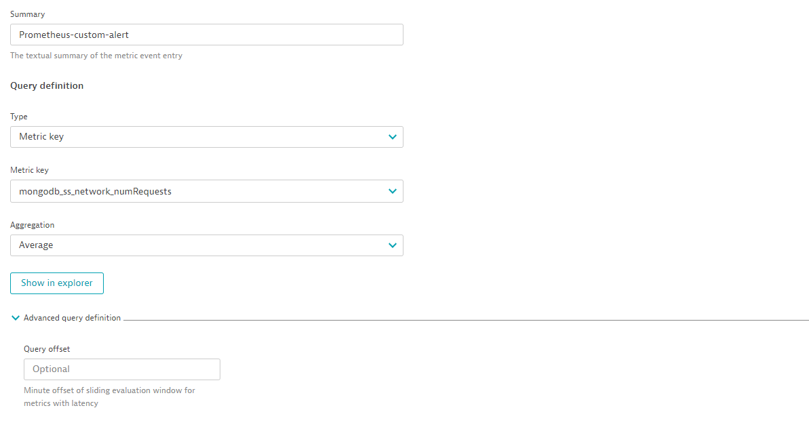
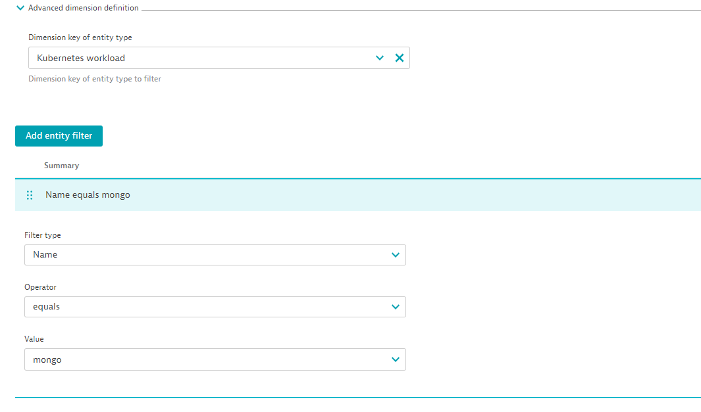

## Setup Custom Alerts (With Auto-Detective baseline)

In this section, we'll setup a custom alert when the automatic baseline has been breached for the Prometheus metrics.

(Dynatrace purposefully takes a few hours at initial deployment to generate data context before raising alerts. The custom threshold will enable alerts immediately.)

## A) Create custom event

All metrics collected by Dynatrace are now available in the metrics drop-down menu. Select the metrics that you would like to set a custom event for. In this case we will be using `mongodb_ss_network_numRequests`.

Scroll down to **Monitoring strategy** and configure the following:

1. Model-type: **Static threshold**
1. Configure to be alerted if the metric is above **10000**
   
1. In Advanced dimension definition, select **kubernetes workload**
   filter type: Name
   Operator : equals
   value: mongo
   
1. Name it something like **Prometheus-custom-alert**
1. Click on **Create custom event for alerting**
   

- **Note**: Dynatrace gives you a preview of alerts you would have received as per the baseline and the configuration under **Alert Preview** section so that you can fine-tune the settings in order to avoid alert storm.
