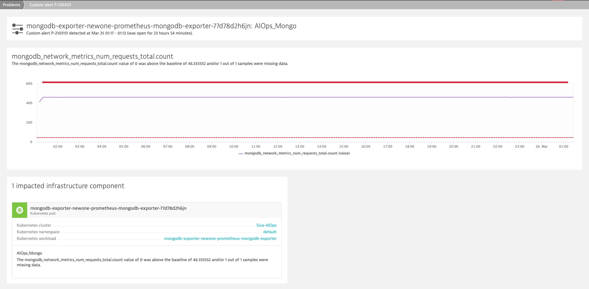

## Trigger an alert

In this step, let us simulate load by executing a load-script so that the automatic threshold is breached, thereby, triggering an alert.

## A) Enable load generation & alerts

Run the following deployment to run a new K6 test:

```sh
kubectl apply -f ~/HOT_DAY_SCRIPT/exercise/01_Prometheus/loadgenerator.yaml -n samplebank
```

Once the script is executed, it would fire multiple requests parallely on the application. This will trigger an alert similar to the below:


