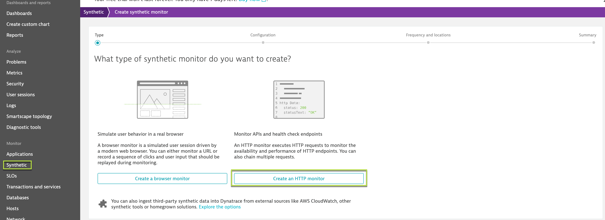

## Why push the metrics in Dynatrace?
In this step, we will walk through the automatic baseline and uses of pushing prometheus metrics into Dynatrace. We will setup a synthetic browser in order to populate automatic baseline.

Once the metrics are being pushed in Dynatrace, the DAVIS AI engine will start digesting the information and identifying the baseline for the metrics. You can setup custom alerts (with auto-detective baseline) so that you don’t just get alerts but smart alerts.

### Populate Baseline using Synthetic Monitors
Dynatrace uses real-time traffic to generate a baseline for the pivotal parameters like response-time, error-rate, throughput and etc for the service or application. So, in order to generate some traffic, we will setup the HTTP monitor which would result DAVIS to generate a baseline.

In your Dynatrace tenant, navigate to "Synthetic" and click on "Create synthetic monitor". Further, click on "Create an HTTP monitor"

Follow these steps to configure the monitor:
1. Name this HTTP monitor: Prometheus-setup-1
1. Click “Add HTTP request”
1. Request type: HTTP request
1. HTTP Request URL: AWS-IP:3000/login - Replace the AWS-IP with your machine IP
1. Name: Sample-app
1. Click on “Add HTTP request”

HTTP monitors can be scheduled to run from Dynatrace's private synthetic location and scheduled to run in configurable time intervals. For this setup, configure the HTTP monitor to run every **1 minute** from any **two** available locations.

* **Note**: Currently, Mumbai is the synthetic monitors location that is whitelisted for your AWS instance. So, select **Mumbai** as your synthetic location.

Once configured, Dynatrace will fire the HTTPS-requests on the service, which will generate traffic. To view the generated requests, navigate to **Transactions & Services > node-bank** service. The traffic will be used by DAVIS to determine the baseline of the service or the requests.

<!-- ------------------------ -->
