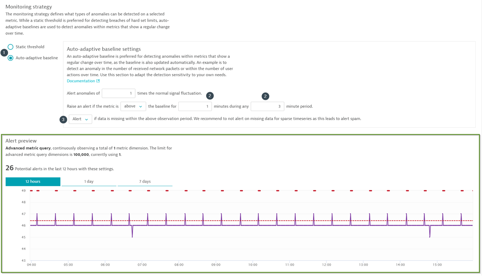

## Setup Custom Alerts (With Auto-Detective baseline)
In this step, we will setup a custom-alert to alert us when the automatic baseline has been breached for the Prometheus metric(s)

Setup a custom alert with an auto-detective baseline so that the AI engine would determine the threshold after studying the trend and behaviour of the metrics. To setup a custom alert

All the metrics which were pushed into Dynatrace are now available in the metrics drop-down menu. Select the metrics that you would like to set a custom event for. In this case we will be using
`mongodb_ss_network_numRequests`.

Further, scroll down to **Monitoring strategy** and configure the following:
1.	Alert-type: **Auto-adaptive baseline**
1.	Configure to be alerted if the metric is **above** the baseline for **1 minutes** during **3 minutes** window
1.	Select **Alert** to ensure you are notified if data is missing.

1. Name the title **Prometheus-custom-alert**
1. Click on **Create custom event for alerting**

* **Note**: Dynatrace would indicate the number of alerts you would have received as per the baseline and the configuration under **Alert Preview** section so that you can fine-tune the settings in order to avoid alert storm.

<!-- ------------------------ -->
