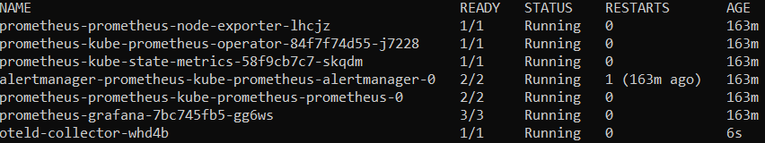
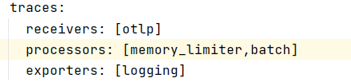
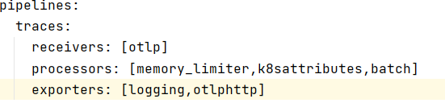
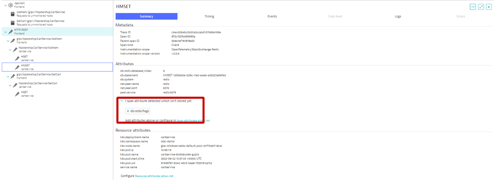
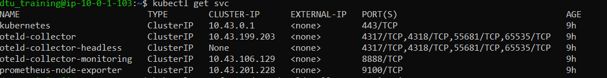

## Building a Collector Trace Pipeline
In this lab you'll learn how to :
* build a Trace pipeline
* use the processor K8sattrributes
* use the processor spanMetrics
* use the otlp http exporter

### Step 1: Export Traces to Logs

A. Look at  the OpenTelemtryCollector template

In the Bastion host, go to the folder : `exercise/02_collector/trace`
   ```bash
   (bastion)$ cd ~/HOT_DAY_SCRIPT
   (bastion)$ cd exercise/02_collector/trace
   (bastion)$ cat openTelemetry-manifest.yaml
   ```
This collector is currently receiving traces and exporting it directly to the logging exporter.

B. Deploy the OpenTelemetryCollector 
   ```bash
   (bastion)$ kubectl apply -f openTelemetry-manifest.yaml
   ```
   This will deploy OpenTelemtry Collector in a daemon set mode.
   
C. Look at the produced logs 
   
   ```bash
   kubectl get pods 
   ```
   you should have one pod running with our collector :
   

   Copy the pod name of the collector , and display the logs :

   ```bash
   kubectl logs <Collector pod name>
   ```

### Step 2. Update the current Trace Pipeline 

A. Edit the OpenTelemetryCollector object
   In the Bastion host, edit the file  : `exercise/02_collector/traces/openTelemetry-manifest.yaml`
   Change the Trace pipeline to process span , where each task will always :
      - start with the `memory_limiter`
      - end with the `batch` processor 
   ```bash
   (bastion)$ vi openTelemetry-manifest.yaml
   ```
   
   
B. Add k8s attributes 
   Adding k8s attributes to the generated traces , means using the processor `k8sattributes`.
   `k8sattributes` will interact with the k8s Api to collect details related to the span.
   
   To interact with the Api , you need to use a Service Account having the right cluster role.
   The following Service Account has already been deployed and has all the right privileges: `otelcontribcol`
   
   Add the following extra attributes :
   * `k8s.pod.name`
   * `k8s.pod.uid`
   * `k8s.deployment.name`
   * `k8s.namespace.name`
   * `k8s.node.name`
   * `k8s.pod.start_time`
   
Here is the link to documentation of the [k8sattributes processor](https://pkg.go.dev/github.com/open-telemetry/opentelemetry-collector-contrib/processor/k8sattributesprocessor).
   
 
   Edit the `openTelemetry-manifest.yaml`, by adding the right defintion of processor
   
   ```bash
   (bastion)$ vi openTelemetry-manifest.yaml
   ```

   Add this under processors in the YAML file:
   ```YAML
     k8sattributes:
       auth_type: "serviceAccount"
       passthrough: false
       filter:
         node_from_env_var: KUBE_NODE_NAME
         
       extract:
         metadata:
           - k8s.pod.name
           - k8s.pod.uid
           - k8s.deployment.name
           - k8s.namespace.name
           - k8s.node.name
           - k8s.pod.start_time
   ```
   
   

C. Change the Processor flow
   
   Change the Processor flow in the trace pipeline to add the `k8sattributes` after the `memory_limiter`
   Apply the change made on the collector :
    
   ```bash
   (bastion)$ kubectl apply -f openTelemetry-manifest.yaml
   ```
   
D. Look at the logs of the collector to see the updated format of the spans
   Get the new Pod name of the collector and look a the logs :

   ```bash
   (bastion)$ kubectl logs  <Collector pod name>
   ```

### Step 3. Export the generated spans to Dynatrace

A. Update the current trace pipeline
   In the OpenTelemetry Collector pipeline , edit  `openTelemetry-manifest.yaml` to export the spans to :
      - The logs of the collector
      - Dynatrace OpenTelemtry Trace ingest API

   ```bash
   (bastion)$ vi openTelemetry-manifest.yaml
   ```
   
   expected flow :
   
   
B. Look at the generated traces in Dynatrace
   Open your Dynatrace tenant :
   > 1. Navigate to `Distributed traces` via Dynatrace Menu 
   > 2. Click on ingested Traces
   > 3. Click on the Trace named HTTP GET or HTTP Post

C. Add all span attributes not stored by Dynatrace
   Look at each generated span, add all span attributes detected but not stored by dynatrace.
   
   
D. Look at the Service Screen
   In your Dynatrace tenant: 
   > 1. Navigate to `Services` via Dynatrace Menu 
   > 2. Click on the `checkoutservice`

### Step 4 The metrics produced by the collector

1. Look at the prometheus metrics produced by the Collector
   Get the new service montoring name of the Collector
   
   ```bash
    (bastion)$ kubectl get svc
   ```
   
   
   Expose the port 8088 locally on the bastion host :
   
   ```bash
   (bastion)$ kubectl port-forward svc/<collector monitoring service name> 8088:8888
   ```

   Open another terminal and connect to the bastion host.
   Look at the metrics by send http request to `http://localhost:8088/metrics`
   
   ```bash
   (bastion)$ curl http://localhost:8088/metrics
   ```
   
