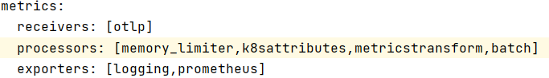

## Building a Metric Pipeline

In this lab you'll learn how to :
* build a Metric pipeline
* use the processor `metricstransform`
* use the processor `spanMetrics`
* use the dynatrace exporter

### Step 1: Update the collector Pipeline
 A. Look at  the OpenTelemetryCollector template
   In the Bastion host, go to o the folder : `exercise/02_collector/metrics`
    
   ```bash
   (bastion)$ cd ~/HOT_DAY_SCRIPT
   (bastion)$ cd exercise/02_collector/metrics`
   (bastion)$ cat openTelemetry-manifest.yaml
   ```

 B. Add a metricstransform processor 
 
   Add in generated metrics one new label to store the K8s.cluster.name and the Cluster id.
   To get the Cluster id run the following command :
   
   ```bash
    kubectl get namespace kube-system -o jsonpath='{.metadata.uid}'
   ```
    
   Update the `openTelemetry-manifest.yaml` by adding the following processor :
    
   ```bash
   (bastion)$ vi openTelemetry-manifest.yaml
   ```
   add the following processor 
    
   ```yaml
      metricstransform:
        transforms:
           include: .+
           match_type: regexp
           action: update
           operations:
             - action: add_label
               new_label: K8s.cluster.name 
               new_value: hotday2023
             - action: add_label
               new_label: k8s.cluster.id
               new_value: <YOUR CLUSTER ID>             
   ```
    
C. Add a metric pipeline
   The metric that would :
   * receive `otlp metrics`
   * process with `memory_limiter`, `k8sattributes` , `metricstransform` , `batch`
   * exporter: `prometheus`
   
   
     
D. Replace the prometheus exporter with the dynatrace exporter

   ```yaml
    metrics:
      receivers: [otlp]
      processors: [memory_limiter,k8sattributes,batch]
      exporters: [logging,dynatrace]
   ```


E. Apply the changes :
   
   ```bash
   (bastion)$ kubectl apply -f  openTelemetry-manifest.yaml
   ```
   
### Step 2: Look at the produced metrics
A. In your Dynatrace tenant:
   > 1. Navigate to `Metrics` via Dynatrace Menu
   > 2. Search for `hotday`
   

