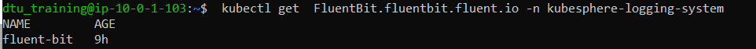
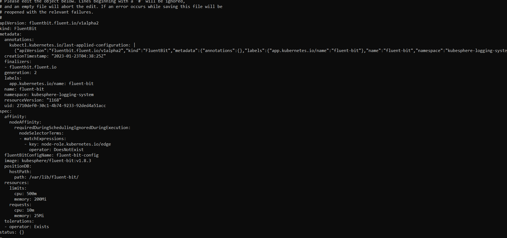
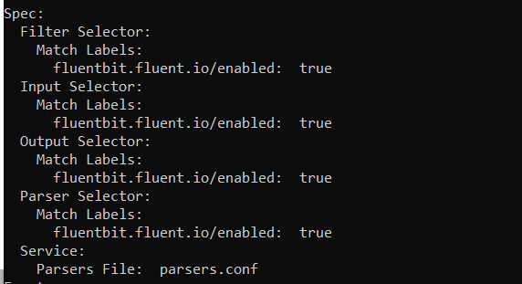
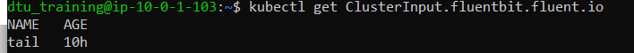
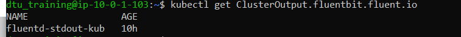
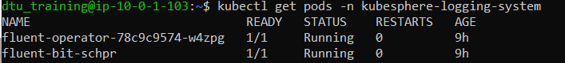

## Building a Fluentbit Log pipeline using the FLuent Operator

In this section you'll learn how to :

- Look at the existing configuration of fluentbit
- Enrich the logs using a fluentbit Filter plugin
- Structure the enriched logs to send logs to dynatrace
- use the otlp http exporter

## A) Enrich the logs with Kubernetes Labels

1. Look at the Fluentbit configuration

The cluster has already Fluentbit agents running in the cluster.
Let's first have a look a the various fluenbit objects deployed in the cluster

```bash
kubectl get FluentBit.fluentbit.fluent.io -n kubesphere-logging-system
```



2. After confirming it is present, edit the manifest to see the contents with:

```bash
kubectl edit FluentBit.fluentbit.fluent.io -n kubesphere-logging-system
```



This object is defining that a fluentbit daemonset will be deployed in the namespace `kubesphere-logging-system` of the cluster
This object map to a specific configuration object : `fluent-bit-config`

Exit vi.

3. Look at the ClusterFluentBitConfig

```bash
kubectl describe ClusterFluentBitConfig.fluentbit.fluent.io fluent-bit-config
```



This object will map the various steps that would be involved in our Log ingest pipeline :

**EXAMPLE ONLY**

```YAML
service:
  parsersFile: parsers.conf
inputSelector:
  matchLabels:
    fluentbit.fluent.io/enabled: "true"
filterSelector:
  matchLabels:
    fluentbit.fluent.io/enabled: "true"
outputSelector:
  matchLabels:
    fluentbit.fluent.io/enabled: "true"
```

This object will define labels that attach the ClusterInput objects ( to collect logs ) , ClusterFilter objects, and the ClusterOutput objects of our pipeline.

4. Look at the ClusterInput

```bash
kubectl get ClusterInput.fluentbit.fluent.io
```



5. Describe this object

```bash
kubectl describe ClusterInput.fluentbit.fluent.io
```

The clusterinput is currently collecting the logs for our pods with the help of the Tail plugin :

**EXAMPLE ONLY**

```YAML
tail:
  tag: kube.*
  path: /var/log/containers/*.log
  parser: cri
  refreshIntervalSeconds: 10
  memBufLimit: 10MB
  skipLongLines: true
  db: /fluent-bit/tail/pos.db
  dbSync: Normal
```

6. Look at ClusterOutput

```bash
 kubectl get ClusterOutput.fluentbit.fluent.io
```



Describe this object

```bash
kubectl describe ClusterOutput.fluentbit.fluent.io
```

Fluentbit is currently sending the collected logs in the stdout of the Fluentbit Pods.

7. Look at the logs of the fluentbit Pods

```bash
 kubectl get pods -n kubesphere-logging-system
```



8. Export the pod id matching fluent-bit (NOT the operator) to use in further steps:

```bash
export fluentpod=<pod>
```

9. Let's display the logs currently parsed by Fluentbit:

```bash
kubectl logs $fluentpod -n kubesphere-logging-system
```

## B) Add kubernetes labels

Let's enrich the logs by adding the kubernetes information
Fluentbit has a filter plugin named `kubernetes`. This plugin will interact with the k8S api to add the right labels to our logs.

Let's add a new Filter step in our current log pipeline.

1. Edit the cluster template provided with:

```bash
vi ~/HOT_DAY_SCRIPT/exercise/04_Fluent/cluster_filter_template.yaml
```

We will add a filter step in our pipeline with the help of a `ClusterFilter` object.
In the CLusterfilter object we will add several steps .
To add the kubernetes labels, we will use kubernetes:

```YAML
    - kubernetes:
        kubeURL: https://kubernetes.default.svc:443
        kubeCAFile: /var/run/secrets/kubernetes.io/serviceaccount/ca.crt
        kubeTokenFile: /var/run/secrets/kubernetes.io/serviceaccount/token
        labels: true
        annotations: true

```

2. Add the filter by applying the yaml:

```bash
kubectl apply -f ~/HOT_DAY_SCRIPT/exercise/04_Fluent/cluster_filter_template.yaml -n kubesphere-logging-system
```

3. Now let's have a look at the new format of the logs processed by Fluenbit.

```bash
kubectl logs $fluentpod -n kubesphere-logging-system
```

The fluent operator takes few seconds to load the new pipeline, but you should see a kubernetes object added in our logs.

Lift the kubernetes information in the log stream

The kubernetes filter has added a new json object with all the kubernetes information.
Let's move the information to our logs.

4. Fluentbit filter has a `nest` plugin to lift data from a json object , let's add to our Clusterfilter a lift operation.

```bash
vi ~/HOT_DAY_SCRIPT/exercise/04_Fluent/cluster_filter_template.yaml
```

Add after the kubernetes filter, nest:

```YAML
    - nest:
        operation: lift
        nestedUnder: kubernetes
        addPrefix: kubernetes_

```

This will lift all attributes of the new json object to our logs stream and will add a prefix in front of each new attribute.

5. Apply the new format with:

```bash
kubectl apply -f ~/HOT_DAY_SCRIPT/exercise/04_Fluent/cluster_filter_template.yaml -n kubesphere-logging-system
```

6. View the log changes:

```bash
kubectl logs $fluentpod -n kubesphere-logging-system
```

We can see that there is json object holding the kubernetes labels and we can do the same operation by lifting kubernetes_labels.

7. Add a second NEST filter under the first one:

```bash
vi ~/HOT_DAY_SCRIPT/exercise/04_Fluent/cluster_filter_template.yaml
```

```YAML
    - nest:
        operation: lift
        nestedUnder: kubernetes_labels

```

8. Now let's have a look at the new format of the logs processed by Fluenbit.

```bash
kubectl apply -f ~/HOT_DAY_SCRIPT/exercise/04_Fluent/cluster_filter_template.yaml -n kubesphere-logging-system
```

```bash
kubectl logs $fluentpod -n kubesphere-logging-system
```

## C) Name the log labels

To be aligned the log structure with dt log ingest API we will rename labels and remove unuseful information.
Fluentbit has a plugin `modify`.

1. Let's edit our cluster filter:

```bash
vi ~/HOT_DAY_SCRIPT/exercise/04_Fluent/cluster_filter_template.yaml
```

by adding an extra filter step:

```YAML
    - modify:
        rules:
          - remove: stream
          - remove: kubernetes_container_hash
          - rename:
              message: content
              log: content
              date: timestamp
              kubernetes_pod_name: k8s.pod.name
              kubernetes_namespace_name: k8s.namespace.name
              kubernetes_pod_id: k8s.pod.uid
              kubernetes_host: k8s.kubernetes_node
          - add:
              k8s.kubernetes.cluster.id: CLUSTER_ID_TOREPLACE
              k8s.cluster.name: Hotday2023

```

1A. The cluster id can be retrieved with:

```bash
kubectl get namespace kube-system -o jsonpath='{.metadata.uid}'
```

2. Finally, let's have a look at the new format of the logs processed by Fluenbit.

```bash
kubectl apply -f ~/HOT_DAY_SCRIPT/exercise/04_Fluent/cluster_filter_template.yaml -n kubesphere-logging-system
```

```bash
kubectl logs $fluentpod -n kubesphere-logging-system
```
