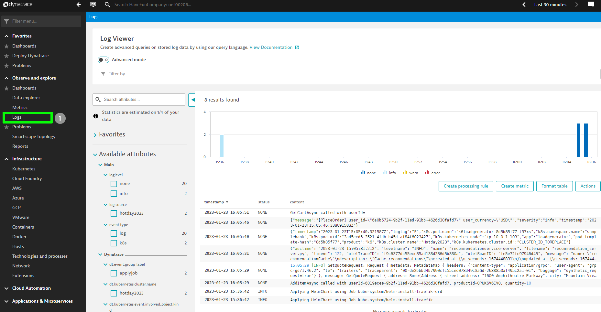
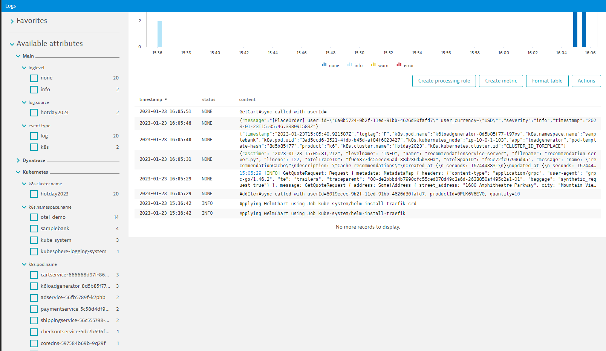

## How to forward the logs to Dynatrace
In this lab you'll learn how to :
* use the right filter plugin to batch the logs before sending it to dynatrace
* configure the http output plugin to send the logs to dynatrace

### Step 1: Create a ClusterFilter

In our case we want to send all the logs collected by Fluentbit from our Pods.
To be able to throttle everything we would apply it on the logs taged: `kube.*`

In the Bastion host, in the folder `exercise/04_Fluent/` edit the following file : 
   ```bash
   vi cluster_filter_throttle_filter.yaml
   ```
The Dynatrace API limits the number of logs per ingest API call to 1000.
Therefore we will add the `throttle` operator that will allow us to bach our logs.

Add the following lines :
```yaml
- throttle:
   rate: 800
   window: 3
   interval: 10s
   printStatus: true
```

Let's apply this new CLusterFilter:
  ```bash
   kubectl apply -f cluster_filter_throttle_filter.yaml
   ```

### Step 2: Create a ClusterOutput
In the bastion host the cluster Output plugin as already been configured.
```yaml
   apiVersion: fluentbit.fluent.io/v1alpha2
   kind: ClusterOutput
   metadata:
     name: fluent-http
     labels:
       fluentbit.fluent.io/enabled: "true"
       fluentbit.fluent.io/component: logging
   spec:
     match: kube.*
     http:
       host: TENANT_TO_REPLACE
       uri: /api/v2/logs/ingest
       port: 443
       format: json_stream
       allowDuplicatedHeaders: false
       jsonDateKey: timestamp
       jsonDateFormat: iso8601
       headers:
         Authorization: Api-Token API_TOKEN_TO_REPLACE
         Content-Type: application/json; charset=utf-8
       tls:
         verify: false
```
( TENANT_TO_REPLACE will have the url of your own Dynatrace tenant)

To send lobs to dynatrace , we need :
- use the json_stream format
- specify the key holding the date
- configure the communication to the log ingest api ( by specifying the host, uri)
- handle the authentification with the help of the header : Authorization

Let's apply it, and look at the logs in dynatrace.
 
```bash
(bastion)$ kubectl apply -f cluster_output_http.yaml
```

### Step 3: Look at the the logs in dynatrace

In Dynatrace, let's have a look a the logs sent by Fluentbit.




You can see that all the log attributes are available, and will help us to filter our logs :



It means that by applying the right filter we could create Metric and filter out of the logs sent by Fluentbit.

