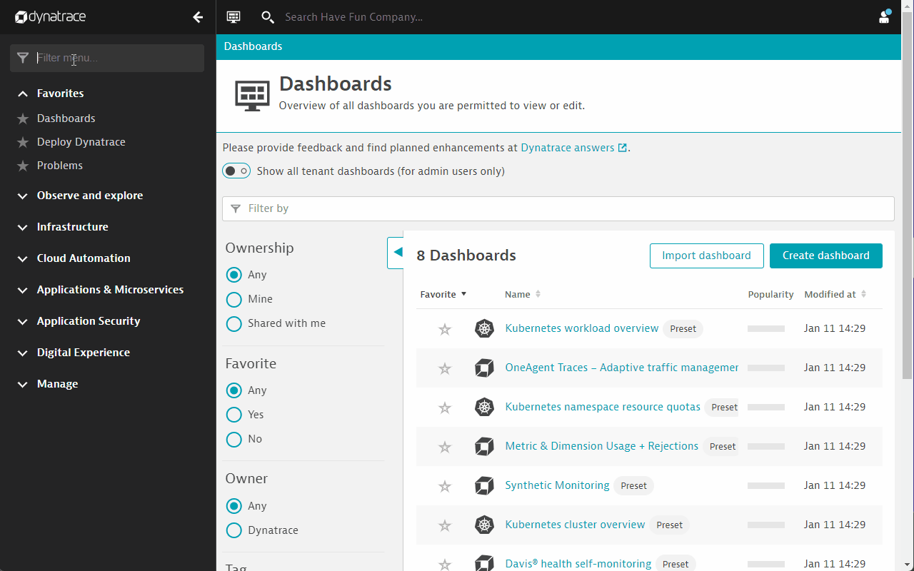

## Prepare your workspace

Welcome to the **Automate and integrate OpenTelemetry with Dynatrace lab**.

Before we begin, your workspace must get prepared. In this section we will

- Turn on Extension Execution Controller in your Dynatrace environment
- Access our Development Host
- Run the application for todays session.

### Turn on Extension Execution Controller

Go to Dynatrace Menu -> Settings -> Preference -> Extension Execution Controller



### Access development host

In addition to your Dynatrace Environment we have provisioned a development host for you.

Here we will build and run the applications for todays session.

#### Log into your development environment

The IP Address and credentials for this Ubuntu host can be found within the `Environments` tab.


1. Copy the IP address and paste it into a new browser window.
2. Append /code to the address bar, i.e. 1.2.3.4 **/code**
3. Full URL will look something like this: http://1.2.3.4/code
4. Press enter, you should see the login screen now. Copy the password that has been provided under the IP address.
   

We are using <a href="https://github.com/coder/code-server" target="_blank">Visual Studio Code Server</a> today in order to build and launch applications.


#### Open a terminal tile in Visual Studio Code
Your development environment also provides access to the command line of your host.

1. In the **Getting Started** screen, click on **Open a folder** to start,
1. or use the hamburger menu  -- File -- Open Folder
1. Select **shopizer** folder
1. Click on the Menu Button  in the top left corner and select `Terminal` and in here `New Terminal`.
   
1. As a result a terminal tile will appear at the bottom of the screen.
1. Your current directory within this bash terminal should be `shopizer` at this point.

### Run the application

To run the application, type this command `mvn spring-boot:run` in the `sm-shop` directory.

```bash
cd sm-shop
mvn spring-boot:run
```

### You have arrived!

At this stage your development machine is ready to run the applications we are going to use today.
