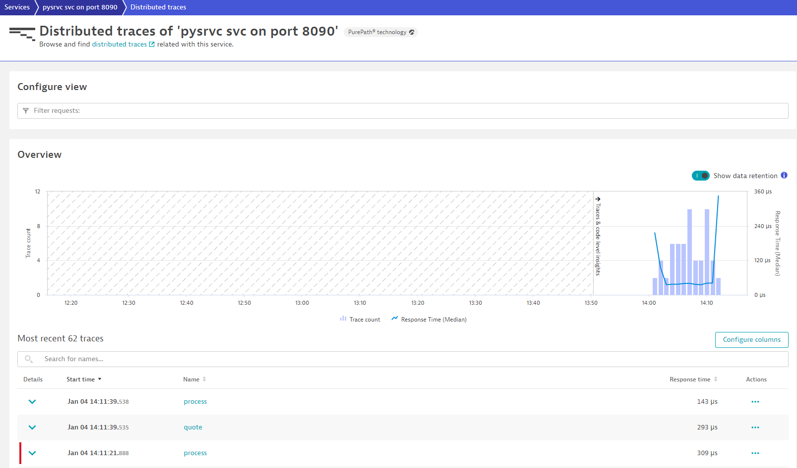

## 1. Basic plumbing for OpenTelemetry with Python

---

### Introduction

Before we can begin creating Spans and providing better insights into our Python webservice, we should first get an overview and understanding of the OpenTelemetry setup (_the plumbing_) that is already in place for these exercises.

Reference Dynatrace documentation can be found at [this link](https://www.dynatrace.com/support/help/extend-dynatrace/opentelemetry/opentelemetry-traces/opentelemetry-ingest/opent-python#tabgroup--instrument-application--manual-instrumentation). While the concepts are still the same we adapted the setup for ease of use during this training.

Let's find out what's involved.

Go to the <mark>./shopizer/pysrvc/otel.py</mark> file.

### 📑 Key Concepts

Expand each section as needed.

<details>
  <summary><strong>Create an OpenTelemetry Resource</strong></summary>

  A resource is nothing more than the representation of an entity which produces telemetry data. In Dynatrace, Resources define the Services which tie together our observability signals (traces, metrics, logs). OpenTelemetry provides an implementation of `Resource` as part of its `SDK`, all we have to provide is attributes to describe this resouce.

  We use two types of attributes. 
  On lines `43-47`, we provide some static details as strings:
  ```python
  resource = {
      ResourceAttributes.SERVICE_NAME: "pysrvc svc on port 8090",
      ResourceAttributes.SERVICE_VERSION: "v1.0.0",
      "environment": "hotday"
  }
  ```

  > 📝 **Note**: `ResourceAttributes` allows us to access "semantic attributes" - industry set standards for attribute names

  On lines `49-57`, we attempt to interrogate the OneAgent for some Dynatrace-specific attributes:
  ```python
  try:
      data = ''
      with open("dt_metadata_e617c525669e072eebe3d0f08212e8f2.json") as f:
          data = json.load(open(f.read()))
      resource.update(data)
  except:
      pass    

  return resource
  ```

  > 📝 **Note**: `dt_metadata_e617c525669e072eebe3d0f08212e8f2.json` is a file that contains a path under which OneAgent writes topology-specific dimensions related to the process reading it. This means we can provide Dynatrace with OneAgent supplied information about the Process that our Resource is running on. More on this in the [online documentation](https://www.dynatrace.com/support/help/shortlink/enrich-metrics#oneagent-file-open-interface).

  Finally, these resource attributes are used on line `64` where the Resource is created:
  ```python
      resource=Resource(self.resource_props)
  ```
</details>

<details>
  <summary><strong>Set up Trace export</strong></summary>

  With a resource in place that we can link our Traces to, all we need is a way to send our Traces to Dynatrace. Dynatrace supports ingesting Traces in `OTLP` format via the [Trace Ingest API](https://www.dynatrace.com/support/help/extend-dynatrace/opentelemetry/opentelemetry-traces/opentelemetry-trace-ingest-api); this is conveniently exposed locally by the OneAgent at `http://localhost:14499/otlp/v1/traces`.

  Before we can make use of the endpoint, however, we must set up our "ingest pipeline". This consists of:
  * **Trace Provider** - mandatory to start tracing and it associates traces with a Resource
  * **Span Processor** - watches the lifecycle of spans and sends them to an exporter when appropriate; we are using a `Batch Span Processor` which batches spans together and compresses data before sending it
  * **Span Exporter** - converts the spans to the required format for the backend platform; we are using the `OTLP Span Exporter` to send spans in OTLP format to the Dynatrace API

  On lines `62-71` you can see this all in action:
  ```python
  tracer_provider = TracerProvider(
      sampler=sampling.ALWAYS_ON,
      resource=Resource(self.resource_props)
  )
  tracer_provider.add_span_processor(
      BatchSpanProcessor(OTLPSpanExporter(
          endpoint="http://localhost:14499/otlp/v1/traces"
       ))
  )
  trace.set_tracer_provider(tracer_provider)
  ```

  From here on you may make use of the tracing capability by aquiring a tracer:
  ```python
  trace.get_tracer("whatever-tracer-name")
  ```
</details>

<details>
  <summary><strong>The adaptation for this training</strong></summary>

  The implementation here is a little different as the whole setup was written as a custom `class` called `CustomOpenTelemetry`.

  On line `94` we create an instance of this class:
  ```python
  ot = CustomOpenTelemetry()
  ```

  This allows us to then use our custom OpenTelemetry setup in other files through this variable `ot`.
  For example, we conveniently saved a tracer (`trace.get_tracer("perform-hot")`) as an attribute of `ot` on line `27`:
  ```python
  self.tracer = trace.get_tracer("perform-hot")
  ```
  So from here on, in all exercises, you can use `ot.tracer` and access the full functionality of the tracing SDK.
</details>

### 📌 Your Tasks

1. Start the Demo application
   ```bash
   cd sm-shop
   mvn spring-boot:run
   ```
2. Familiarize yourself with the code in the <mark>otel.py</mark> file.
3. Explore the Python webservice in Dynatrace
   1. Go to Services
   2. Click on `pysrvc svc on port 8090`
      * Can you tell where the name is coming from?
   3. Click `Distributed traces` (top right corner)
      * Can you tell where these traces are coming from?

### ✅ Verify Results

You have completed this exercise once you can visualize the Python webservice and have understood where the data is coming from.

