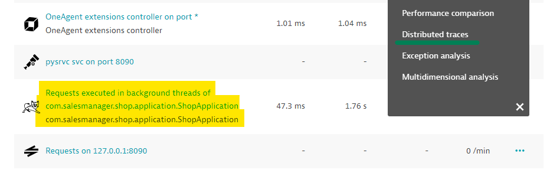
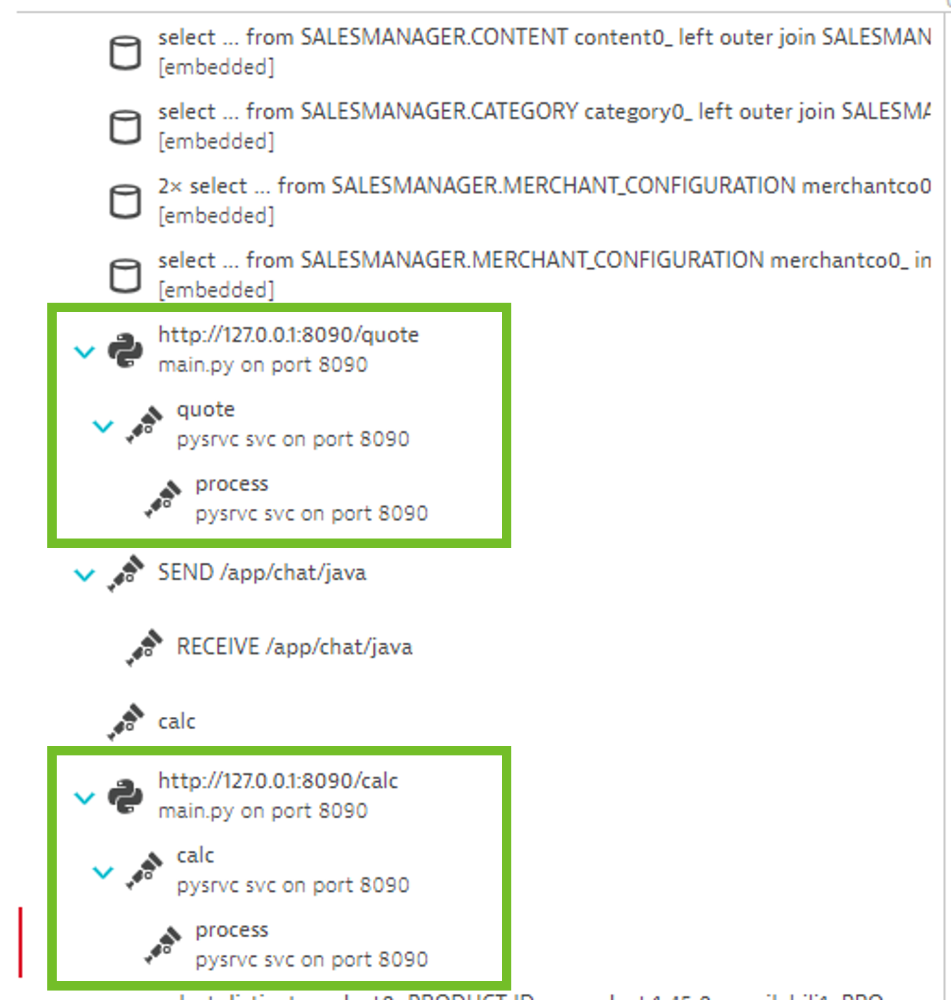

## Creating Spans into the Python webservice

---

### Introduction

Now that we're familiar with the OpenTelemetry setup for Python, it's time to start tracing our missing transactions. Our Python webservice is a very simple Flask web app that has three routes: `/newroute`, `/quote`, and `/calc`.

You may have noticed in the previous exercise that we are only ingesting spans for the `/quote` route, and even those are disconnected from the upstream trace!

In this exercise you'll create the missing spans and use Context to stitch them to their upstream traces.

Head over to `./shopizer/pysrvc/main.py` to begin.

### Key Concepts

#### Create custom Spans

In Python, Spans can be created by first aquiring a `tracer` and then invoking the `start_as_current_span("your-span-name")` function. This can be done either using the context manager keyword `with` and wrapping it around the code that's part of the Span, or it can be used as a `decorator` over an entire function.

**Example - as a decorator:**
```python
@tracer.start_as_current_span("my-span")
def my_function:
    print("Doing some work...")
```

**Example - as a context manager:**
```python
def my_function:
    with tracer.start_as_current_span("my-span"):
        print("This is part of the span.")

    print("This isn't part of the span.")
```

> 📝 **Note:** In our code, we access OpenTelemetry through the `ot` variable and can access a tracer using `ot.tracer`. The `ot` variable was imported already on line 8.

#### Set Spans in Context

We can think of `Context` as the glue that holds all Spans together in the same Trace. When a transaction goes across different processes and resources, the default OpenTelemetry behavior is to assign a new `Context` to each Span, thus creating separate transactions. We can modify this behavior by propagating `Context` across traces.

##### Incoming Traces

For our `/quote` and `/calc` routes, the OneAgent has already started an upstream trace and has injected Context (`traceparent`, `traceid`) into the headers of requests. We must extract it to set our spans in it.

Context can be extracted using the `propagate` module. Within an app route, Flask allows us to access headers via `request.headers`. The extraction looks like this `propagate.extract(request.headers)` which returns us the Context.

For Python, setting a span in context then becomes a one-liner:
```python
with tracer.start_as_current_span("my-span", propagate.extract(request.hreaders)):
    print("Doing some work...")
```

##### Outgoing Traces

For outgoing traces, we must capture our current Context and inject it into the headers of the outgoing web request. On the receiving side, the steps described above must happen for the end-to-end view to work. Luckily, the OneAgent already does this by default.

To capture the current context we can use the `context` module like so: `context.get_current()`. For web request headers, a simple dictionary will suffice to hold the context. To actually inject it we can use another function of the `propagate` module called `inject`. Altogether it looks like this:
```python
my_context = context.get_current()
headers = {}
propagate.inject(headers, ctx)
```

> 📝 **Note:** The `headers` variable above will now hold the trace context that is needed to stitch any downstream spans to this current one.

### Your Tasks

1. Create a Span for route `/calc`
2. Extract the context for routes `/quote` and `/calc` and set your Spans into context
3. Create a Span for `/newroute`
   * Note: there is no previous context here 

Restart the application to verify any changes:
```bash
Ctrl + C
mvn spring-boot:run
```

### Verify results

To verify your results, go to Services and find the `Requests executed in the background threads of com.salesmanager.shop.application.ShopApplication` service then click `...` and drilldown to `Distributed traces`:


Then open any of the following requests:
* `http://127.0.0.1:8080/shop/product/vintage-laptop-bag.html/ref=c:3`
* `http://127.0.0.1:8080/shop/product/vintage-exotik-carry-bag.html/ref=c:2,2`
* `http://127.0.0.1:8080/shop/product/vintage-courier-bag.html/ref=c:2`
* `http://127.0.0.1:8080/shop/product/vintage-bag-with-leather-bands.html/ref=c:1,4`

You should see the Trace extend into the `/quote` and `/calc` routes of the Python webservice like so:

