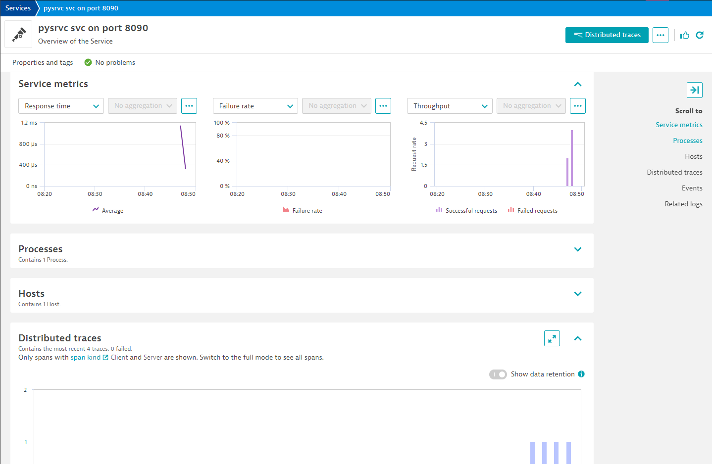
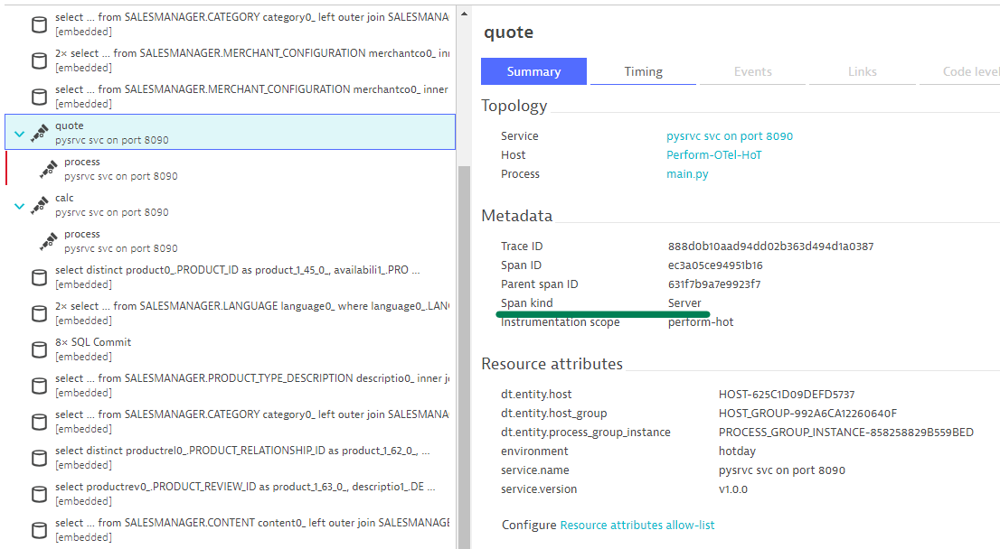
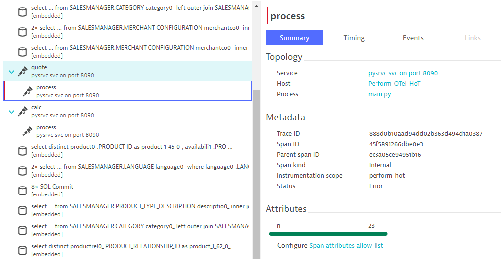
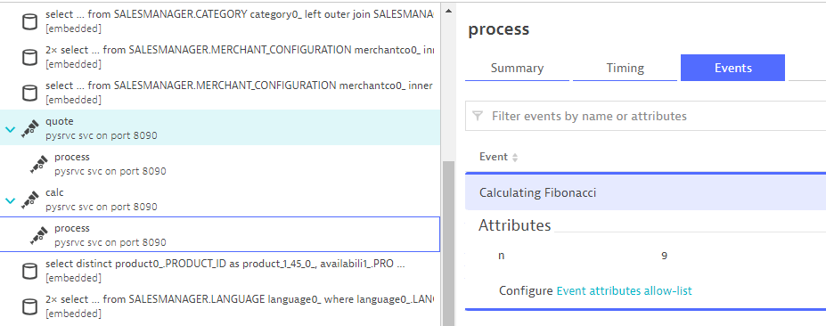
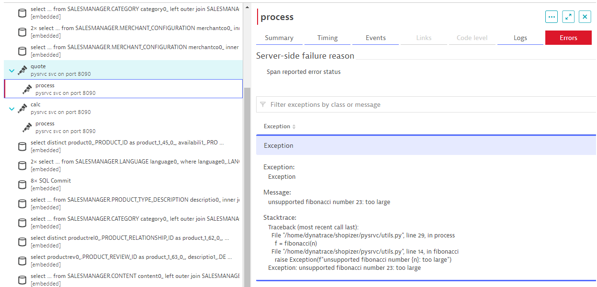

## Customizing Spans for better insights

---

### Introduction

While tracing provides us the most basic visibility into our transactions and allows to see the end-to-end picture, in most cases there will be a need to capture additional detail relevant to troubleshooting problems.

In this exercise you'll modify your previously created Spans to capture additional details.

### Key Concepts

#### Setting Span Kind

You may have noticed previously that the Service page for the Python webservice in Dynatrace is not populating all sections. That's because not all Spans are treated equally. There are several possible kinds:

* **SERVER** - span covers server-side handling of a synchronous request
* **CLIENT** - span describes a request to some remote service
* **PRODUCER** - span describes the inititor of an asynchronous request
* **CONSUMER** - span describes a child of an asynchronous request
* **INTERNAL** - (default value) representing an internal operation without remote calls

Setting a Span Kind can be done when the span is created:
```python
def my_func():
    with tracer.start_as_current_span("my-span", kind=trace.SpanKind.SERVER):
        print("This is now a SERVER span")
```

#### Adding attributes

Spans allow us to store simple custom information relevant to our troubleshooting as Attributes. If you're familiar with Dynatrace Request Attributes, OpenTelemetry's Span attributes are very similar.

To add an attribute we can use the `set_attribute` function of the Span which takes the name and value of the attribute. Before invoking it, however, we must store our span to a variable. All together it can be done like this:
```python
def my_func():
    with tracer.start_as_current_span("my-span") as span:
        span.set_attribute("name", "perform")
        span.set_attribute("year", 2023)
        print("Doing some work...")
```

#### Recording events

While attributes are great for storing simple single values, events can carry more information and mark a specific meaningful point in time.

Adding an event is done using the `add_event` function of the Span which takes the title of the event and a dictionary of key/value pairs representing the attributes of the event. Here's an example:

```python
def my_func():
    with tracer.start_as_current_span("my-span") as span:
        print("Putting together a report...")
        span.add_event(
            "Report is finished", 
            {"pages": 254, "errors": 0, "warnings": 3}
        )
```

#### Recording failures

Very often our code will be designed to handle failures and either recover or take an alternative path. However, for monitoring purposes, we want to be aware of any internal graceful failures that don't necessarily stop a transaction.

For this purpose, OpenTelemetry allows setting a status for a Span which can be `Unset`, `Ok`, or `Error`. Similar to recording events, failure details including stack traces can be recorded using the `record_exception` function which takes an `Exception` along with optional attributes.

You can see this in action in `./shopizer/pysrvc/utils.py` on lines `31-33`:

```python
...
    except Exception as e:
        span.record_exception(e)
        span.set_status(Status(StatusCode.ERROR, e))
```

### Your Tasks

1. Modify your Spans for the `/quote` and `/calc` routes and set the Span Kind as `SERVER`.
2. Modify your Span for the `/newroute` route and set the Span Kind as `CLIENT`.
3. In `utils.py`, inside the `process` function, add the variable `n` as an attribute to the span.
4. In `utils.py`, inside the `process` function, record an event called "Calculating Fibonacci" which records the `n` variable as an attribute.

Restart the application to verify any changes:
```bash
Ctrl + C
mvn spring-boot:run
```

### Verify results

From Services click on the `pysrvc on port 8090` service. Verify that the page displays three charts at the top and the spans for `/quote` route in the Distributed traces panel.



Open any of the traces and verify that for the `/qoute` and `/calc` routes, the Span Kind is set to "Server":



Finally, open the `process` span and verify that your attribute and event have been registered. You can view your event in the Events tab, and depending on the span you may also observe a failure recorded in the Errors tab.

The attribute should appear like this:



The event should appear like this:



On failed spans, you can explore the Exception details:

