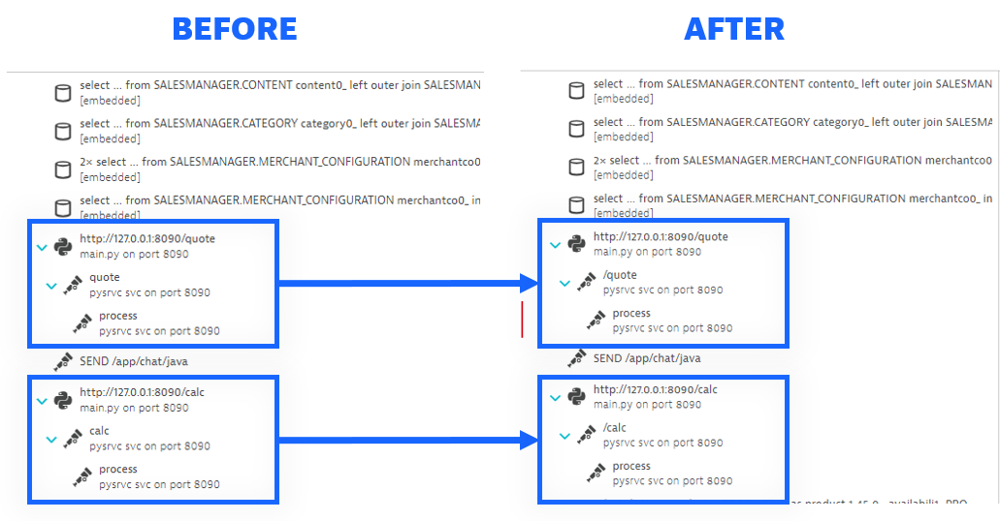

## 4. Python Auto-Instrumentation for Flask

---

### Introduction

By now you must be thinking "*Do I really need to write so much instrumentation myself?*". Luckily, the answer is "No!". Most languages and frameworks that support OpenTelemetry also come prepared with some auto-instrumentation that can take away a lot of the initial effort.

In this exercise you'll add OpenTelemetry's auto-instrumentation for Flask and remove some of the code you wrote.

### 📑 Key Concepts

<details>
  <summary><strong>What is auto-instrumentation</strong></summary>

  Auto-instrumentation is a way of adding core observability signals to a previously unmonitored system. Using common knowledge about the techonology, many frameworks come with packages/modules which are ready to automate the core interactions within.

  While saving a lot of effort, auto-instrumentation won't know about the deeper innerworkings of the system. Chances are, you'll still have to customize or create additional spans to fully observe your system.

</details>

<details>
  <summary><strong>Auto-instrumentation for Flask</strong></summary>

  Our Python webservice is based on the Flask framework. We can implement the auto-instrumentation after we created our app:

  ```python
  app = Flask("Py-Flask-App")
  FlaskInstrumentor().instrument_app(app)
  ```

  This will have the following effects:
  * Create Server Spans for all app routes
  * Automatically propagate Context for all Spans
  * Add semantic attributes to all created Spans
</details>

### 📌 Your Tasks

In <mark>./shopizer/pysrvc/main.py</mark>:
1. On line `12`: Add auto-instrumentation for the Python webservice
2. Delete or comment out (using `#`) the code you previously wrote for routes `/quote` and `/calc` (around lines `22` and `30`).
   > 💡 **Hint:** Don't forget to check and fix code indentation issues as needed

Restart the application to verify any changes:
```bash
Ctrl + C
mvn spring-boot:run
```

<details>
  <summary>Show solution</summary>

  ```python
  # Lines 11 & 12 should look like this:
  app = Flask("Py-Flask-App")
  FlaskInstrumentor().instrument_app(app)

  # The /quote and /calc routes (line 20 onwards) should look like this:
  @app.route("/quote", methods=["GET"])
  def quote():
      ot.metrics["requests_count"].add(1, {"request": "/quote"})
      process(random.randint(0, 25))
      return make_response({}, 200)

  @app.route("/calc", methods=["GET"])
  def calc():
      ot.metrics["requests_count"].add(1, {"request": "/calc"})
      process(random.randint(0, 25))
      return make_response({}, 200)
  ```
</details>

### ✅ Verify results

Open the `pysrvc svc on port 8090` service in Dynatrace and open one of the `/quote` traces from its Distributed traces view. 

Verify that spans for `/quote` and `/calc` exist:



Verify that these spans have instrumentation scope `opentelemetry.instrumentation.flask` and have attributes added already:

