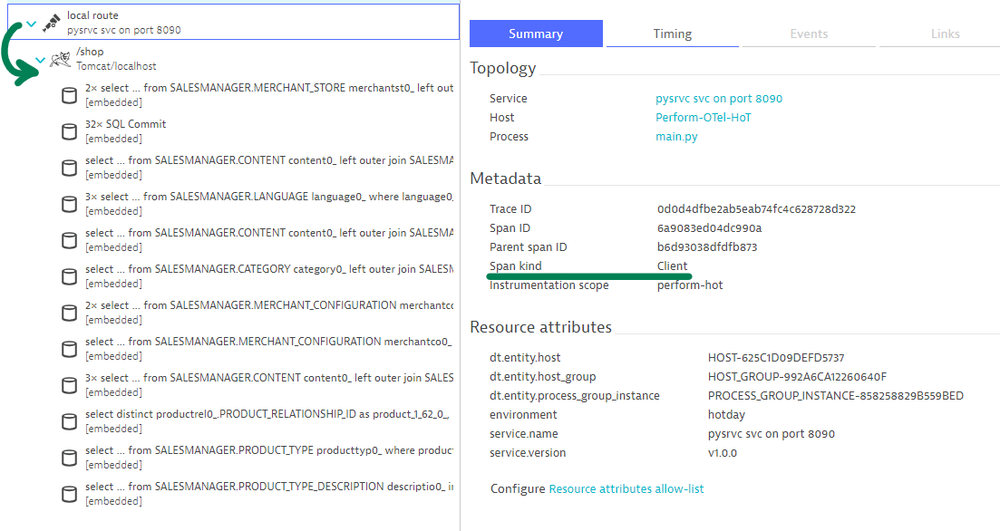

## Optional: Context injection with Python web requests

---

### Introduction

This exercise is optional, in case you have spare time and want to challenge yourself. You will have noticed that our Python webservice has a `/newroute` route which we haven't really talked about.

In this exercise you'll apply knowledge from the previous exercises and instrument `/newroute` accordingly.

Head over to `./shopizer/pysrvc/main.py`

### Your Tasks

1. Disable (by commenting with `#`) the auto-instrumentation for Python
2. Create a Span for the `/newroute` route
3. Set the Span Kind to CLIENT
4. Capture the current context and inject it into the headers of the request

Restart the application to verify any changes:
```bash
Ctrl + C
mvn spring-boot:run
```

Trigger the route from the command-line
```bash
curl http://localhost:8090/newroute
```

### Verify results

Open the `pysrvc on port 8090` service in Dynatrace and look for your `/newroute` spans in its Distributed traces panel. Open up any of these traces and verify the Span kind and most importantly the continuation of the transaction into the Java side of the application.



<details>
  <summary>See solution here</summary>
  
  ```python
    app = Flask("Py-Flask-App")
    # FlaskInstrumentor().instrument_app(app)

    @app.route("/newroute", methods=["GET"])
    def newroute():
        with ot.tracer.start_as_current_span("local route", kind=trace.SpanKind.CLIENT):
            ctx = context.get_current()
            headers = {}
            propagate.inject(headers, ctx)
            requests.get("http://localhost:8080/shop", headers=headers)
            return make_response({}, 200)
```

</details>