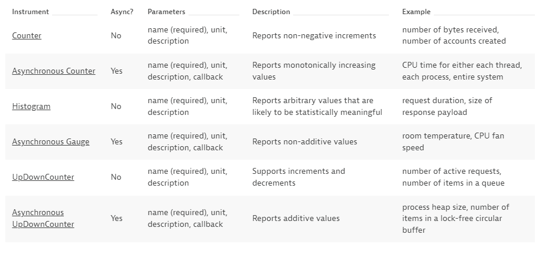
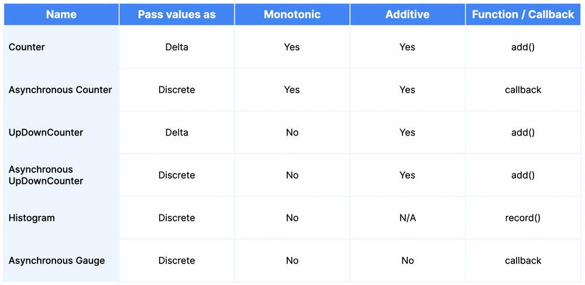
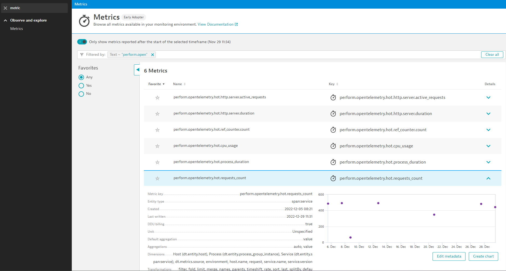

## OpenTelemetry metric definition in Python

In this section we go through OpenTelemetry Metric setup and create a new metric. 

Reference: Dynatrace documentation
- [OpenTelemetry metric concepts](https://www.dynatrace.com/support/help/shortlink/opentelemetry-metric-concepts)
- [OpenTelemetry instrument code samples](https://www.dynatrace.com/support/help/shortlink/opentelemetry-instrument-examples)

1. MeterProvider (MetricReader/Exporter) configuration
1. Instrument definition
1. Recording a measurement (sync & async)
1. Finding your metric in Dynatrace

---

### 1. Meter Provider Configuration 
#### 👂 Listen & follow in code

Navigate to the following file:

```
pysrvc/otel.py
```

We will be using the variable `ot` again which holds the configuration for our OpenTelemetry Metrics setup:

```python
ot = CustomOpenTelemetry()
```

In the `setup_exporters(self)` our configuration starts on line `74` setting up our MeterProvider with `configure_dynatrace_metrics_export`. 

```python
        # Set up metrics export
        metrics.set_meter_provider(MeterProvider(
            metric_readers=[
                configure_dynatrace_metrics_export(
                    export_dynatrace_metadata=True,
                    prefix="perform.opentelemetry.hot",
                    default_dimensions=self.resource_props
                )
            ]
        ))
```

In cases where we do not have a OneAgent on the local host we can define the endpoint (ActiveGate or Cluser) and API token like so:

```python
        # Set up metrics export to remote endpoint
        metrics.set_meter_provider(MeterProvider(
            metric_readers=[
                configure_dynatrace_metrics_export(
                    export_dynatrace_metadata=True,
                    prefix="perform.opentelemetry.hot",
                    default_dimensions=self.resource_props
                    endpoint_url=endpoint_url,
                    api_token=api_token)
            ]))
```

Finally, we create an empty dictonary on line `26` which will end up holding our instruments that will be referenced through `ot` to populate measurements:

```python
    self.metrics = {}
```
---
### 2. Meter & Instrument Creation 
#### 👂 Listen & follow in code
The Meter can create the following Instrument types:



On line `28` we create a Meter instance in the variable `meter` using `metrics` (our MeterProvider):

```python
        self.meter = metrics.get_meter("perform-hot")
```

Using `meter` we create an instrument of type observable (async) guage on line `29`:

```python
        self.meter.create_observable_gauge(
            callbacks=[get_cpu_usage],
            name="cpu_usage",
            description="CPU Usage per processor, as percentage",
            unit="1"
        )
```

 On line `35` we call the function `create_counter_instrument` to create our Counter instrument:

```python
        self.create_counter_instrument(
            "requests_count",
            "Counts the number of requests to the service"
        )
```

Taking us to line `85` for the actual creation of the instrument:

```python
    def create_counter_instrument(self, name: str, description: str):
        self.metrics[name] = self.meter.create_counter(
            name=name, 
            description=description, 
            unit="1"
        )
```

### 📌 Task

**Your Task:** Create a histogram instrument

**2.1** In the file `pysrvc/otel.py` create a function called `create_histogram_instrument` on line `92` which is used to define our instrument:

The function will take 4 inputs:
- `self`
- `name: str`
- `description: str`
- `unit: str`
  - Use `.create_histogram` to create a histogram instrument

>💡 **Hint**
>
>Copy the `create_counter_instrument` on line `85` as a starting point and modify it for your histogram instrument:
>
>```python
>    def create_counter_instrument(self, name: str, description: str):
>        self.metrics[name] = self.meter.create_counter(
>            name=name, 
>            description=description, 
>            unit="1"
>        )
>```

<details>
  <summary>Expand for Solution</summary>
  
  ```python
  def create_histogram_instrument(self, name: str, description: str, unit: str):
    self.metrics[name] = self.meter.create_histogram(
    name=name,
    description=description,
    unit=unit
  )
  ```
</details>

**2.2** Create a call to the `create_histogram_instrument` function on line `39` passing the following parameters:
- `"process_duration"`
- `"Duration of Fibonacci calculation, in milliseconds"`
- `"ms"`

>💡 **Hint**
>
>Copy the `self.create_counter_instrument` on line `35` as a starting point and modify it for your histogram instrument:
>
>```python
>        self.create_counter_instrument(
>            "requests_count",
>            "Counts the number of requests to the service"
>        )
>```

<details>
  <summary>Expand for Solution</summary>
  
  ```python
        self.create_histogram_instrument(
            "process_duration",
            "Duration of Fibonacci calculation, in milliseconds",
            "ms"
        )
  ```
</details>

---

### 3. Passing measurements to Instruments 
#### 👂 Listen & follow in code
Depending on the instrument type there are different functions used for populating measurements:



On line `15` we can see our callback function for our observable (async) gauge `cpu_usage`:

```python
        def get_cpu_usage(_: CallbackOptions):
            for (number, percent) in enumerate(psutil.cpu_percent(percpu=True)):
                attributes = {"cpu_number": str(number)}
                yield Observation(percent, attributes)
```

To see how our Counter is populated navigate too:

```
pysrvc/main.py
```
On line `21` in the `quote` function we use `ot` to pass a measurement to the `request_count` counter instrument:

```python
def quote():
    with ot.tracer.start_as_current_span("quote") as span:
        ot.metrics["requests_count"].add(1, {"request": "/quote"})
        process(random.randint(0, 25))
        return make_response({}, 200)
```

And we pass another measurmenet in `calc` function on line `29` but with a different attribute value:

```python
def calc():
    ot.metrics["requests_count"].add(1, {"request": "/calc"})
    process(random.randint(0, 25))
    return make_response({}, 200)
```

### 📌 Task

**Your Task:** Send a measurment to your histogram instrument

Open `pysrvc/utils.py` and between line `29-30` add a line to populate your measurment for the histogram passing the variable `duration` as the metric and add an attribute with the key `"number"` and variable `n` as the value. 
- change the dictionary reference to the name of the new histogram instrument `"process_duration"`

>💡 **Hint**
>
>Copy the line `23` in `pysrvc/main.py` as a starting point and modify it for your histogram instrument and remember that `.record` is used to pass a measuremnt to a histomgram instrument type:
>
>```python
>    ot.metrics["requests_count"].add(1, {"request": "/quote"})
>```
>

<details>
  <summary>Expand for Solution</summary>
  
  ```python
  ot.metrics["process_duration"].record(duration, {"number": n})
  ```
</details>

Once completed restart your applicaiton:

```
Ctrl+C
mvn spring-boot:run
```

<details>
  <summary>My webserver won't start</summary>
  
  Run the following to kill any remaining processes on port 8080:
  ```
  $ sudo kill -9 `sudo lsof -t -i:8080`
  ```
  Then attempt to start the app again:
  ```
  mvn spring-boot:run
  ```
</details>

---

### 5. Finding the measurments in Dynatrace
#### 👂 Listen & follow in Dynatrace

Navigate in your Dynatrace client to the Metrics Explorer and type in `perform.opentelemetry` to see the metrics populating in Dynatrace:



You might have also noticed that there are two addtional metrics showing up as well; these are created automatically by the Flask automatic instrumentation: 

```
perform.opentelemetry.hot.http.server.active_requests
perform.opentelemetry.hot.http.server.duration
```
---

### Summary

To summarize what we've done:
- We configured our MeterProvider to use the Dynatrace Metric Exporter
- We created a Meter instance and used that to create our Insturments
- We created a Histogram instrument tyep
- We populated measurments in our Instruments using `ot` in our applicaiton code

```java
+------------------+
| MeterProvider    |                 +-----------------+             +--------------+
|   Meter A        | Measurements... |                 | Metrics...  |              |
|     Instrument X +-----------------> In-memory state +-------------> MetricReader |
|     Instrument Y |                 |                 |             |              |
|   Meter B        |                 +-----------------+             +--------------+
|     Instrument Z |
|     ...          |                 +-----------------+             +--------------+
|     ...          | Measurements... |                 | Metrics...  |              |
|     ...          +-----------------> In-memory state +-------------> MetricReader |
|     ...          |                 |                 |             |              |
|     ...          |                 +-----------------+             +--------------+
+------------------+
```

