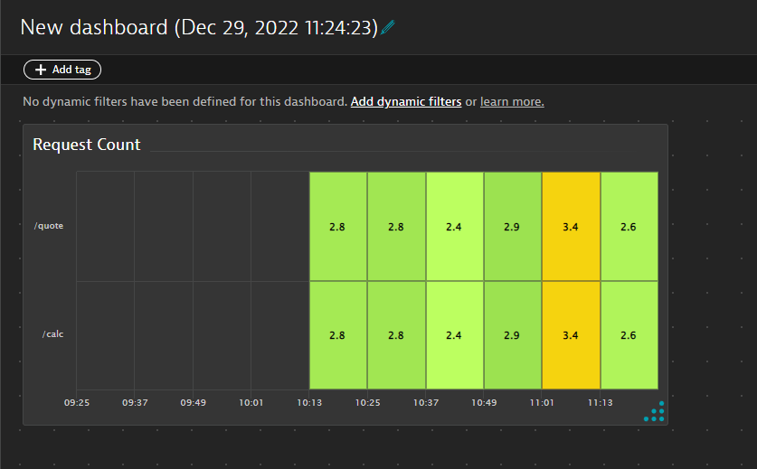
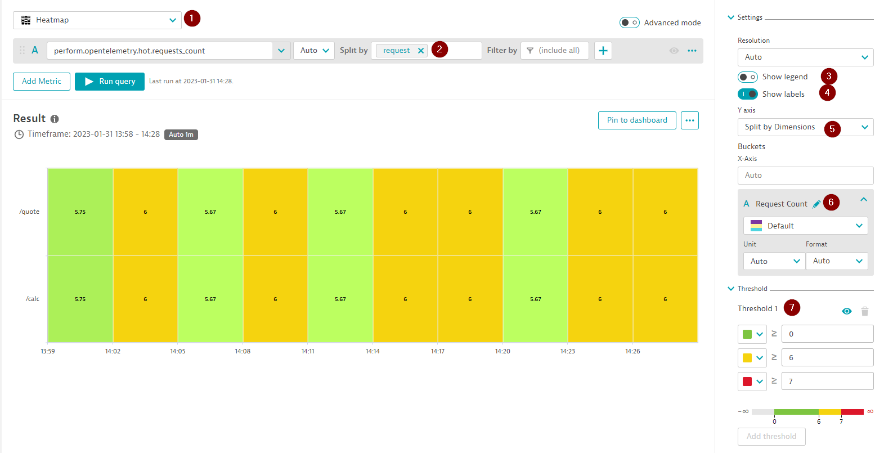
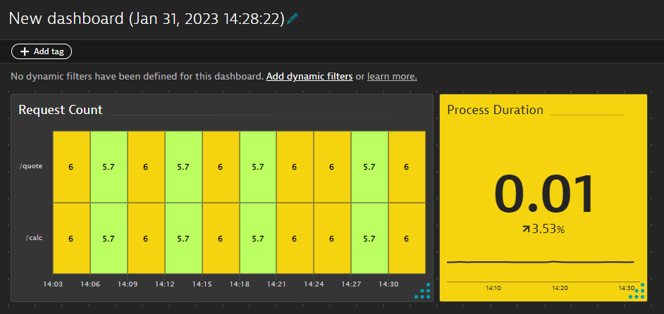
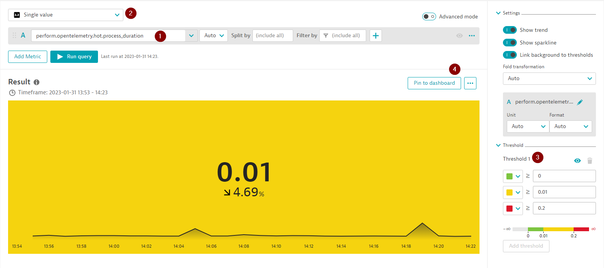
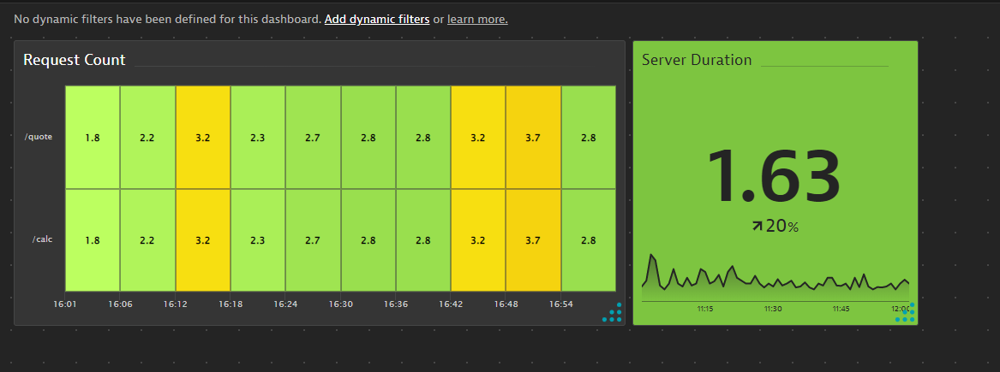

## Metric Browser & Dashboards

In this section we create a dashboard using our OpenTelemetry metrics. 

1. Explore metrics in Dynatrace
1. Create a heatmap and pin to a dashboard
1. Create a single value tile and pin to dashboard

---

## Dashboarding

#### 📌 Follow along

Navigate to the metric brower and search for the text `perform.opentelemetry`. Expand `perform.opentelemetry.hot.requests_count` and click `Create chart` to open the data explorer


Let's create a heatmap with the following settings:
1. Select `Heatmap` chart type
1. Split by Dimension `request`
1. Show legend `off`
1. Show Labels `on`
1. Y axis: `Split by Dimensions`
1. Rename our metric to `CPU Usage`
1. Set the threshold as:
   - Green > 0
   - Yellow > 2
   - Red > 3
1. Pin the tile with the title `Request Count` to a new dashboard:



<details>
  <summary>Solution</summary>
  
  

</details>

---

### 📌 Task

**Your Task:** Add a Single Value tile to the new dashboard

1. Select the `perform.opentelemetry.hot.http.server.duration` metric
1. Choose `Single value` as the chart type
1. Set your thresholds as:
   * Green > 0
   * Yellow > 2
   * Red > 3 
1. Pin to the same dashboard with the title `Server Duration`



<details>
  <summary>Solution</summary>
  
  

</details>

---

### 📌 Bonus Task

<details>
  <summary>Expand should you choose to accept...</summary>

Add another tile, a Honeycomb, with the metric `perform.opentelemetry.hot.cpu_usage` showing the labels and setting thresholds. Rename the metric to `CPU Usage` and pin this to the dashboard with the title `CPU Usage` and rename the dashboard to `Python App Overview`. 

Your dashboard should look similar to this:



</details>

---

<details>
    <summary><b>Dashboard JSON</b></summary>
    
```json
{
  "metadata": {
    "configurationVersions": [
      6
    ],
    "clusterVersion": "1.257.164.20221230-102519"
  },
  "id": "581ce315-9bb6-4442-8836-4b48179bebfc",
  "dashboardMetadata": {
    "name": "Python App Overview",
    "shared": false,
    "popularity": 3,
    "hasConsistentColors": false
  },
  "tiles": [
    {
      "name": "Request Count",
      "tileType": "DATA_EXPLORER",
      "configured": true,
      "bounds": {
        "top": 0,
        "left": 0,
        "width": 722,
        "height": 342
      },
      "tileFilter": {},
      "customName": "Data explorer results",
      "queries": [
        {
          "id": "A",
          "metric": "perform.opentelemetry.hot.requests_count",
          "timeAggregation": "DEFAULT",
          "splitBy": [
            "request"
          ],
          "enabled": true
        }
      ],
      "visualConfig": {
        "type": "HEATMAP",
        "global": {
          "hideLegend": true
        },
        "rules": [
          {
            "matcher": "A:",
            "unitTransform": "auto",
            "valueFormat": "auto",
            "properties": {
              "color": "PURPLE",
              "seriesType": "LINE"
            },
            "seriesOverrides": []
          }
        ],
        "axes": {
          "xAxis": {
            "visible": true
          },
          "yAxes": []
        },
        "heatmapSettings": {
          "yAxis": "DIMENSIONS",
          "showLabels": true
        },
        "thresholds": [
          {
            "axisTarget": "LEFT",
            "rules": [
              {
                "value": 0,
                "color": "#7dc540"
              },
              {
                "value": 3,
                "color": "#f5d30f"
              },
              {
                "value": 5,
                "color": "#dc172a"
              }
            ],
            "queryId": "",
            "visible": true
          }
        ],
        "tableSettings": {
          "isThresholdBackgroundAppliedToCell": false
        },
        "graphChartSettings": {
          "connectNulls": false
        },
        "honeycombSettings": {
          "showHive": true,
          "showLegend": true,
          "showLabels": false
        }
      },
      "queriesSettings": {
        "resolution": ""
      },
      "metricExpressions": [
        "resolution=null&(perform.opentelemetry.hot.requests_count:splitBy(request):sort(value(auto,descending)):limit(20)):limit(100):names"
      ]
    },
    {
      "name": "Server Duration",
      "tileType": "DATA_EXPLORER",
      "configured": true,
      "bounds": {
        "top": 0,
        "left": 722,
        "width": 342,
        "height": 342
      },
      "tileFilter": {},
      "customName": "Data explorer results",
      "queries": [
        {
          "id": "A",
          "metric": "perform.opentelemetry.hot.http.server.duration",
          "timeAggregation": "DEFAULT",
          "splitBy": [],
          "enabled": true
        }
      ],
      "visualConfig": {
        "type": "SINGLE_VALUE",
        "global": {
          "hideLegend": false
        },
        "rules": [
          {
            "matcher": "A:",
            "properties": {
              "color": "DEFAULT"
            },
            "seriesOverrides": []
          }
        ],
        "axes": {
          "xAxis": {
            "visible": true
          },
          "yAxes": []
        },
        "heatmapSettings": {
          "yAxis": "VALUE",
          "showLabels": false
        },
        "singleValueSettings": {
          "showTrend": true,
          "showSparkLine": true,
          "linkTileColorToThreshold": true
        },
        "thresholds": [
          {
            "axisTarget": "LEFT",
            "rules": [
              {
                "value": 0,
                "color": "#7dc540"
              },
              {
                "value": 2,
                "color": "#f5d30f"
              },
              {
                "value": 3,
                "color": "#dc172a"
              }
            ],
            "queryId": "",
            "visible": true
          }
        ],
        "tableSettings": {
          "isThresholdBackgroundAppliedToCell": false
        },
        "graphChartSettings": {
          "connectNulls": false
        },
        "honeycombSettings": {
          "showHive": true,
          "showLegend": true,
          "showLabels": false
        }
      },
      "queriesSettings": {
        "resolution": ""
      },
      "metricExpressions": [
        "resolution=Inf&(perform.opentelemetry.hot.http.server.duration:splitBy():sort(value(auto,descending)):limit(20)):limit(100):names",
        "resolution=null&(perform.opentelemetry.hot.http.server.duration:splitBy():sort(value(auto,descending)):limit(20))"
      ]
    },
    {
      "name": "CPU Usage",
      "tileType": "DATA_EXPLORER",
      "configured": true,
      "bounds": {
        "top": 0,
        "left": 1064,
        "width": 304,
        "height": 304
      },
      "tileFilter": {},
      "customName": "Data explorer results",
      "queries": [
        {
          "id": "A",
          "metric": "perform.opentelemetry.hot.cpu_usage",
          "timeAggregation": "DEFAULT",
          "splitBy": [],
          "enabled": true
        }
      ],
      "visualConfig": {
        "type": "HONEYCOMB",
        "global": {
          "hideLegend": false
        },
        "rules": [
          {
            "matcher": "A:",
            "unitTransform": "auto",
            "valueFormat": "auto",
            "properties": {
              "color": "DEFAULT",
              "seriesType": "LINE",
              "alias": "CPU Usage"
            },
            "seriesOverrides": []
          }
        ],
        "axes": {
          "xAxis": {
            "displayName": "",
            "visible": true
          },
          "yAxes": []
        },
        "heatmapSettings": {
          "yAxis": "VALUE"
        },
        "thresholds": [
          {
            "axisTarget": "LEFT",
            "rules": [
              {
                "value": 0,
                "color": "#7dc540"
              },
              {
                "value": 90,
                "color": "#f5d30f"
              },
              {
                "value": 95,
                "color": "#dc172a"
              }
            ],
            "queryId": "",
            "visible": true
          }
        ],
        "tableSettings": {
          "isThresholdBackgroundAppliedToCell": false
        },
        "graphChartSettings": {
          "connectNulls": false
        },
        "honeycombSettings": {
          "showHive": true,
          "showLegend": true,
          "showLabels": true
        }
      },
      "queriesSettings": {
        "resolution": ""
      },
      "metricExpressions": [
        "resolution=Inf&(perform.opentelemetry.hot.cpu_usage:splitBy():sort(value(auto,descending)):limit(20)):names"
      ]
    }
  ]
}
```

</details>