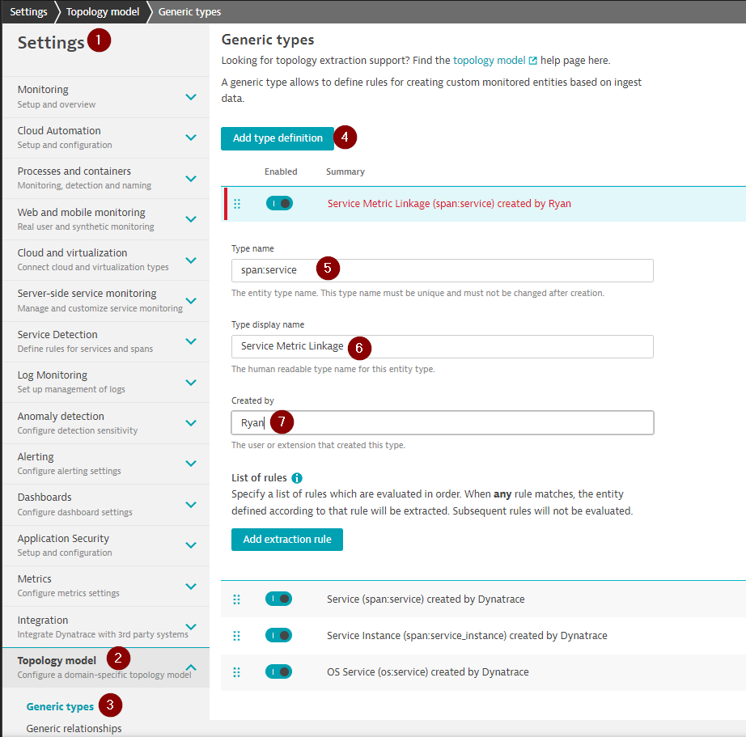
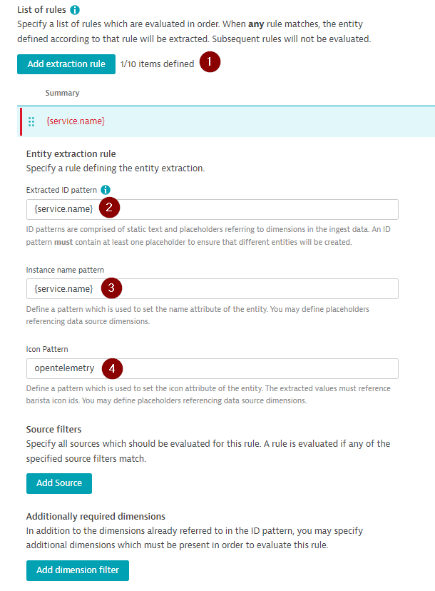
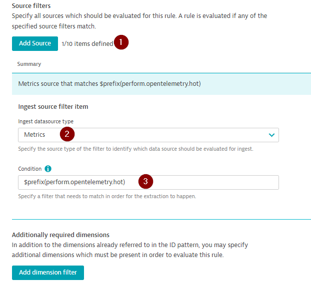
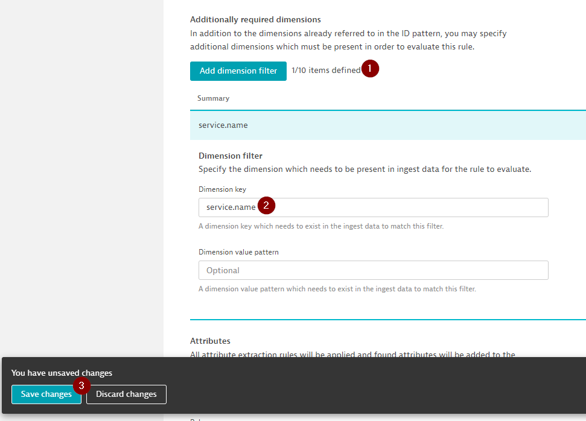
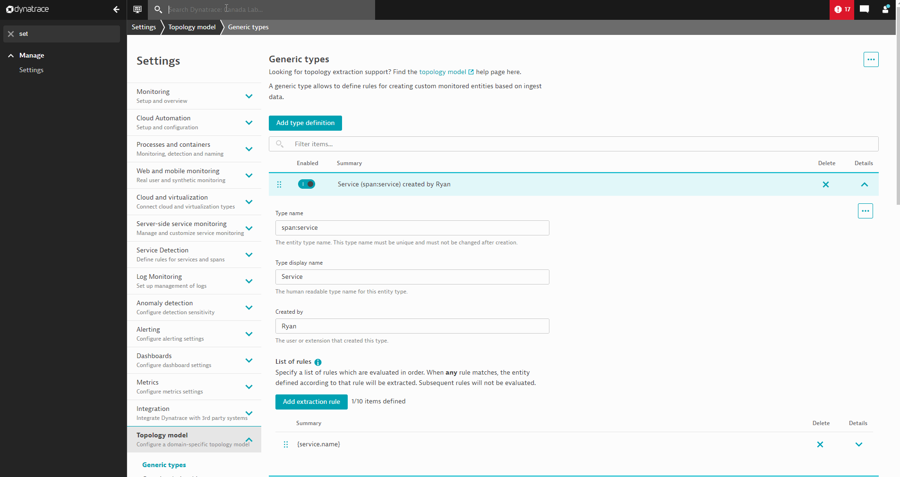
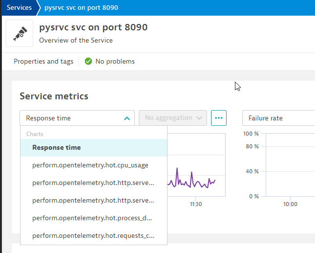

## Connecting metrics to Topology

Here we explore how to connect our metrics to the Dynatrace Topology. 

1. Create a rule to expand the Dyantrace topology
1. Find metrics in the Unified Analysis Screen of our python service

---

## Linking metrics to the Dynatrace Topology

#### 📌 Follow along

#### 1.  Go to `Settings >  Toplogy model > Generic types > Add type definition` and start by completeing the following feilds and click on `Add extraction rule`:

| Field | Value |
| ------ | ------------- |
| Type name | `span:service`  |
| Type display name | `Service Metric Linkage` |
| Created by | _Your Name_ | 

   

#### 2. Fill out the following fields and click on `Add Source`:

| Field | Value |
| ------ | ------------- |
| Extracted ID pattern | `{service.name}`  |
| Instance name pattern | `{service.name}` |
| Icon Pattern | `opentelemetry` | 

   

#### 3. Fill out the following values and click on `Add dimensions filter`

| Field | Value |
| ------ | ------------- |
| Ingest datasource type | `Metrics`  |
| Condition | `$prefix(perform.opentelemetry.hot)` |

   

#### 4. Finally, fill out the following values and click on `Save Changes`:

| Field | Value |
| ------ | ------------- |
| Dimension key | `service.name`  |
| Dimension value pattern | _Leave Blank_ |

   

---

## Unified Analysis Screen

#### 👂 Listen & follow in Dynatrace

Now that we have our topology we can navigate to the Service screen for our python service to see the result

In the top search bar type in `pysrvc svc on port 8090` to navigate to the service screen:

Under the Service Metrics if we drop down the menu we can see our OpenTelemetry metrics showing up:

This completes connecting our OpenTelemetry metrics to our Python Service in the Dynatrace topology! 