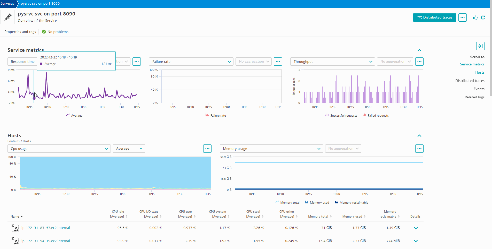
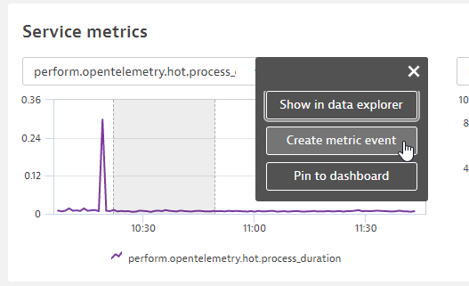
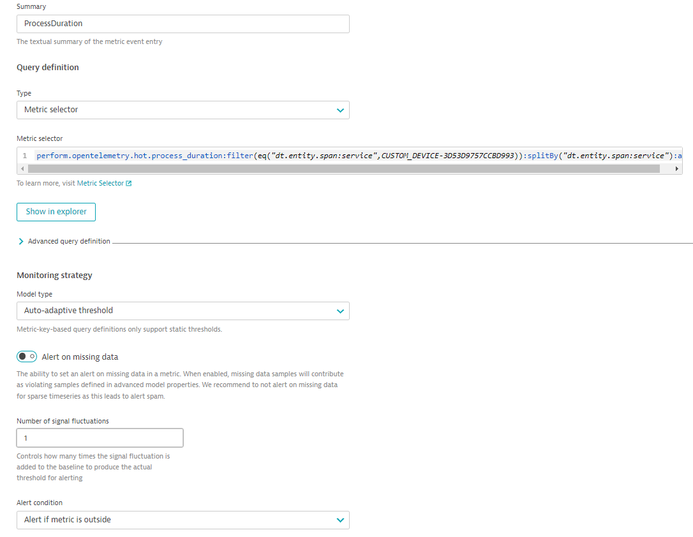
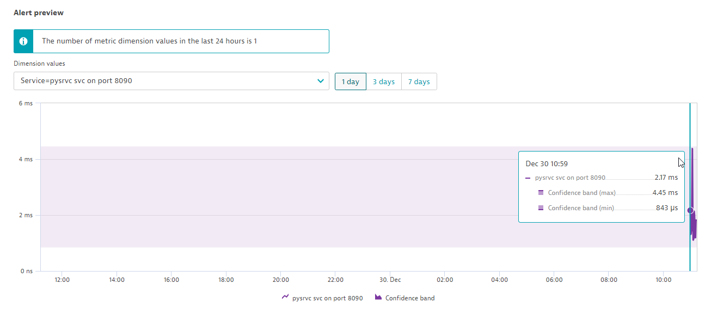
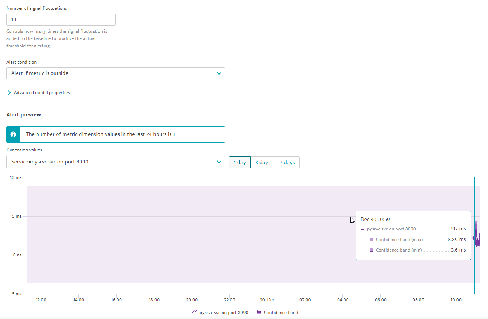
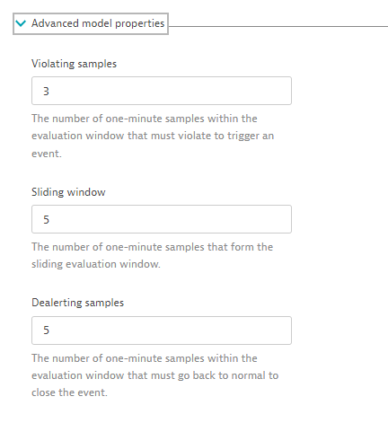
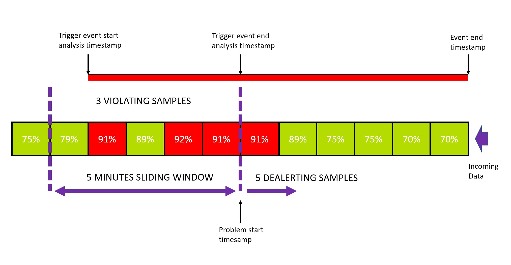

## Creating alerts in Dynatrace

Here we look at ad-hock anlysis of metrics connected to our python service and creating alerts on our metrics. 

1. Trigger Davis Exploritory Analysis
1. Create alerts using auto-adaptive and seasonal baselines 

---

## Davis Exploritory Analysis

#### 👂 Listen (follow along if you like)

Quickly identify observability signals relevant to any signal behavior (for example, a spike on a chart) that you want to investigate. Now that our metrics are connected to the topology they can be included in this anlysis. 

Highlight an area in the unified anlysis screen until Anlyze is a teal color. Click Anlyze to trigger the anlysis:

> 📝 **Note**: 
>- The quality of the results significantly improves when you select a phenomenon correctly.
>- For a spike analysis, a rule of thumb is that the spike itself should cover a third of the reference time series, with one third before and one third after the spike.

---

## Metric Events (Alerting)

#### 👂 Listen (follow along if you like)

Lets create an Auto Adaptive baseline metric event for the `perform.opentelemetry.hot.process_duration` metric. 

Select the metric from the drop down and click the elipse `...` next to the metric and select `Create metric event`:

Set the following:

| Field | Value |
| ------ | ------------- |
| Summary | `ProcessDuration`  |

The `Metric selector` is pre-populated for us since we navigated from the Service screen. 

Set the following in the `Monitoring strategy` section:

| Field | Value |
| ------ | ------------- |
| Model Type | `Auto-adaptive threshold`  |
| Number of signal fluctuations | `1` |
| Alert condition | `Alert if metric is outside` | 

In the `Alert preview` select `Service=pysrvc svc on port 8090` as the Dimension Value to get the alert preview:

By changing the `Number of signal fluctions` to 10 to see how this changes the upper limit - and therefore the senesitivity - of our alert:

You can also adjust the sensitivity by modifiying the number of violating samples within a timeframe to trigger/close the alert - you can see this under `Advanced model properties: 

Here is a good visualization of how this works:

Complete the metric event setup by giving it a Title and optionally set the Event type to be indicitive of the alert being raised and click `Save Changes`.

