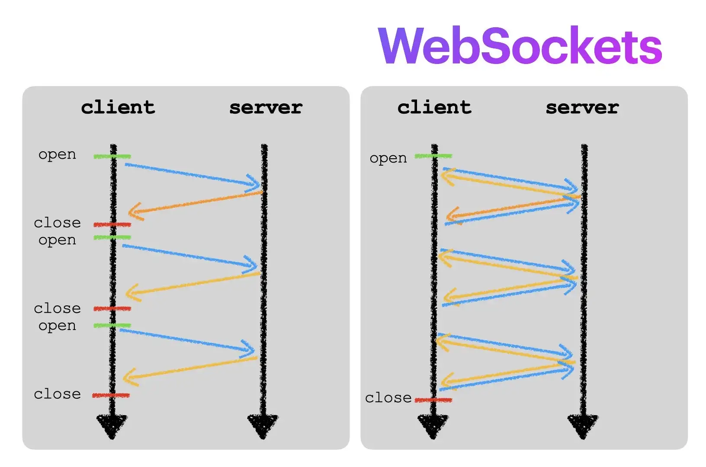
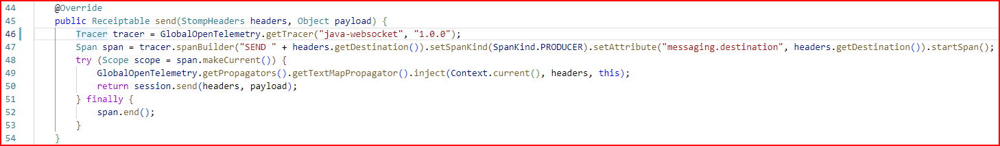
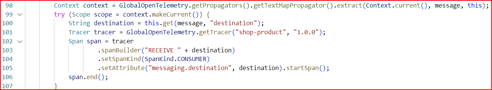
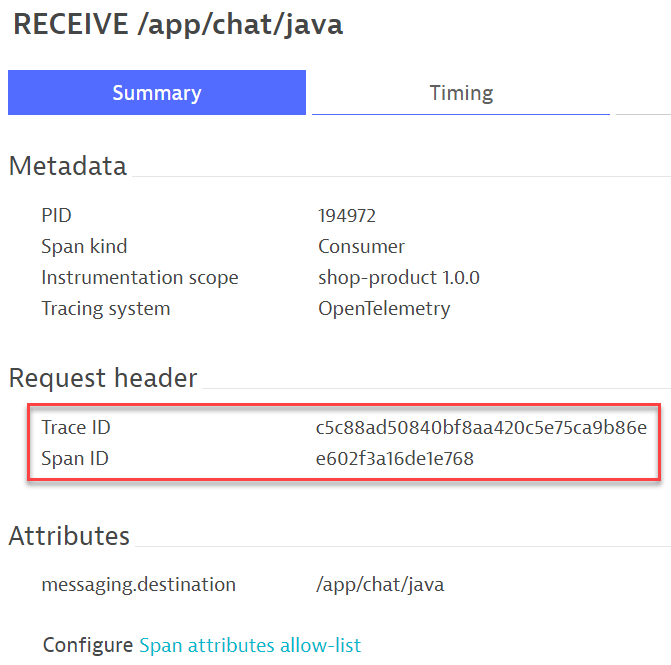

## Linking 2 Java services together

In this section, a Websocket client-server application writen in Java now needs to be added to our Shopizer e-commerce application.

The developers decided that <mark>**ShopProductController.java** </mark> class in the e-commerce application will be making a call to the websocket server to exchange some information. Here is an illustration of how ShopProductController service communicates with the websocket service.



The websocket client-server classees have already been instrumented using OpenTelemetry by the developer as they are the ones who decide what signals they require for diagnostics. We do not need to worry about the instrumentation.

The challenge is to ensure that the distributed traces from ShopProductController service are linked to the spans of the websocket service.

Let's take a look at the distributed traces captured in Dynatrace. Here we are using the OneAgent Java auto-instrumentation capabilites combined with OpenTelemetry. All OpenTelemetry spans are captured by the OneAgent and linked with the Dynatrace PurePaths to show a full distributed trace.

### View distributed traces for websocket "client" service

As the OneAgent is capturing the spans automatically from the instrumented websocket "client", we can find the websocket client spans as part of a PurePath easily. In the **Dynatrace menu > distributed traces** screen, seach for the the transaction <mark>**product** </mark>.


Pick any distributed traces in this filtered list. All these traces are generated from the ***ShopProductController*** class. You can see that the websocket SEND span appears between the Python calls.


### View distributed traces for websocket "server" service

Return to the `distributed traces` screen. Ensure that all seach filters have been cleared. 

You will notice that there is a "standalone" span called <mark>**RECEIVE /app/chat/java**</mark> that is not connected to any traces.


Let's take a closer look at the meta-data of the span.


As we are using the OneAgent to handle the OpenTelemetry spans in Java, the OneAgent automatically recognizes the OpenTelemetry API as well. This is evident if you look at the **code** tab.


### Trace context propagation to link spans across 2 separate services

We learnt about ***trace context propagation*** in the previous sections. The same concept is applied here to link the 2 services.

#### Java code for websocket "client" service

Open <mark>**TaggingStompSession.java**</mark> file in the folder

```
sm-shop/src/main/java/com/salesmanager/shop/store/controller/product/
```



**Line 46** to **Line 53** in the ***send*** method is the OpenTelemetry instrumentation code.

Observe that the developer has also coded the trace context propagation on **Line 49**

#### Java code for websocket "server" service

Open <mark>**WebSocketConfig.java**</mark> in the same folder as above. For reference, the filder is

```
sm-shop/src/main/java/com/salesmanager/shop/store/controller/product/
```



**Line 98** to **Line 106** in the ***Message*** method is the OpenTelemetry instrumentation code.

Observe that the developer has also coded the trace context propagation on **Line 98**

If both the SEND and RECEIVE methods have the trace context propagation code in place, why is Dynatrace not linking the 2 services?

Let's look at the meta-data of the RECEIVE span again



It turns out that the OneAgent automatically generates a new trace ID as the OneAgent has no knowledge of the caller service or java method, so it assumes that this OpenTelemetry span is the "***originator***".

This is a common scenario when a mix of OneAgent and OpenTelemetry is used. Unless the OneAgent is able to automatically instrument the ***calling method***, otherwise, the spans will never be linked. To resolve this, we could find out which code to manually instrument via OpenTelemetry, but to save ourselves that effort, product itself has a setting to assist help in such configurations without the need to write complicated code.

All we need to do now is to tell Dynatrace in **Span context propagation** settings, that if it recognizes a certain SpanKind, attribute, scope etc., propagate the span context so that the traces can be connected. More details can be found in the Dynatrace online documenation [Span context propagation](https://www.dynatrace.com/support/help/shortlink/span-settings#span-context-propagation)

### 📌 Task

Configure Dynatrace to allow for trace context propagation.

1. Navigate to **Settings > Server-side service monitoring**.
1. Expand it and select  **Span context propagation**.
1. Click on <mark>**Add item** </mark> button.
1. Give a name to the rule.
1. Under the ***Matches*** header, click on <mark>**Add item** </mark> button.


Configure the **match** ruleset using the following:
- Source: <mark>**Spand Kind**</mark>
- Value: <mark>**Producer**</mark>


💡 **Important:** Remember to click on <mark>**Save changes** </mark>.

The final configuration screen should look like this:


### Result

Once the configuration is complete, wait a few minutes and choose one of the distributed traces belonging to ***/product/***.

You will see that the SEND span is now connected to the RECEIVE span.


### Summary

Configuring trace context propagation can be done via the Dynatrace UI if we are using the OneAgent to receive OpenTelemetry spans.