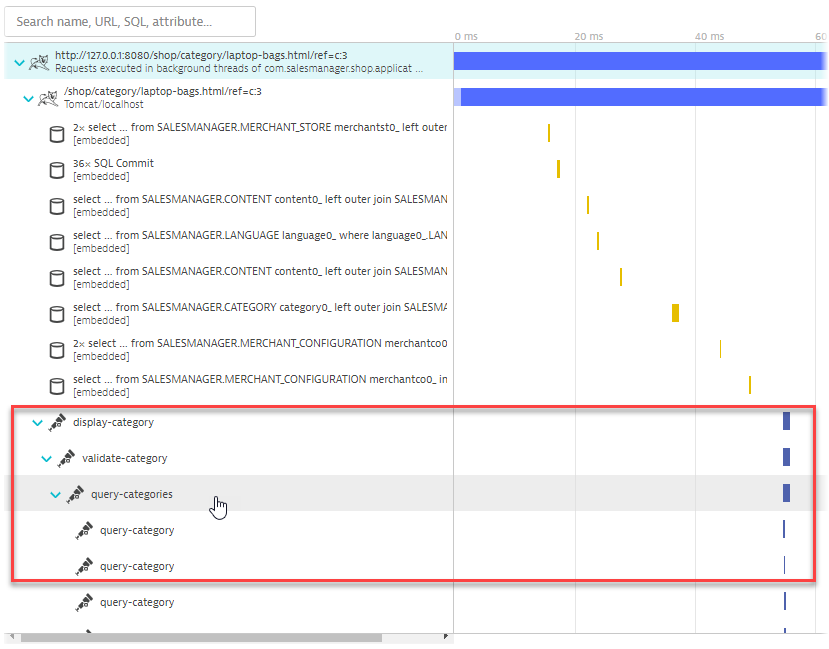
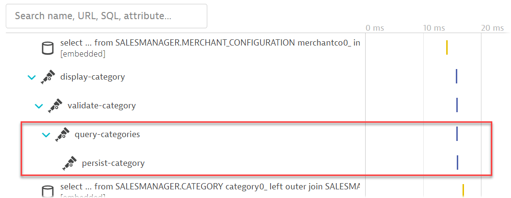

## Bonus - Control span capturing without writing code

In this section, we will explore using Dynatrace to control the amount of spans it receives without touching the Java code. This applies only if the OneAgent is used to collect the OpenTelemetry spans.

### Viewing the distributed traces in Dynatrace

Let's investigate the transactions related to <mark>**category** </mark>. Go to **Dynatrace menu > distributed traces**, seach for the the transaction <mark>**category** </mark>.

Click on any one of the traces. The application we are working with is already augmented with OpenTelemetry. The developer has chosen to signal to monitoring solutions which portions of the application code are of importance.

In this specific case the developer might have been a bit too overzealous. The Span <mark>**query-category** </mark> is visible countless times within the PurePath.

You might only need to track the span of `query-categories` from an operations perspective, rather than all the interations of each `query-category`.

You can use the Dynatrace UI to configure what spans you need without having to write code.

### 📌 Task

**Your Task:** Use the Dynatrace UI to exclude the span named <mark>**query-category** </mark>.

1. Navigate to **Settings > Server-side service monitoring > Span capturing**, click on <mark>**Add item** </mark>.

2. Fill in the rule name, and set the rule action to <mark>**Ignore** </mark>. Click on <mark>**Add item** </mark> under the ***Matches*** header.

3. Copy and paste <mark>**query-category** </mark> in the ***Value*** field. In our case it's sufficient enough to specify the span name that should be excluded. But you'll notice that the configuration allows for much more specific exclusion rules.

4. 💡 **Important!** Don't forget to click on <mark>**Save changes** </mark>!

Once everything is in order, you should have the following configured

### Result

After effecting the configuration, you do not need to restart the application. Wait for a few minutes and access the distributed traces in Dynatrace again. Select one of the newest <mark>**category** </mark> traces.

The new distributed traces will look like this:

### Summary

You can exclude control how much spans is visiable in Dynatrace without having to touch the code.