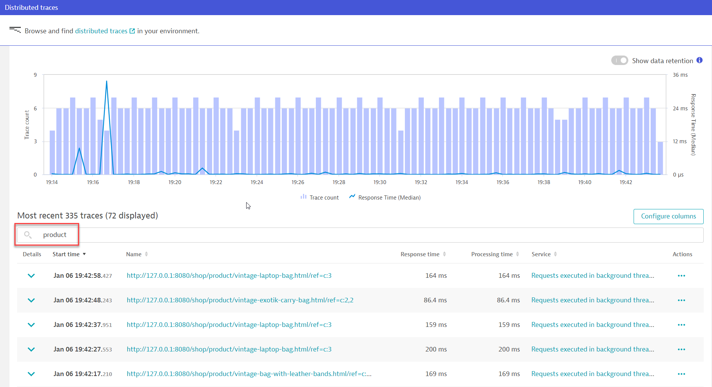

## Bonus - Augmenting auto-instrumented code using OpenTelemetry

In this section, we are going to explore a section of the code in <mark>**ShopProductController.java**</mark> and use OpenTelemetry to enhance/augment the auto-instrumented code.

### Viewing the code shopizer application code

First, let us open the shopizer application's code in the <mark>**ShopProductController.java** </mark> in the folder below.

```
sm-shop/src/main/java/com/salesmanager/shop/store/controller/product/
```

**Line 118** in the ***handleQuote*** method is the code that initiates the MessageCLientRunner Java object, which in turn is designed with StompMessage Java codes to handle sending messages to the WebSocket server.

```java
MessageClientRunner.getSession().send("/app/chat/java", new ClientMessage(USER_ID, reference));
```

### Viewing the websocket SEND spans in Dynatrace

As the OneAgent is capturing the spans automatically, we can see the spans as part of a PurePath easily. Recall that we were inspecting these distributed traces eariler in the Java Trace Context Propagation section.

As a refresher, here is how to access these traces. In the **Dynatrace menu > distributed traces** screen, seach for the the transaction <mark>**product** </mark>.



Pick any distributed traces in this filtered list. All these traces are generated from the ***ShopProductController*** class. You can see that the websocket SEND span appears between the Python calls.


However, is it not easy to see which method in the ***ShopProductController*** class is making the call to send messages to the websocket server... We can use OpenTelemetry in combination with the auto-instrumented spans to further enhance the representation of the spans in Dynatrace.

> 💡 **HINT**
>
> Typical steps to instrument Java applications with Open Telemetery
>
> 1. Add dependencies to your project
> 1. Import the claases
> 1. Acquiring a Tracer
> 1. Create spans
> 1. Configure context propagation (optional)

Reference: Dynatrace documentation [Manually instrument Java applications with OpenTelemetry](https://www.dynatrace.com/support/help/extend-dynatrace/opentelemetry/opentelemetry-traces/opentelemetry-ingest/opent-java)

### 📌 Task

**Your Task:** Augment the auto-instrumented ***ShopProductController*** class with OpenTelemetry to "enrich" the distributed traces with more information.

We will use <mark>**ShopProductController.java** </mark> file. The tracer has been already pre-setup. All you need to do is to create the spans.

💡 **HINT**
- You can use the code in ***sm-shop/src/main/java/com/salesmanager/shop/store/controller/category/ShoppingCategoryController.java*** as a reference.
- <mark>Line **118** </mark> is the code that you will need to add the OpenTelemetry spans.

As you are making changes to the Java code, you will have to "recompile" the application.

Restart the application to verify any changes:

```bash
Ctrl + C
mvn spring-boot:run
```

### Result

Once you have successfully instrumented the Java code, your distributed traces should look like this.


And if were to investigate the `java-handleQuote` span, notice how Dynatrace handles the parent and child spans nicely without you having the manually code it in OpenTelemetry.


### Summary

You can augment the OneAgent instrumented code using OpenTelemetry. This helps to provide extra context to the distributed traces.

<details>
  <summary>Expand for solution</summary>
  
  ```java
  Span span = getTracer().spanBuilder("java-handleQuote").startSpan();
	try (Scope scope = span.makeCurrent()) {
		MessageClientRunner.getSession().send("/app/chat/java", new ClientMessage(USER_ID, reference));					
	} finally {
		span.end();
  }
  ```
</details>