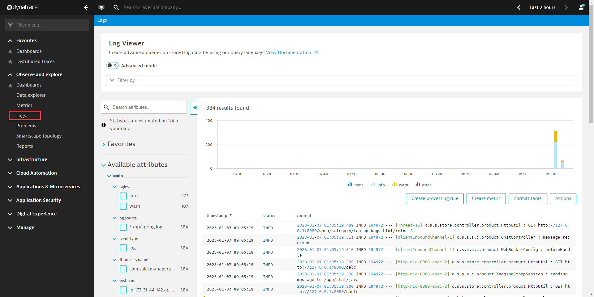
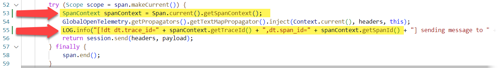
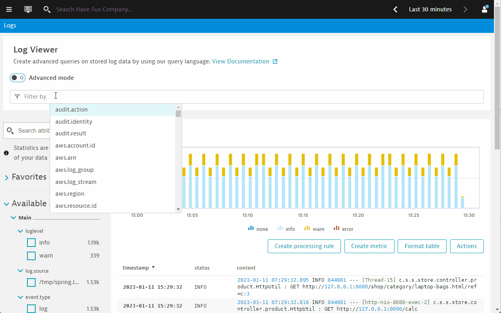
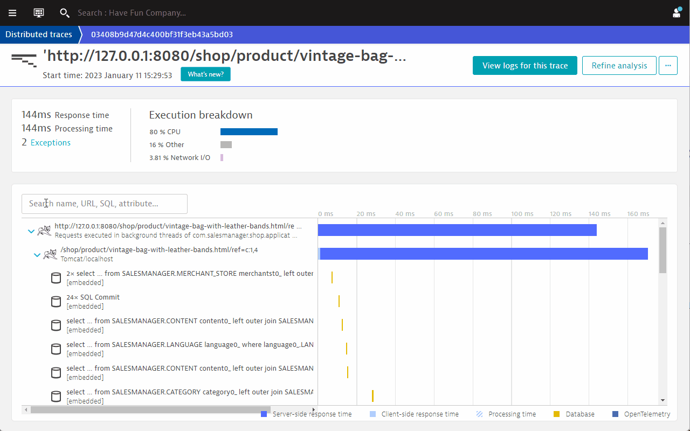

## Connecting log data to OpenTelemetry traces

> 📝 **Reference:** Dynatrace documentation [Connecting log data to traces](https://www.dynatrace.com/support/help/shortlink/log-monitoring-log-enrichment#opentelemetry-java)

### Configure Dynatrace to ingest logs
1. Navigate to **Settings > Log Monitoring**.
1. Expand it and select  **Log sources and storage**.
1. Click on the tab labled ***Process groups perspective***.
    - 📝**Note:** Dynatrace offers an updated configuration experience as an ***opt-in*** option. Talk to any instructor if you would like to know more.
    - We will use the existing UI in today's hands on.
1. Select the check box next to <mark>**com.salesmanager.shop.application.ShopApplication** </mark>.
1. **Important:** Remember to click on <mark>**Save changes** </mark>.

This is how the configuration looks like:


Wait for a few minutes after the configuration. To view the ingested logs, navigate to **Dynatrace menu > logs**.




### 📌 Task

Make changes to <mark>**TaggingStompSession.java**</mark> to include the span ID and trace ID in the logs

Open <mark>**TaggingStompSession.java** </mark> in the directory

```
sm-shop/src/main/java/com/salesmanager/shop/store/controller/product/
```

You are required to do 3 things:

1. Import the ***SpanContext*** Java libs. This has already been done for you in <mark>line **12** </mark>.
1. Retrieve the span context from the span that was started from the ***span.makeCurrent()*** OpenTelemetry function.
    - Uncomment <mark>line **55** </mark>
1. Retrieve span and trace IDs and insert them to the logs.
    - Uncomment <mark>line **57** </mark>
    - ***spanContext.getTraceId()*** and ***spanContext.getSpanId()*** are respectively used to retrieve the traceID and spanID of the current span.
1. Recompile the application to effect the changes:

```bash
Ctrl + C
mvn spring-boot:run
```

The final code will look like the following:



### Results

1. Navigate to **Dynatrace menu > logs** again.
1. In the ***Filter by*** bar, type in <mark>**chat** </mark>.
1. The logs will be filtered down to contents matching the keyword ***chat***. CLick on any one of the log entries.
    
1. Expore the meta-data.
1. Click on <mark>**View trace** </mark> button to jump into the distributed traces view.
1. Navigate to the ***SEND /app/chat/java*** span and click on it.
1. Click on the ***Logs*** tab to reveal the specific log entry that matches that span entry.
    

### Summary

Connecting OpenTelemetry traces to logs allows you to analze the observability data in context. This can be done easily in Dynatrace. This allows for more effective diagnostics capabilities. In addition, DAVIS AI engine will be able to make use of the contextual data when generating problem cards.