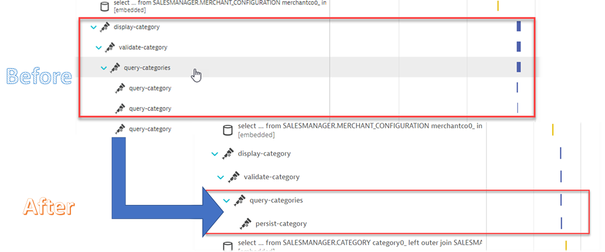
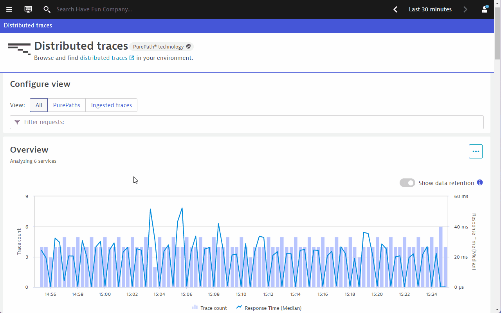
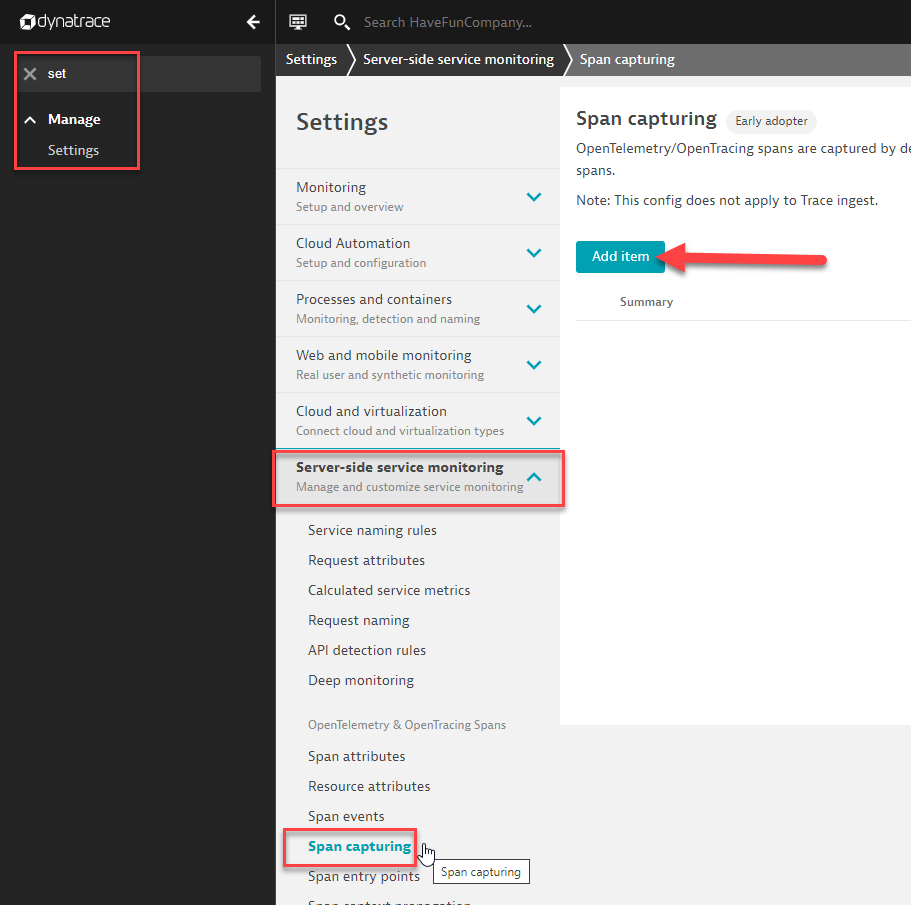
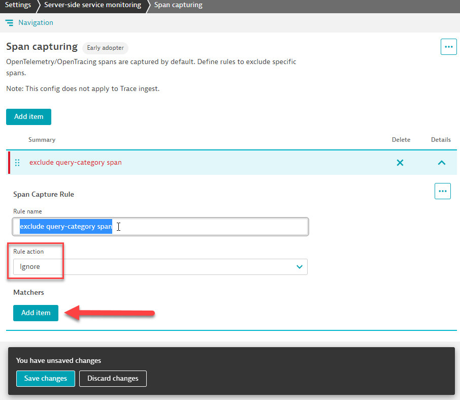
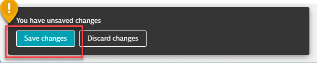
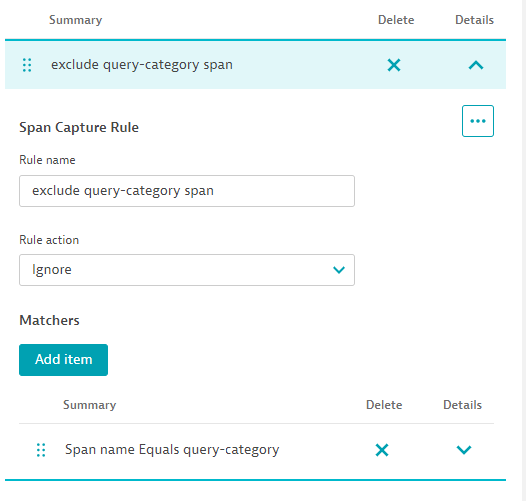

## Control span capturing without touching the code

**Situation**: An overzealous developer has instrumented a lot of his code for debugging purposes. However, from an Operations perspective, you only need some important spans for observability.

**Goal**: Control what spans you require in Dynatrace without touching the code.

### View the distributed traces of ***category*** requests

Let's investigate the transactions related to <mark>**category** </mark>. Go to **Dynatrace menu > distributed traces**, seach for the the transaction <mark>**category** </mark>.

Click on any one of the traces. The application we are working with is already augmented with OpenTelemetry. The developer has chosen to signal to monitoring solutions which portions of the application code are of importance.

The Span <mark>**query-category** </mark> is visible countless times within the PurePath.

You might only need to track the span of `query-categories` from an operations perspective, rather than all the interations of each `query-category`.

### 📌 Task

Exclude the span named <mark>**query-category** </mark>.

> 💡 **HINT** The Dynatrace settings you require can be found in **Settings > Server-side service monitoring > Span capturing**

### Result

After effecting the configuration, you do not need to restart the application. Wait for a few minutes and access the distributed traces in Dynatrace again. Select one of the newest <mark>**category** </mark> traces.

The new distributed traces will look like this:

Congratulations! You have found a way to control the amount of spans Dynatrace receives without touching the Java code. Do note that this method can only be used if the OneAgent is used to collect the OpenTelemetry spans.

---

  
Expand for solution

  
  1. Navigate to **Settings > Server-side service monitoring > Span capturing**, click on <mark>**Add item** </mark>.

  

  2. Fill in the rule name, and set the rule action to <mark>**Ignore** </mark>. Click on <mark>**Add item** </mark> under the ***Matches*** header.

  

  3. Copy and paste <mark>**query-category** </mark> in the ***Value*** field. In our case it's sufficient enough to specify the span name that should be excluded. But you'll notice that the configuration allows for much more specific exclusion rules.

  4. 💡**Important!** Don't forget to click on <mark>**Save changes** </mark>!
  
  

  Once everything is in order, you should have the following configured

  
  

