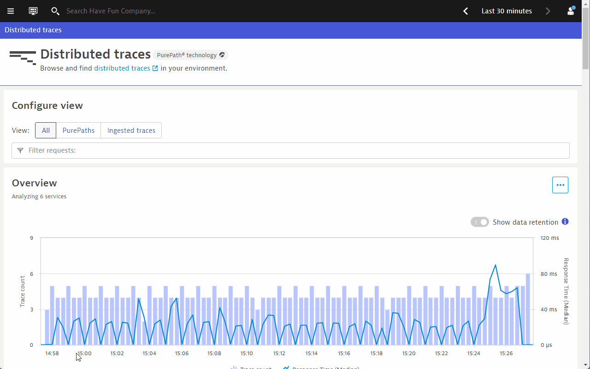
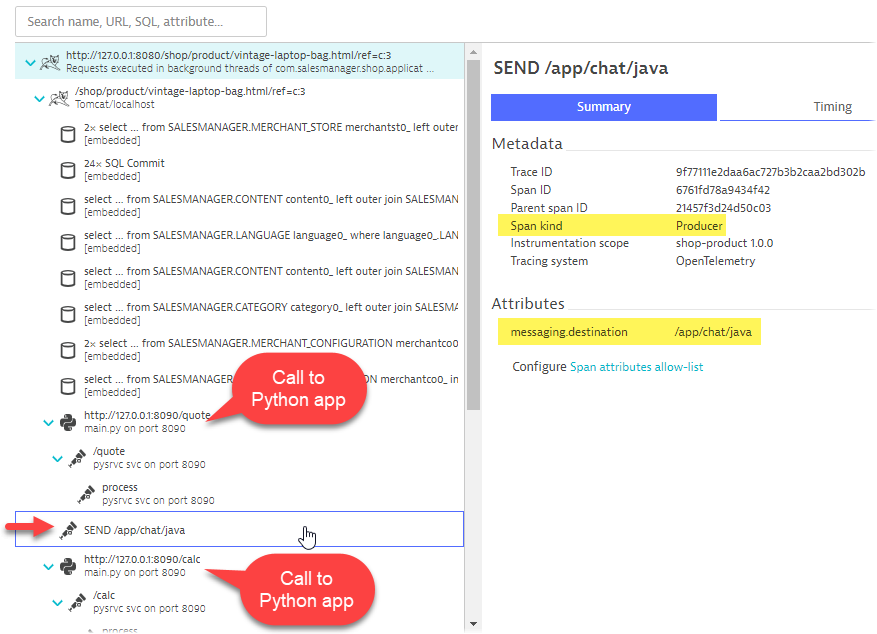
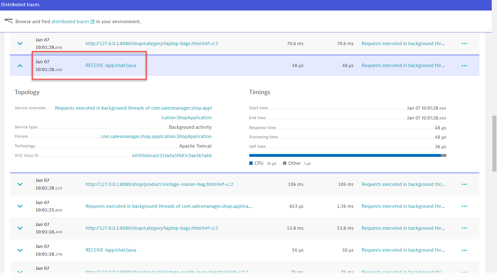
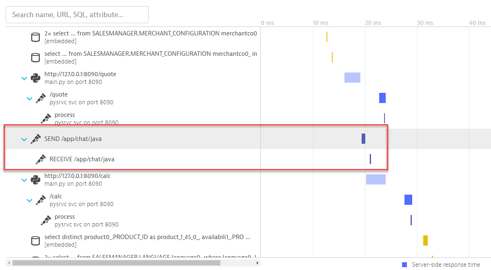
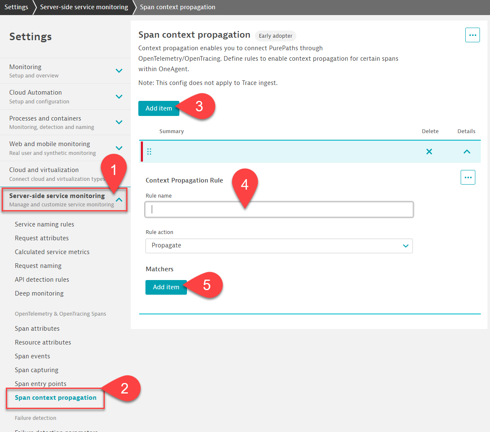
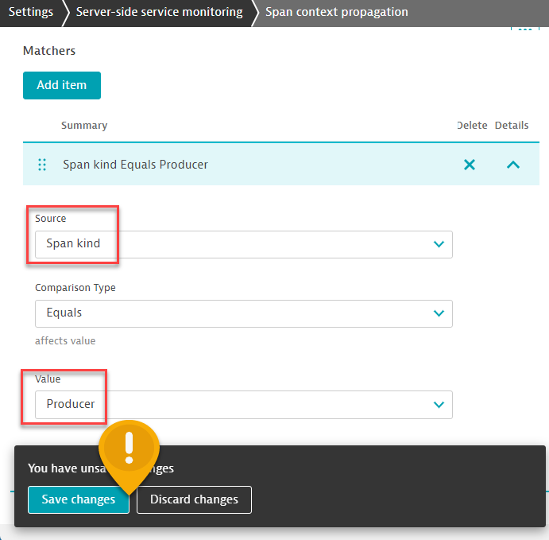
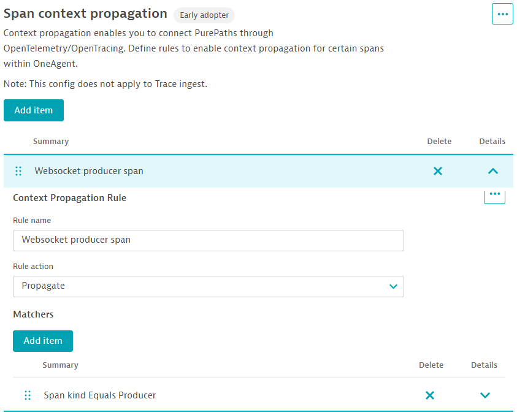
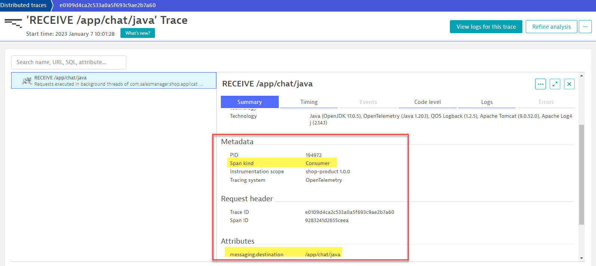
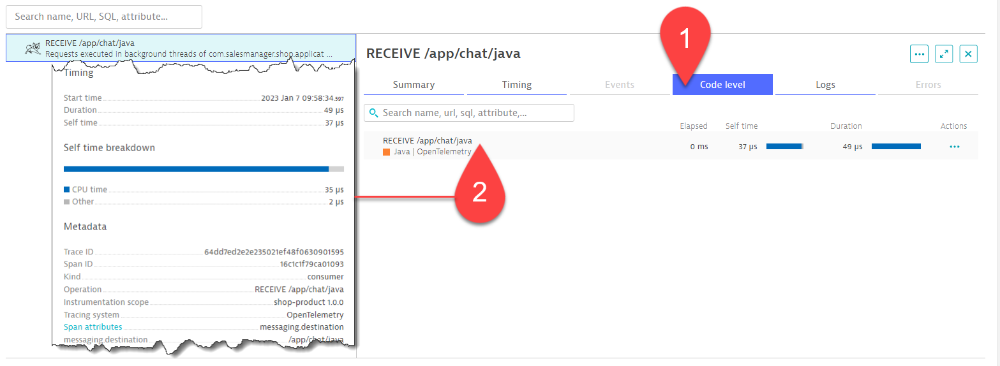

## Why are 2 Java services separated?

**Situation**: A Websocket client-server application has been instrumented with OpenTelemetry, but why are the spans not connected in Dynatrace?

**Goal**: Link the SEND spans with the RECEIVE spans.


### Where to find distributed traces for websocket "client" service?

In the **Dynatrace menu > distributed traces** screen, seach for the the transaction <mark>**product**</mark>.



Pick any distributed traces in this filtered list. All these traces are generated from the ***ShopProductController*** class. You can see that the websocket SEND span appears between the Python calls.



### Where to find distributed traces for websocket "server" service?

Return to the `distributed traces` screen. Either clear all prior filters or search for <mark>**RECEIVE**</mark> . 

You will notice that there is a "standalone" span called <mark>**RECEIVE /app/chat/java**</mark> that is not connected to any traces.



Why are the RECEIVE spans not connected with the SEND spans?

### 📌 Task

Find a way to link the SEND spans with the RECEIVE spans.

> 💡 **HINT-1**
> - The code of the websocket client is in `TaggingStompSession.java`, check out ***trace context propagation*** on **Line 56**
> - The code of the websocket server is in `WebSocketConfig.java`, check out ***trace context propagation*** on **Line 98**
> - Both files are found in the followng folder
>
> ```
> sm-shop/src/main/java/com/salesmanager/shop/store/controller/product
> ```
> - Why are the SEND spans not connected with RECEIVE spans even though the OpenTelemetry instrumentation for trace context propagation exits?

> 💡 **HINT-2**
> - Explore the settings in the Dynatrace UI **Settings > Server-side service monitoring > Span context propagation**

### Result

Once you have completed the task, wait a few minutes and choose one of the distributed traces belonging to ***/product/***.

You will see that the SEND span is now connected to the RECEIVE span.



Congratulations! You have solved a puzzle that has been bugging the DevOps team for a long time! If you are using the OneAgent to instrument OpenTelemetry spans, you will need to do additional settings when linking 2 services together.

---

<details>
  <summary>Expand for Solution</summary>

  ### Solution
  Configure Dynatrace to allow for trace context propagation.
  1. Navigate to **Settings > Server-side service monitoring**.
  1. Expand it and select  **Span context propagation**.
  1. Click on <mark>**Add item** </mark> button.
  1. Give a name to the rule.
  1. Under the ***Matches*** header, click on <mark>**Add item** </mark> button.

  

  Configure the **match** ruleset using the following:
  - Source: <mark>**Spand Kind**</mark>
  - Value: <mark>**Producer**</mark>

  

  💡 **Important:** Remember to click on <mark>**Save changes** </mark>.

  The final configuration screen should look like this:

  
</details>

---

<details>
  <summary>Expand for Explanation</summary>

  ### Explanation
  Let's take a closer look at the meta-data of the RECEIVE span, created from the `WebSocketConfig.java` class.

  

  As we are using the OneAgent to handle the OpenTelemetry spans in Java, the OneAgent automatically recognizes the OpenTelemetry API as well. This is evident if you look at the **code** tab.

  

  Another part of the meta-data is the traceid

  

  It turns out that the OneAgent automatically generates a new trace ID as the OneAgent has no knowledge of the caller service or java method, so it assumes that this OpenTelemetry span is the "***originator***".

  This is a common scenario when a mix of OneAgent and OpenTelemetry is used. Unless the OneAgent is able to automatically instrument the ***calling method***, otherwise, the spans will never be linked. To resolve this, we could
  1. hunt for the code and manually instrument via OpenTelemetry, or
  1. use the UI in Dyntrace to configure **Span context propagation** settings (do not need to write complicated code)

  By configuring the **Span context propagation** settings, we are telling Dynatrace that if it recognizes a certain SpanKind, attribute, scope etc., propagate the span context so that the traces can be connected. More details can be found in the Dynatrace online documentation [Span context propagation](https://www.dynatrace.com/support/help/shortlink/span-settings#span-context-propagation)
</details>