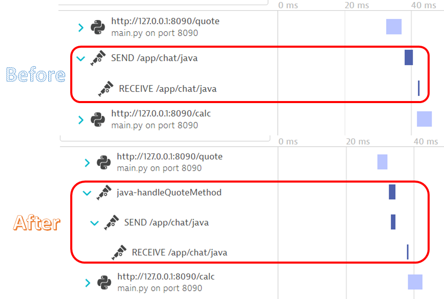
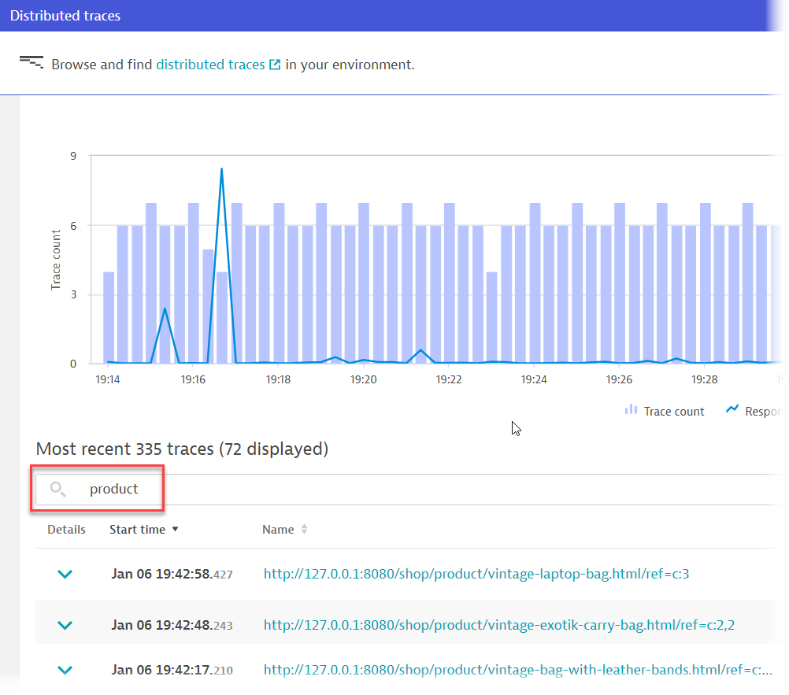
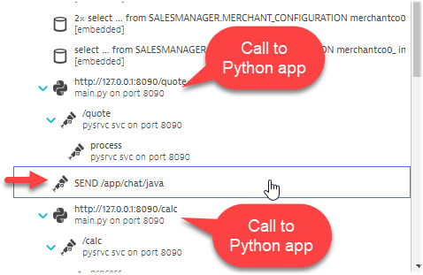
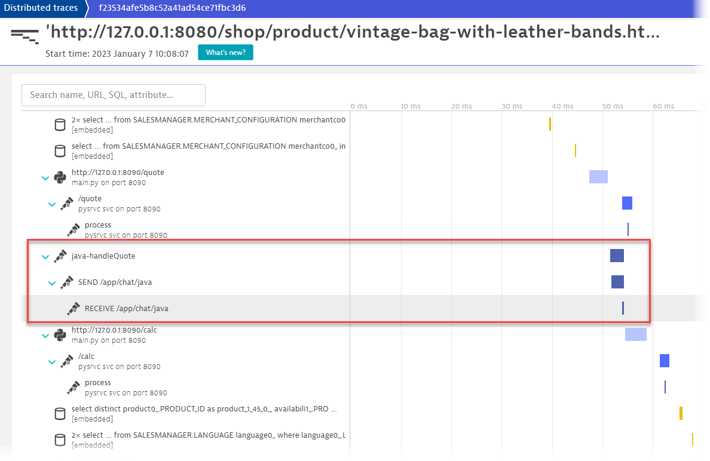
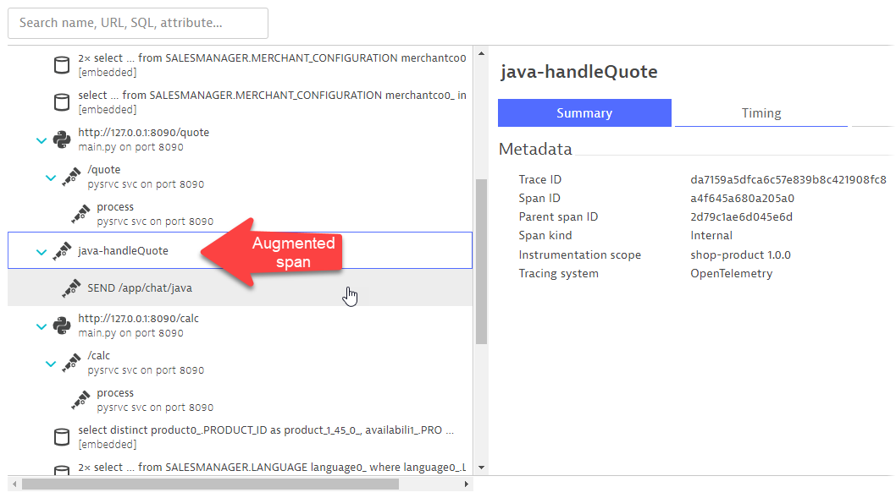

## Augment auto-instrumented code using OpenTelemetry

**Situation**: The websocket client spans appear in the ecommerce application. However, is it not easy to see which method on the  ecommerce application side that is making the call to send messages to the websocket server. The calling method information might be useful during diagnotics.

**Goal**: Create a parent span in the ecommerce application to indicate which method is calling the websocket client code.



### Where to find the websocket SEND spans in Dynatrace?

As the OneAgent is instrumenting the websocket client spans automatically, the spans appear as part of a PurePath easily. Recall that we were inspecting these distributed traces eariler in the Java Trace Context Propagation section.

In the **Dynatrace menu > distributed traces** screen, seach for the the transaction <mark>**product** </mark>.



Pick any distributed traces in this filtered list. All these traces are generated from the ***ShopProductController*** class. You can see that the websocket SEND span appears between the Python calls.



However, is it not easy to see which method in the ***ShopProductController*** class is making the call to send messages to the websocket server...

### Where to find the ecommerce application code?

Open the ecommerce application's code in the <mark>**ShopProductController.java** </mark> in the folder below.

```
sm-shop/src/main/java/com/salesmanager/shop/store/controller/product/
```

**Line 118** in the ***handleQuote*** method is the code that initiates the MessageCLientRunner Java object, which in turn is designed with StompMessage Java codes to handle sending messages to the WebSocket server.

```java
MessageClientRunner.getSession().send("/app/chat/java", new ClientMessage(USER_ID, reference));
```

### 📌 Task

Augment the auto-instrumented ***ShopProductController*** class with OpenTelemetry to "enrich" the distributed traces with more information.

We will use <mark>**ShopProductController.java** </mark> file. The tracer and all Java dependencies has been already pre-setup. All you need to do is to create the spans.

> 💡**HINT-1**
>
> In the file **ShopProductController.java**, <mark>Line **118** </mark> is the code that you will need to wrap the OpenTelemetry spans around.
>
> Typical steps to instrument Java applications with Open Telemetery
> 1. Add dependencies to your project
> 1. Import the claases
> 1. Acquiring a Tracer
> 1. Create spans
> 1. Configure context propagation (optional)
>
> Reference: Dynatrace documentation [Manually instrument Java applications with OpenTelemetry](https://www.dynatrace.com/support/help/extend-dynatrace/opentelemetry/opentelemetry-traces/opentelemetry-ingest/opent-java)

> 💡**HINT-2**
>
> - Reference code can be found in <mark>**ShoppingCategoryController.java**</mark>, between lines `127-132` or `136-141`.
> - ShoppingCategoryController.java is found in a different folder:
>    ``` 
>    sm-shop/src/main/java/com/salesmanager/shop/store/controller/category/
>    ```
> - You can copy the reference code to implement it in **ShopProductController.java**

As you are making changes to the Java code, you will have to "recompile" the application.

You can do this by using the following commands.

```bash
Ctrl + C
mvn spring-boot:run
```

### Result

Once you have successfully instrumented the Java code, your distributed traces should look like this.



And if were to investigate the `java-handleQuote` span, notice how Dynatrace handles the parent and child spans nicely without you having the manually code it in OpenTelemetry.



Congratulations! You have now made the OpenTelemetry spans easier to spot within the Java distributed traces using OpenTelemetry.

---

<details>
  <summary>Expand for solution</summary>
  
  ### Code to warp around line 118
  ```java
  Span span = getTracer().spanBuilder("java-handleQuote").startSpan();
	try (Scope scope = span.makeCurrent()) {
		MessageClientRunner.getSession().send("/app/chat/java", new ClientMessage(USER_ID, reference));					
	} finally {
		span.end();
  }
  ```
</details>