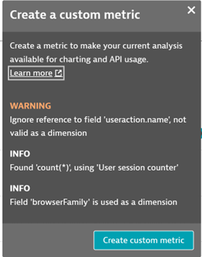
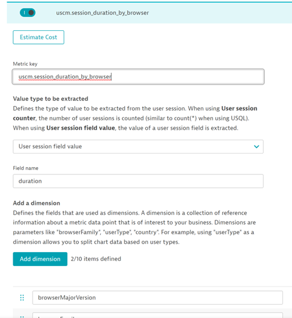

## User Session Custom Metrics

In this module, we will create a a custom metric from the usersession table query in USQL

### User Session Custom Metrics

- User Session Custom Metrics allow us to take USQL queries and convert them over to time series

- This allows for usage in Data Explorer and custom alerting
- User Session Custom Metric also allows data to be stored for up to 5 years (using time series aggregation) and without sampling
- User Session Custom Metrics pull from the usersession USQL table and can use useraction fields as a filter
- The ability to create custom metrics off the user action will be coming to the USQL screen shortly

- Because User Session Custom Metrics use USQL data and can access session-level data that only appears after a session is closed (e.g. session duration, bounce), sessions must end to be processed
- Let’s go back to the Query User Sessions screen

- In the USQL screen, build a query that would return a numerical value – session count, session duration, average performance, etc
- Pull it from the usersession table
- Use any relevant usersession metric as a dimension, and either usersession or useraction as a filter

Some suggestions:


```
SELECT avg(duration), browserMajorVersion, browserFamily FROM usersession WHERE userType="REAL_USER" GROUP BY browserMajorVersion, browserFamily
```

or

```
SELECT avg(duration), browserMajorVersion, browserFamily FROM usersession WHERE userType="REAL_USER" GROUP BY browserMajorVersion, browserFamily
```

- Click Run Query to validate that a numerical value is returned

- And if you do have a successful result, click Create Custom Metric

- Used a field that isn’t supported? The custom metric creation tooltip will let you know what parts of the query do not translate into a custom metric




- You will be brought to the User Session Custom Metrics creation screen, where the metric is already translated from your USQL query – you just need to add a name and save

- Your new custom metric will begin to collect data



