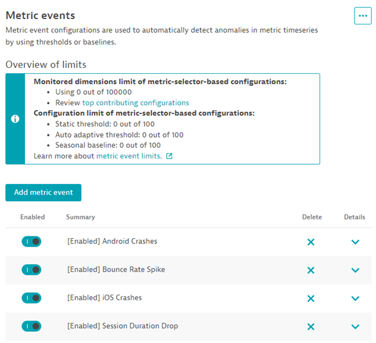
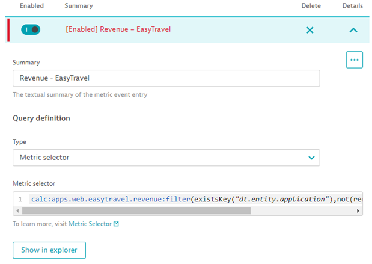
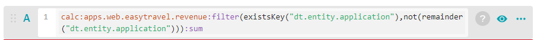
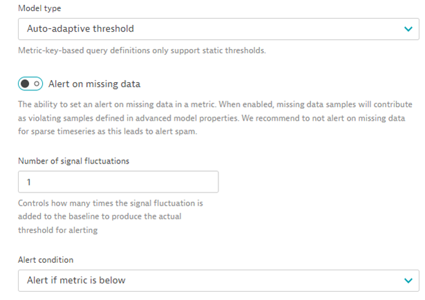
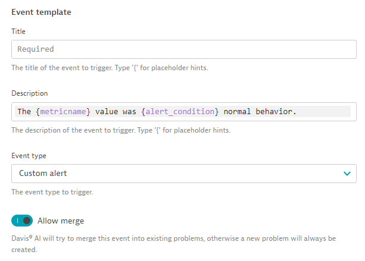
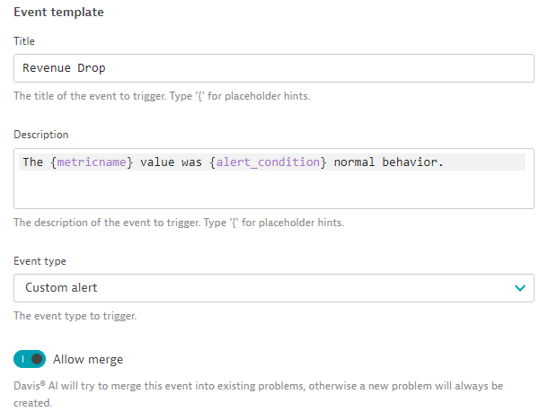

## Metric Events For Alerting

In this module, we will discuss how to use metric events to create custom alerts

### Custom Alerts

- Custom metrics in combination with metric events can create powerful and dynamic alerts for the metrics that are most important

- Dynamic baselining makes setup simple and keeps maintenance requirements low

- This can be used to alert on any combination of metrics that can be built from the MDA or user session query language custom metrics

- On the left-side menu, click “Settings”
- From the sub-menu, expand “Anomaly detection”
- Click on “Metric events”

- Click “Add metric event”
- For the ‘Summary’, we can call this one ‘Revenue – EasyTravel’
- Initially for ‘Type’ , choose “Metric Key”. We will change this shortly
- In the ‘Metric Key’ dropdown, type or choose “revenue”
- Change the aggregation to Sum
- Click ‘Show in explorer’, which will open the data explorer window in a new tab
- Copy the metric expression that is shown there and head back to the previous tab
- Switch the ‘Type’ to Metric Selector and paste in the metric expression we copied from the data explorer tab

- In the next section, we can limit which entities will be alerted on
- This filter would allow us to narrow down on which applications, tags, or management zones this alert would apply to
- Useful for metrics that apply to a larger scope or across multiple applications
- This is not necessary in our case

- Enabling auto-adaptive baselining will allow Dynatrace to automatically adjust the alerting threshold based on the defined settings and the recent history of the selected metric
- For our alerts, change the Model Type to ‘Auto-adaptive threshold’
- Then, change the alert condition to alert when the metric is “below”, as shown in the screenshot

- Using one of the baseline models allows you to set some advanced properties which further tune how the baseline operates
- The ‘Violating samples’ field is important because this is how many FULL 1 minute samples must be above/below the metric baseline for the alert to trigger
- Set the value on this to ‘1’ for our alert
- Sliding window is how many 1 minute buckets the alert evaluates against
- Dealerting samples is how many 1 minute buckets must pass for our alert to finish / end

- After configuring the auto-adaptive baselining, a graph below the baseline settings will populate. Baseline calculation here
- This graph will show the recent history of the selected metric, as well as what the threshold will be configured at, and how many alerts would have been sent out during the selected timeframe
- At this point, a decision can be made to adjust the sensitivity of the baseline in order to alert either more or less frequently

- Finally, at the bottom of the page we can configure the details for what will be contained within a Dynatrace problem card if the metric falls below the threshold

- Title: Title of the problem card. This can include placeholder values like {metricname}
- Description: The message contained within the problem card/notification
- This can be leveraged to contain a better description of the issue or remediation steps for responsible parties
- Event Type: Determines the type of problem card created; this will also tie into problem notifications, both new and existing
- Allow merge: This allows you to choose whether this will be rolled up into other existing problems or not (for example, revenue may drop if overall web traffic dropped and was also detected)

- For our alert, configure the following:

- Title: Revenue Drop
- Severity: Custom alert
- Leave the message default
- Allow merge
- Click “Save Changes” at the bottom of the page

