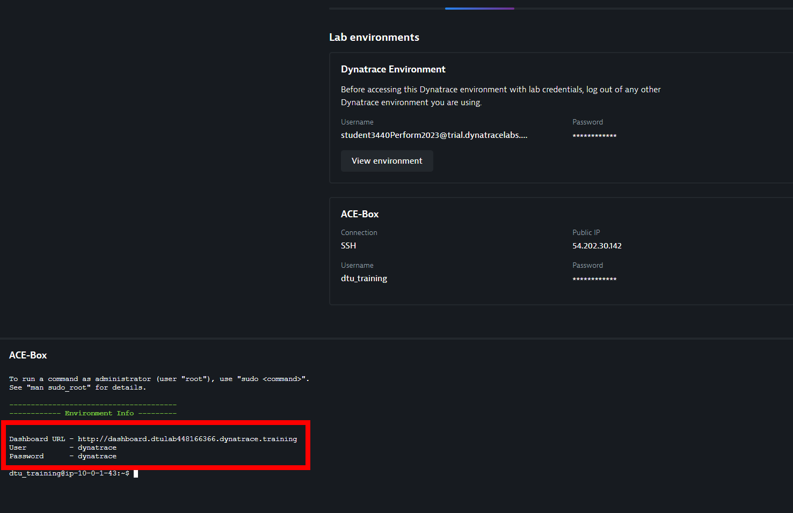

## Lab Setup
Before we get started with the exercises let's start with a few setup steps.

1. Verify access
2. Configure Security Monitoring Rule
3. Enable Runtime Vulnerability Analytics
4.  Enable OneAgent features
5.  Deploy Unguard App

### Verify access to environment
In Dynatrace University you will find the information on how to access the Environment required for the lab. Please make sure you can:
- Access the Dynatrace Environment using a web browser
- Connect to the bastion host using SSH


### Verify access to Dashboard
To access your dashboard, you need it's URL. In order to get it, on your University event, open the `Environments` tab and click on `Open terminal`. This will open a terminal in your VM. 
This will give you the links to the resources used during this HOT session, as seen in the screenshot below.




### Create monitoring rules

To include or exclude specific processes from being monitored by Application Security, you can set up fine-grained monitoring rules, based on properties such as process tag, host tag, and management zone. We will want to focus on the "uguard" application we will deploy in the next step. We there for create a rule to `Do not monitor if Management zone does not equal unguard`.


### Enable runtime vulnerability detection

To enable Application Security,  go to *Application Security > Vulnerabilities* and select Activate settings.


> Alternatively can also directly go to Settings > Application Security > Vulnerability Analytics > General settings.

On the Vulnerability Analytics page that opens, select *Enable Runtime Vulnerability Analytics*. 


> You also have the option to restrict it to certain technologies. 

### Enable OneAgent Features
After enabling runtime vulnerability detection, you need to enable OneAgent Java vulnerable function reporting. This is specifically just for vulnerable functions. The reporting of vulnerable components in general is generally available and running out of the box now.
- Under Settings > Preferences > OneAgent features
- Filter by *vulnerable* and enable the following features
- Java Vulnerable Function Reporting
- Filter by *code-level* and enable the following features (as per the screenshots):
- Java code-level attack evaluation (include the instrumentation enabled toggle)
- Java code-level vulnerability evaluation


## Deploy Unguard

To get started with AppSec, we now need an application we want to monitor. Therefore, we will deploy an application called `unguard` with a pre-build Jenkins pippeline. The same pipeline will also deploy configuration to Dynatrace with the help of our Monitoring-as-code tool (monaco). 

### Trigger Pipelines

Before taking a look at what happens behind the scenes, let us deploy the `unguard` application straight away by going to your jenkins instance (link on your dashboard). On your Jenkins dashboard you will find the `Deploy Unguard` pipeline. Open it by clicking on it and then run it by clicking on `"build with paramters"`  and `Build` (see section **Unguard Deploy** below for screenshots).

#### Unguard deploy

 


### Explore Jenkins Configuration

Now lets quickly check the Jenkins pipelines.

#### Unguard Deploy Pipeline

Using Gitea, open the file `/jenkins/deploy.Jenkinsfile`. Here you will see the pipeline used to deploy unguard. 

```groovy
@Library('ace@v1.1') ace 
def event = new com.dynatrace.ace.Event()

def tagMatchRules = [
    [
        "meTypes": [ "PROCESS_GROUP_INSTANCE"],
        tags: [
            ["context": "CONTEXTLESS", "key": "environment", "value": "unguard"]
        ]
    ]
]
pipeline {
    agent {
        label 'kubegit'
    }
    stages {
        stage('Prepare dependencies') {
            steps {
                checkout scm
                container('kubectl') {
                    sh "kubectl delete ns unguard --ignore-not-found=true"
                }
                container('helm') {
                    sh "helm repo add bitnami https://charts.bitnami.com/bitnami"
                    sh "helm repo update"
                    sh "helm upgrade -i unguard-mariadb bitnami/mariadb --namespace unguard --create-namespace --wait"
                }
            }
        }     
        stage('Deploy via Helm') {
            steps {
                checkout scm
                container('helm') {
                    sh "helm upgrade -i unguard helm/unguard -f helm/unguard/values.yaml --namespace unguard --set ingress.domain=${env.INGRESS_DOMAIN} --wait"
                }
            }
        }
            
        stage('Dynatrace deployment event') {
            steps {
                script {
                    sleep(time:150,unit:"SECONDS")
                    
                    def status = event.pushDynatraceDeploymentEvent (
                        tagRule: tagMatchRules,
                        deploymentName: "unguard deployed",
                        deploymentVersion: "0.0.1",
                        deploymentProject: "unguard",
                        customProperties : [
                            "Jenkins Build Number": "${env.BUILD_ID}",
                            "Approved by":"ACE"
                        ]
                    )
                }
            }
        }     
    }
}

```

Looking at the Jenkins file you will see the **kubectl** and **helm** containers in the **kubegit** pod that are defined in your Jenkins instance and used to run the necessary commands to deploy the helm file of the application. 

### View results in Dynatrace

As a last step, go to your Dynatrace environment and verify that the pipeline deployed unguard and you can see data flowing in. Go to your Dynatrace tenant (accessible from your dashboard) and go to the  `Frontend` page. You will find the application `unguard` as well as the `unguard` management zone with which you can filter entities throughout the environment. 


If you navigate to the `Dashboard` menu, you will also find the `Application Security Issues` dashboard deployed by our monaco pipeline.


Navigate to the `Kubernetes` menu. You will find the `ACE-BOX` cluster in which the `unguard` application is running. If you click on the cluster name, you will find an overview of the Kubernetes integration with Dynatrace. The Jenkins pipeline called monaco to add the necessary credentials to import additional Kubernetes information from Kubernetes (e.g. namespaces, deployments, labels, resource requests...). This will become important in the next exercise.


