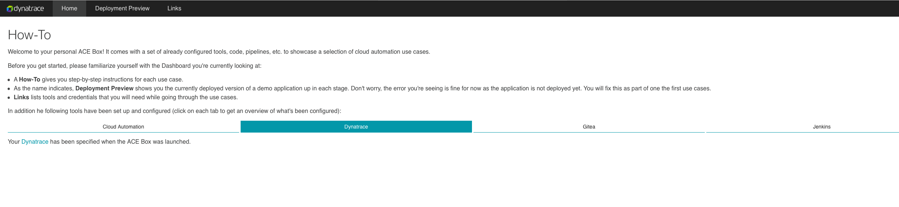

## Enable App Sec RAP
### Verify access to environment
In Dynatrace University you will find the information on how to access the Environment required for the lab. Please make sure you can:
- Access the Dynatrace Environment using a web browser
- Connect to the bastion host using SSH

### Verify access to Dashboard
To access your dashboard, you need it's URL. In order to get it, on your University event, open the `Environments` tab and click on `Open terminal`. This will open a terminal in your VM. 
This will give you the links to the resources used during this HOT session, as seen in the screenshot below.

### Enable runtime vulnerability detection

To enable Application Security,  go to *Application Security > Vulnerabilities* and select Activate settings.

> Alternatively can also directly go to Settings > Application Security > Vulnerability Analytics > General settings.

On the Vulnerability Analytics page that opens, select *Enable Runtime Vulnerability Analytics*. 

> You also have the option to restrict it to certain technologies. 

### Enable OneAgent Features
After enabling runtime vulnerability detection, you need to enable OneAgent Java vulnerable function reporting. This is specifically just for vulnerable functions. The reporting of vulnerable components in general is generally available and running out of the box now.
- Under Settings > Preferences > OneAgent features
- Filter by *vulnerable* and enable the following features
- Java Vulnerable Function Reporting
- Filter by *code-level* and enable the following feature
- Java code-level attack evaluation
- Instrumentation enabled

