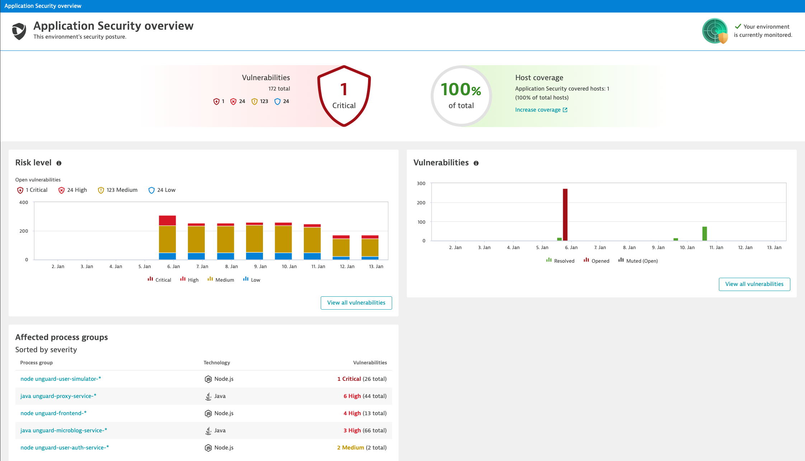
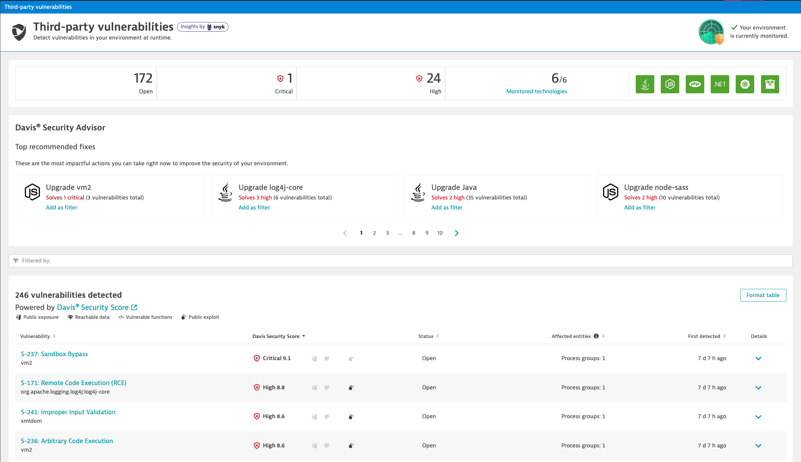
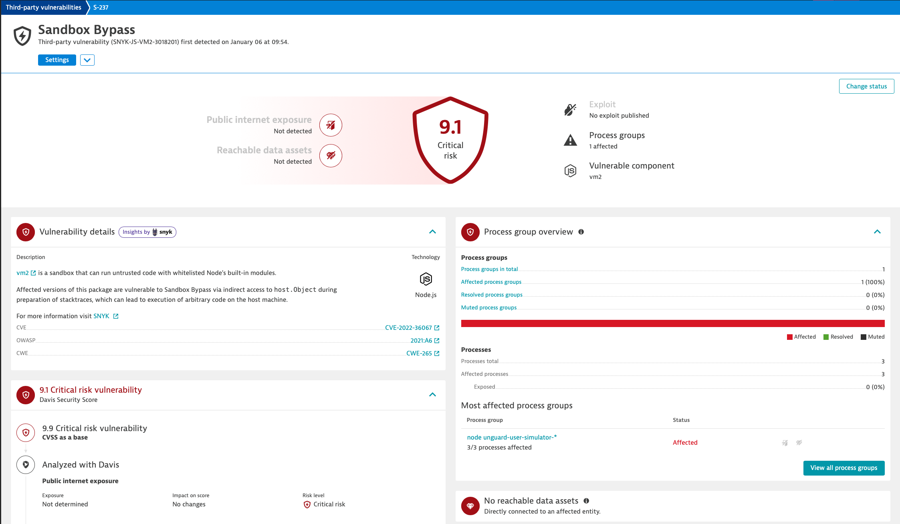
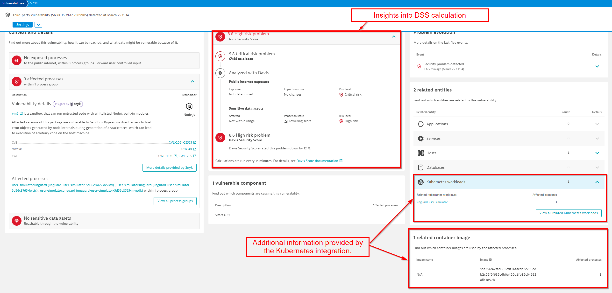

## Getting Familiar with AppSec
### Security Overview

Go to your Dynatrace instance and navigate to `Application Security` > `Security Overview`.

Explore what is displayed ont the screen:
1. How many vulnerabilities were discovered?
2. How many of each category?

> Since we just activated it, the evolution over the past 30 days doesn't show much. 

Click on **View all vulnerabilities**.

### Vulnerabilities
On this screen you can see a list of all vulnerabilities that were discovered in the environment. 

Take a look at the list, try out the different filters, take a look at the findings from the Davis Security Advisor.

**Exercise**
1. How many vulnerabilities are affecting Kubernetes?
2. Which library has the most critical vulnerabilities and should be updated with priority?
3. This environment affected by the vulnerability with CVE ID `CVE-2021-23555`. Find it an open it. 

### Vulnerability details

Here you can find all the details about the selected vulnerabilty.

On the left side under `Context and details` you can see which processes are affected and get more details about the vulnerability. Using the links you can navigate to NVD, CWE, OWASP or Snyk to read more about it. 

**Exercise**
1. With the information in the `Context and details`, find out how to remediate the vulnerability.

With `View all process groups` you get to the Remediation Tracking screen, that shows details about the affected process groups. 

At the bottom you can see the related entities and container images. You can see this information because our monaco pipeline added the Kubernetes credentials needed to integrate Dynatrace with the Kubernetes API.

**Exercise**
1. What is the version of the affected library?
3. On which hosts are the affected processes running?
4. Under which namespace are the vulnerable pods deployed in Kubernetes?