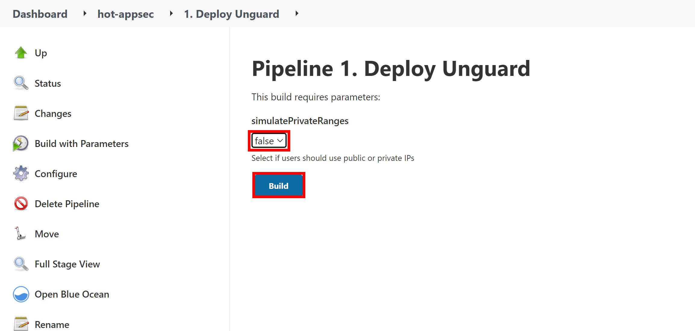
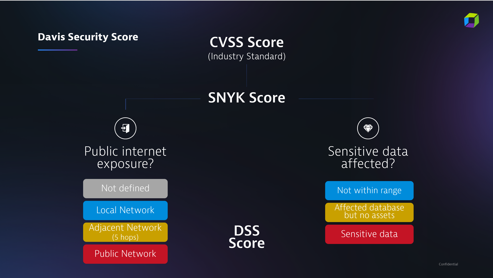
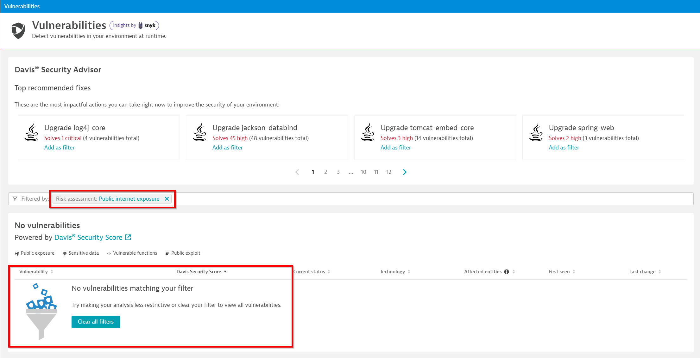
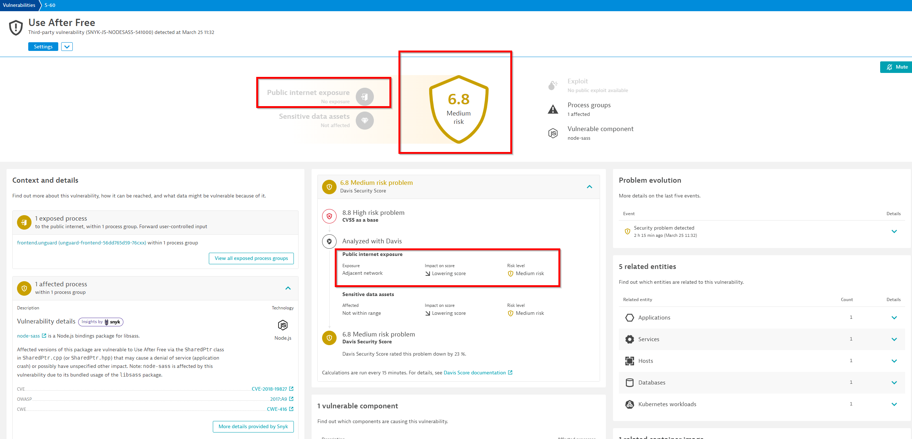
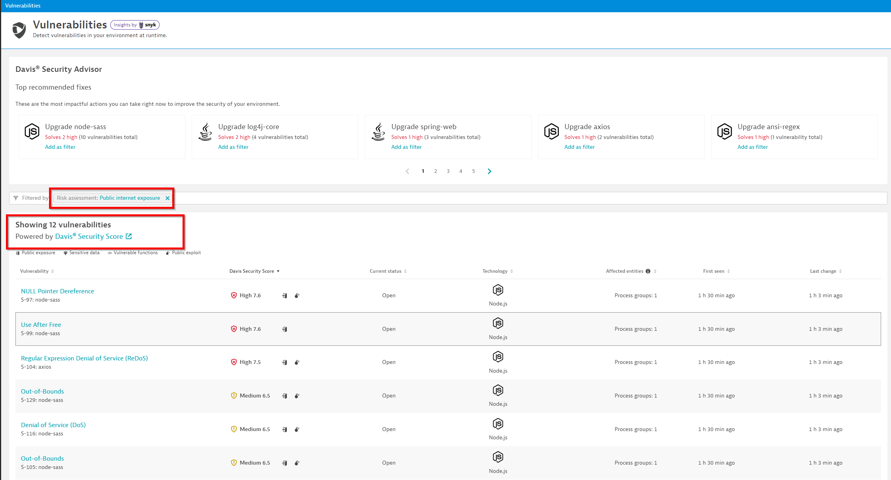
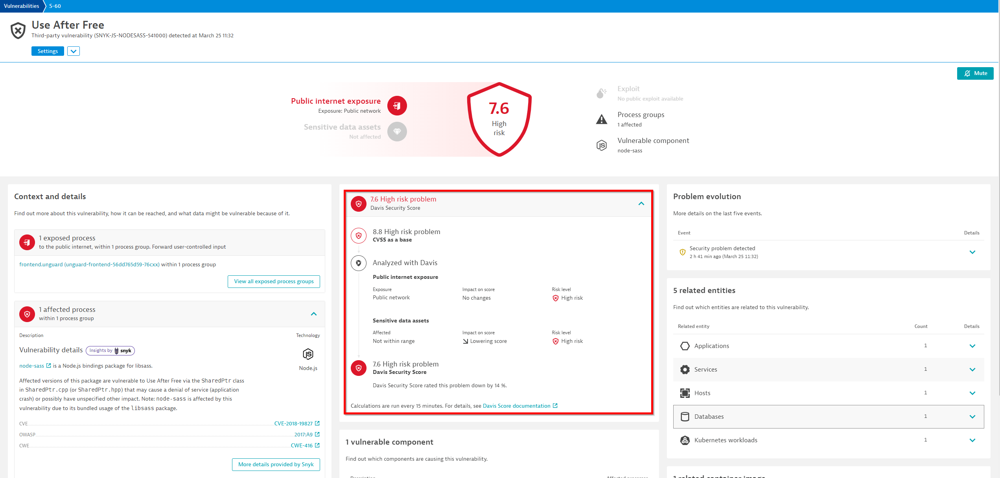

## Davis Security Score

In this hands on exercise we want to see how internet exposure affects the Davis Security Score in real time. 

### Run the Pipeline

We now want our application unguard to be called by users using public IPs. To do so, go to Jenkins and redeploy the unguard application, this time with `simulatePrivateRanges` set to `false`.

### DSS Recap
Why did we enable public IPs? We did it to show how the Davis Security Score works. So let's quickly recap what the DSS is.

Davis Security Score (DSS) is an enhanced risk-calculation score based on the industry-standard Common Vulnerability Scoring System (CVSS). Because Davis AI also considers parameters like public internet exposure and checks to see if and where sensitive data is affected, DSS is the most precise risk-assessment score available.
The OneAgent knows and reflects that in the Davis Security Score.

Let's go to the next chapter to take a hands on look at the DSS!

### Simulating Public Exposure

#### Simulate changes in Davis Security Score

Navigate to `Vulnerabilities` and filter for `Risk assessment: Public Internet Exposure`. As you see, no entities are publicly exposed.

Before we go on, search for the vulnerability with CVE ID: `CVE-2018-19827`, open the vulnerability and see how the DSS has been lowered due to missing internet exposure.

For a vulnerability to have internet exposure, the vulnerable entity has to be called by at least two different non private network. 

#### Analyze changes in Davis Security Score

You will now see the vulnerabilities that evolved to publicly exposed vulnerabilities due to the synthetic activegate as well as your traffic.

We can also check for our vulnerability with CVE ID: `CVE-2018-19827`. You will find that the DSS score increase.

.

