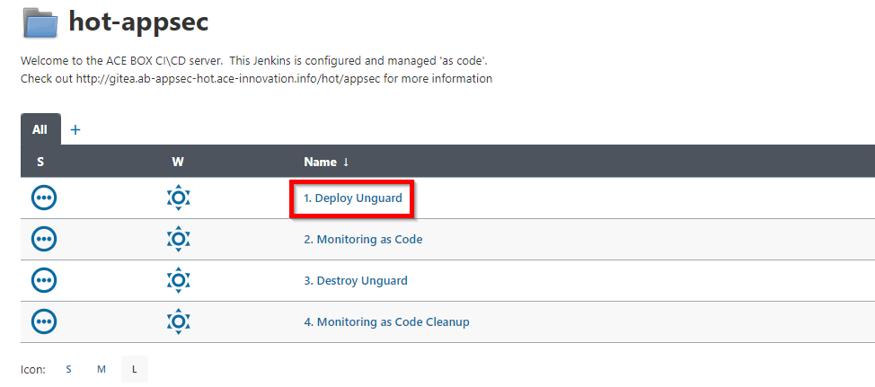
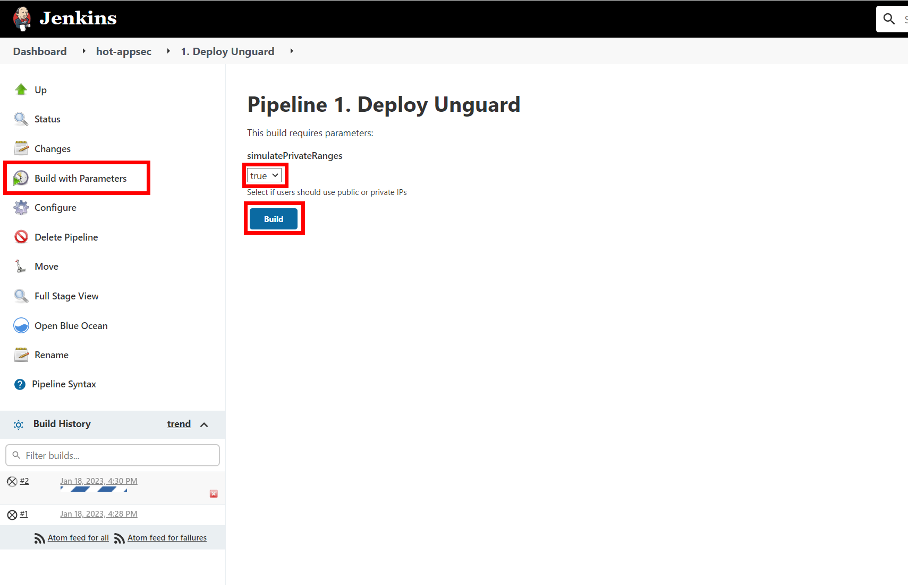
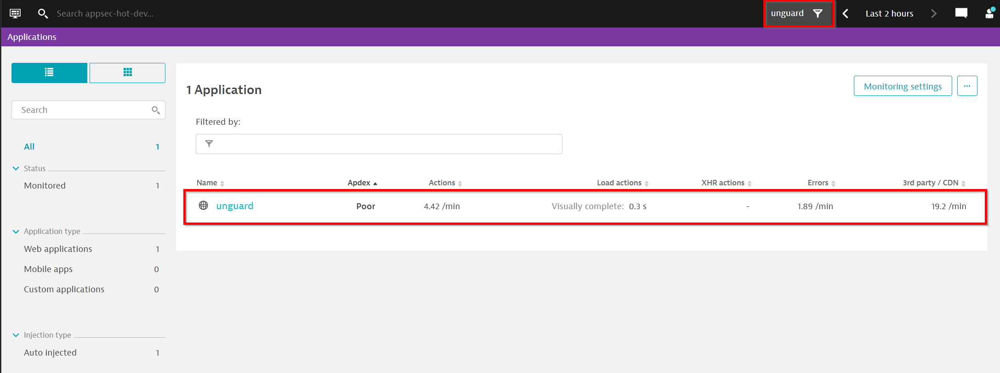
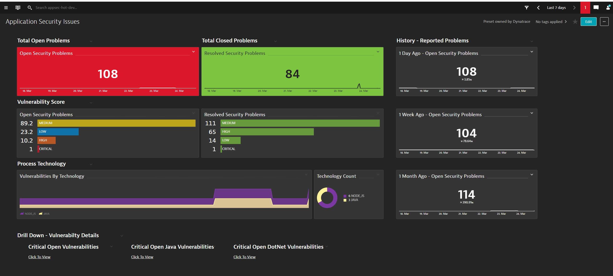
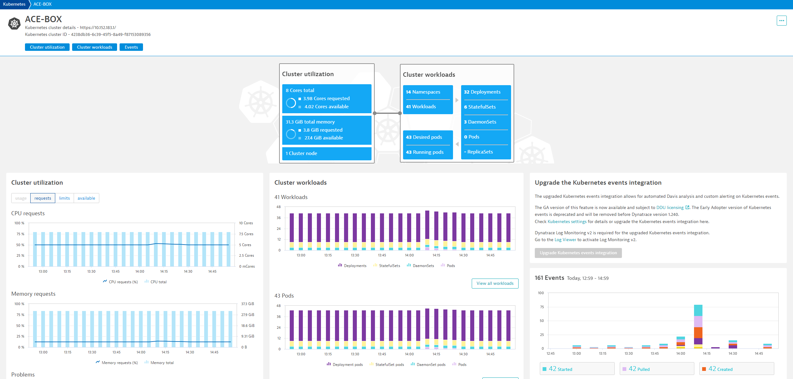

## Deploy Unguard

To get started with AppSec, we now need an application we want to monitor. Therefore, we will deploy an application called `unguard` with a pre-build Jenkins pippeline. The same pipeline will also deploy configuration to Dynatrace with the help of our Monitoring-as-code tool (monaco). 

### Trigger Pipelines

Before taking a look at what happens behind the scenes, let us deploy the `unguard` application straight away by going to your jenkins instance (link on your dashboard). On your Jenkins dashboard you will find the `Deploy Unguard` pipeline. Open it by clicking on it and then run it by clicking on `"build with paramters"`  and `Build` (see section **Unguard Deploy** below for screenshots).

#### Unguard deploy

 




#### Unguard monaco

On top of that we also want to deploy some Dynatrace configuration to our Dynatrace environment. To do so, let's also deploy Dynatrace configuration in order to properly monitor the unguard configuration. In your Jenkins dashboard, open the pipeline `Monitoring as Code`, go on `build with parameters`, enter `base` in the project section and build the pipeline (see section below for screenshots). This pipeline uses the [monaco](https://dynatrace-oss.github.io/dynatrace-monitoring-as-code/) tool to deploy Dynatrace configuration. This is described further in the `Explore Jenkins Configuration` section below. 


While the pipelines run, let us take a look at what we just did.

### Explore Jenkins Configuration

Now lets quickly check the Jenkins pipelines.

#### Unguard Deploy Pipeline

Using Gitea, open the file `/jenkins/deploy.Jenkinsfile`. Here you will see the pipeline used to deploy unguard. 

```groovy
@Library('ace@v1.1') ace 
def event = new com.dynatrace.ace.Event()

def tagMatchRules = [
    [
        "meTypes": [ "PROCESS_GROUP_INSTANCE"],
        tags: [
            ["context": "CONTEXTLESS", "key": "environment", "value": "unguard"]
        ]
    ]
]
pipeline {
    agent {
        label 'kubegit'
    }
    stages {
        stage('Prepare dependencies') {
            steps {
                checkout scm
                container('kubectl') {
                    sh "kubectl delete ns unguard --ignore-not-found=true"
                }
                container('helm') {
                    sh "helm repo add bitnami https://charts.bitnami.com/bitnami"
                    sh "helm repo update"
                    sh "helm upgrade -i unguard-mariadb bitnami/mariadb --namespace unguard --create-namespace --wait"
                }
            }
        }     
        stage('Deploy via Helm') {
            steps {
                checkout scm
                container('helm') {
                    sh "helm upgrade -i unguard helm/unguard -f helm/unguard/values.yaml --namespace unguard --set ingress.domain=${env.INGRESS_DOMAIN} --wait"
                }
            }
        }
            
        stage('Dynatrace deployment event') {
            steps {
                script {
                    sleep(time:150,unit:"SECONDS")
                    
                    def status = event.pushDynatraceDeploymentEvent (
                        tagRule: tagMatchRules,
                        deploymentName: "unguard deployed",
                        deploymentVersion: "0.0.1",
                        deploymentProject: "unguard",
                        customProperties : [
                            "Jenkins Build Number": "${env.BUILD_ID}",
                            "Approved by":"ACE"
                        ]
                    )
                }
            }
        }     
    }
}

```

Looking at the Jenkins file you will see the **kubectl** and **helm** containers in the **kubegit** pod that are defined in your Jenkins instance and used to run the necessary commands to deploy the helm file of the application. 


#### Unguard Monaco

##### What is Monaco?

The Monitoring as Code (MAC) approach enables you to manage your Dynatrace environment monitoring tasks through configuration files instead of a graphical user interface. Configuration files allow you to create, update, and manage your monitoring configurations safely, consistently, and repetitively. They can be reused, versioned, and shared within your team.


##### Unguard Monaco Pipeline

Using Gitea, open the file `/jenkins/monaco.Jenkinsfile`. Here you will see the definition of the **Monitoring as Code** pipeline used to deploy Dynatrace configuration using monaco. 


```groovy
ENVS_FILE = "monaco/environments.yaml"

pipeline {
    parameters {
        string(name: 'PROJECT', defaultValue: 'base', description: 'The name of the monaco project to deploy.', trim: true)
    }
    agent {
        label 'monaco-runner'
    }
    stages {
        stage('Dynatrace Unguard config - Validate') {
            steps {
                container('monaco') {
                    script{
                        sh "monaco -v -dry-run -e=$ENVS_FILE -p=$PROJECT monaco/projects"
                    }
                }
            }
        }
        stage('Dynatrace Unguard config - Deploy') {
            steps {
                container('monaco') {
                    script {
                        sh "monaco -v -e=$ENVS_FILE -p=$PROJECT monaco/projects"
                    }
                }
            }
        }
    }
}
```

Now let's take a look at what configuration was actually deployed. Using gitea, open the folder `/monaco/projects/base`. Here you will find the known folder structure displayed below. 

```groovy 
       
        ─── base
            ├───app-detection-rule
            │       rule.json
            │       rules.yaml
            │       
            ├───application
            │       application.json
            │       application.yaml
            │       
            ├───auto-tag
            │       app.json
            │       auto-tag.yaml
            │       environment.json
            │       
            ├───conditional-naming-processgroup
            │       ACEBox-containernamenamespace.json
            │       conditional-naming-processgroup.yaml
            │       JavaSpringbootNaming.json
            │       MongoDBNaming.json
            │       NodeJSNaming.json
            │       PostgresNaming.json
            │       ProcessGroupExeNameProcessGroupKubernetesBasePodName.json
            │       
            ├───conditional-naming-service
            │       appenvironment.json
            │       conditional-naming-service.yaml
            │       
            ├───dashboard
            │       ApplicationSecurityIssues.json
            │       dashboard.yaml
            │       
            ├───management-zone
            │       management-zone.yaml
            │       unguard.json
            │       
            ├───request-attributes
            │       request-attribute-clientip.json
            │       request-attribute.yaml
            │       
            └───synthetic-location
                    private-synthetic.json
                    synthetic-location.yaml
            
```


### View results in Dynatrace

As a last step, go to your Dynatrace environment and verify that the pipeline deployed unguard and you can see data flowing in. Go to your Dynatrace tenant (accessible from your dashboard) and go to the  `Frontend` page. You will find the application `unguard` as well as the `unguard` management zone with which you can filter entities throughout the environment. 



If you navigate to the `Dashboard` menu, you will also find the `Application Security Issues` dashboard deployed by our monaco pipeline.



Navigate to the `Kubernetes` menu. You will find the `ACE-BOX` cluster in which the `unguard` application is running. If you click on the cluster name, you will find an overview of the Kubernetes integration with Dynatrace. The Jenkins pipeline called monaco to add the necessary credentials to import additional Kubernetes information from Kubernetes (e.g. namespaces, deployments, labels, resource requests...). This will become important in the next exercise.



