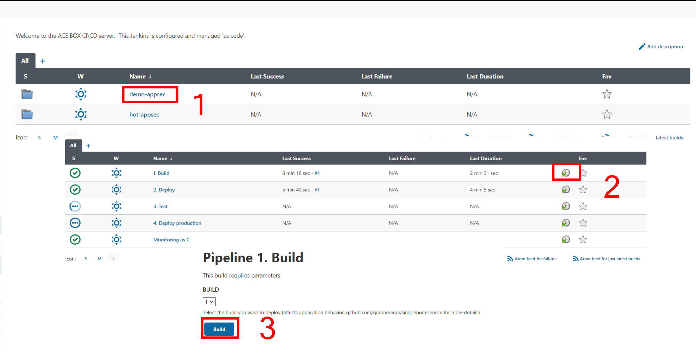
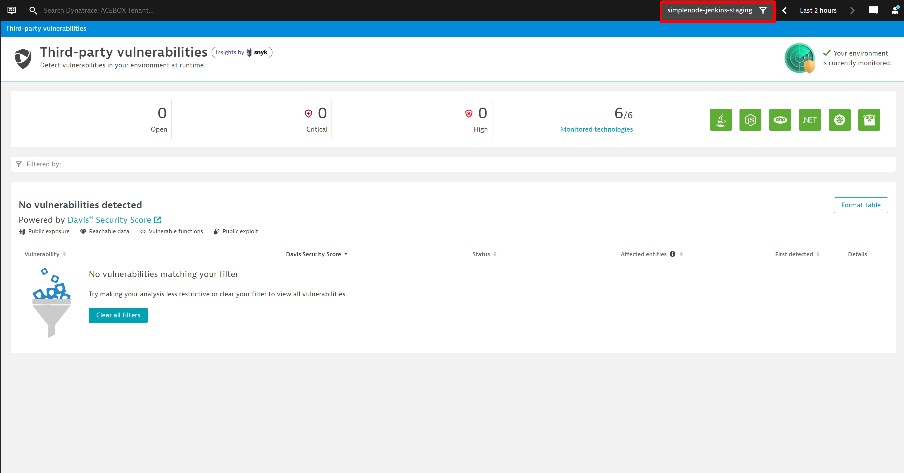
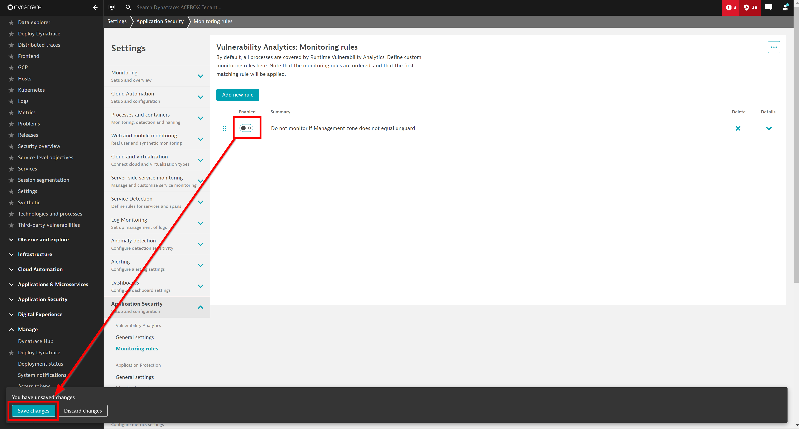
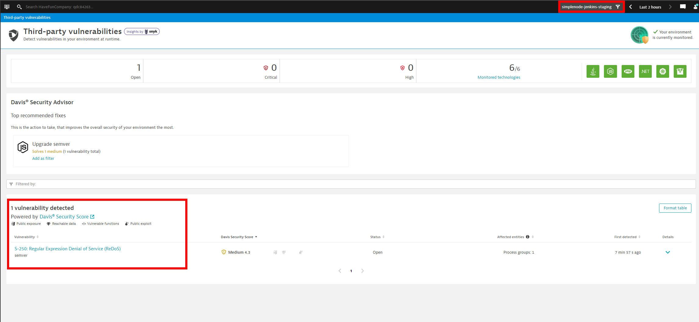

## Deploy Simple Node and Review Results

### Deploy a second app: the SimpleNodeService

To deploy this app, go back to the dashboard of Jenkins, and navigate to the `demo-appsec` folder.
Click on the *play* button next to the pipeline called `1. Build`, and when asked for a build number leave the default `1`, and click on `Build`.

This application is deployed to a different management zone than the 'unguard' application.

### View results in Dynatrace
**TO-DO: update screenshots and management zone to include simplenode application

Since we created a rule, as a last step, go to your Dynatrace environment and navigate to the `Third-party vulnerabilities` page. Filter vulnerabilites by the `simplenode` management zone.  as well as the `unguard` management zone with which you can filter entities throughout the environment. 

#### We disabled monitoring for all applications except unguard

#### Turn on application security globally

#### View results

