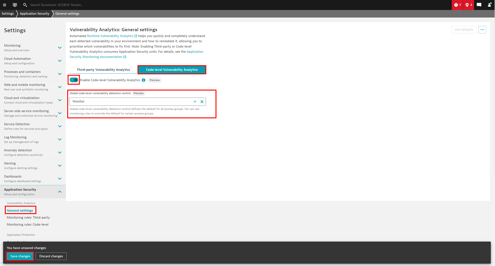
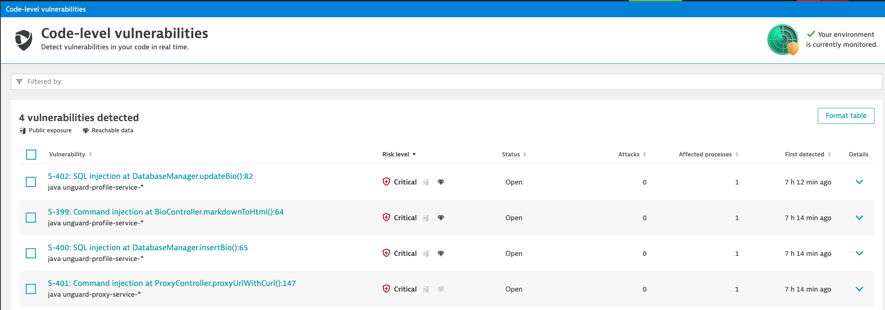
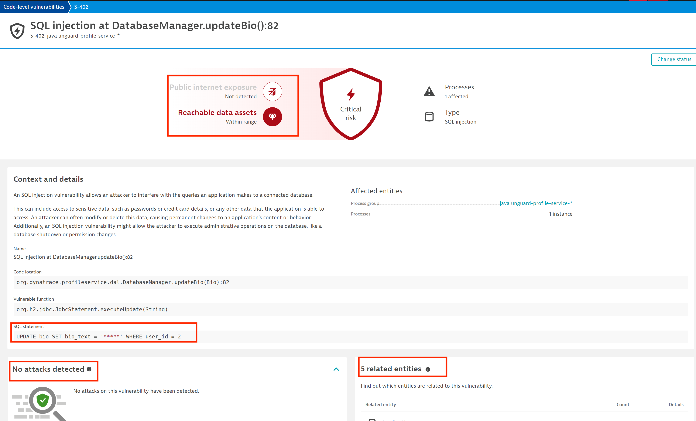

## Code Level Vulnerability Analytics

Until now we focused on known vulnerabilities within open source third party components. We now turn to unknown vulnerabilities in the code due to not following secure coding best practices.

Dynatrace can find SQL injection (SQLi), command injection (CMDi), and JNDI vulnerabilites in java-based running code before an attacker can exploit them in an attack.  Dynatrace does this by evaluating data flows through the applications. Any user generated input is tracked from the web/API request to a vulnerability-type specific function call (database requests for SQLi and command requests for CMDi). If Dynatrace sees that this user input *isn't* sanitized prior to hitting a vulnerable function, then a code-level vulnerability will be logged with all of the context to aid in prioritization that we saw in the previous section. This contextualy prioritized data can then be fed back into remediation workflows to application development teams.

### Enable Code Level Vulnerability Analytics

In Dynatrace go `Settings > Application Security > General` and open the `Code-level Vulnerability Analytics` tab.

### Verify access to Dashboard
If the user generated input is directly used in the vulnerability-type specific function call, then a code-level vulnerability will be created. No malicious attacks are necessary any more to identify these vulnerabilities.
Vulnerability assessment, as well as context and detailed information are shown similar to third-party vulnerabilities.

In the Dynatrace menu, go to the `Code-level vulnerabiities` section under the `Application Security` menu to view any detected code-level vulnerabilities.

 

 ### View Code-level Vulnerability

Within the code-level vulnerability dashboard, open one of the vulnerabilities shown in the list.  This should be familar to what was reviewed earlier in the known vulnerabilities section.  

In addition to providing context around usage (related entities and reachable data assets etc), Dynatrace will also identify if this unknown vulnerabilty was part of an active attack identified by RAP.  We will be discussing RAP in the next section.

One more important thing to note, is that data privacy rules and settings apply to code-level vulnerabilities and the associated user input captured.

