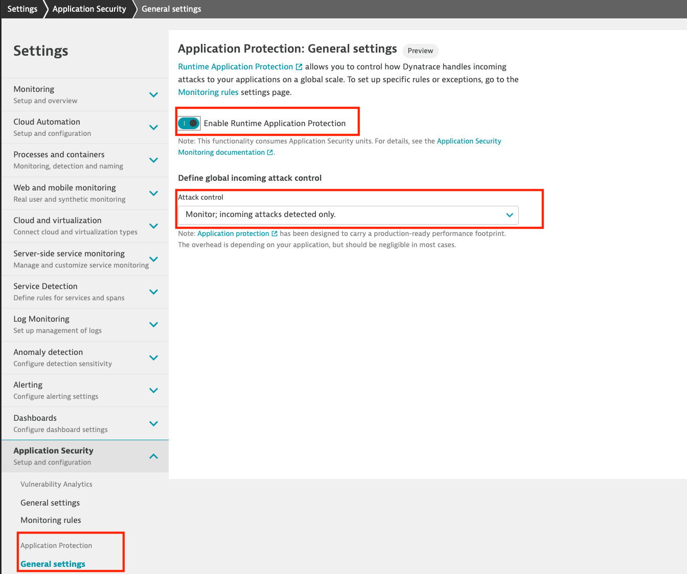

## Enable Runtime Application Protection

To enable Runtime Application Protection,  go to Settings > Application Security > Application Protection > General settings.

On the Application Protection page that opens, select *Enable Runtime Application Protection*.  Set the *Attack Control* to **Monitor; incoming attacks detected only**

> Setting the attack protection means that exploits will be detected and reported but not blocked. 