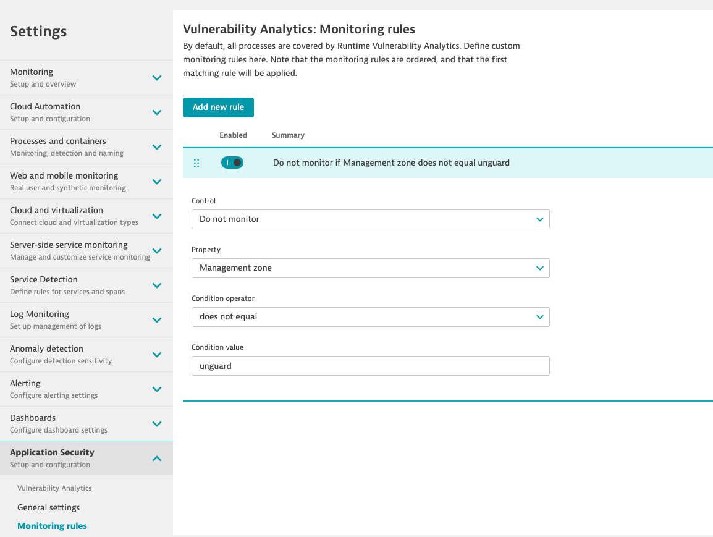

## Configure AppSec

### AppSec monitoring rules 
Security-monitoring rules allow you to set up fine-grained monitoring rules for processes, based on properties such as process tag, host tag, and management zone.

To configure the monitoring rules, go to you Dynatrace instance and navigate to `Settings` > `Application Security` > `Security monitoring rules`.
here you will be able to create rules that specifically define which entities you want to include/exlude from the AppSec monitoring. 

