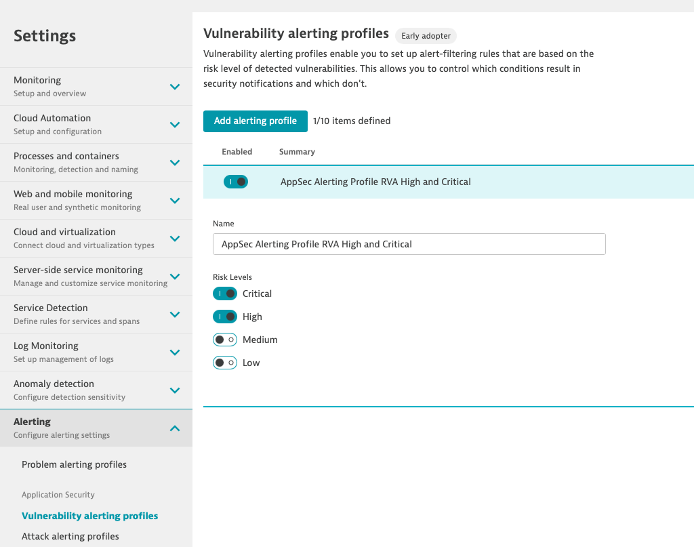
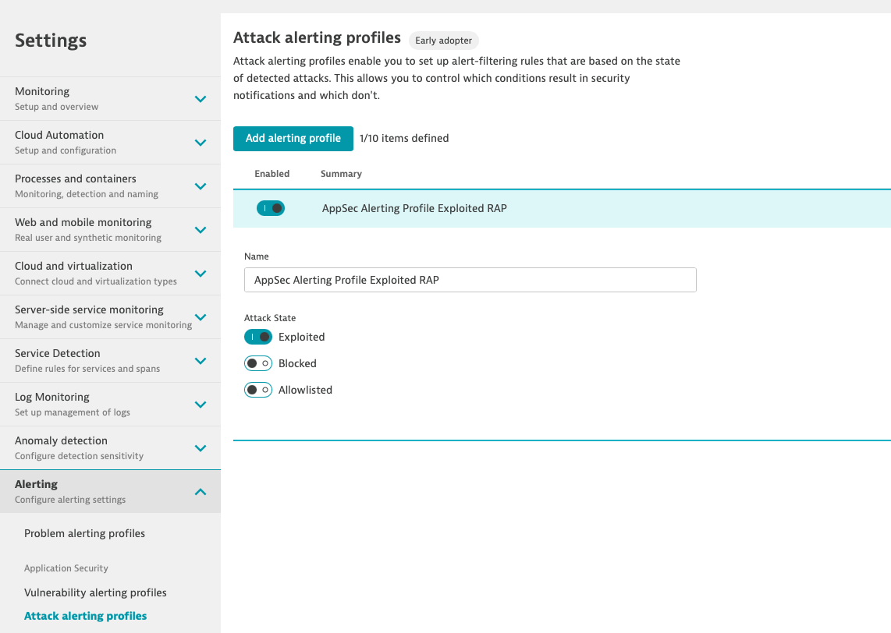
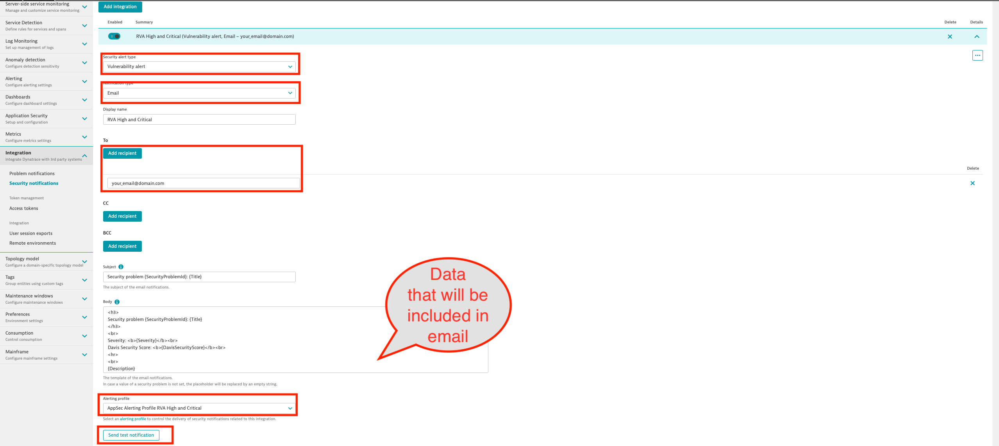
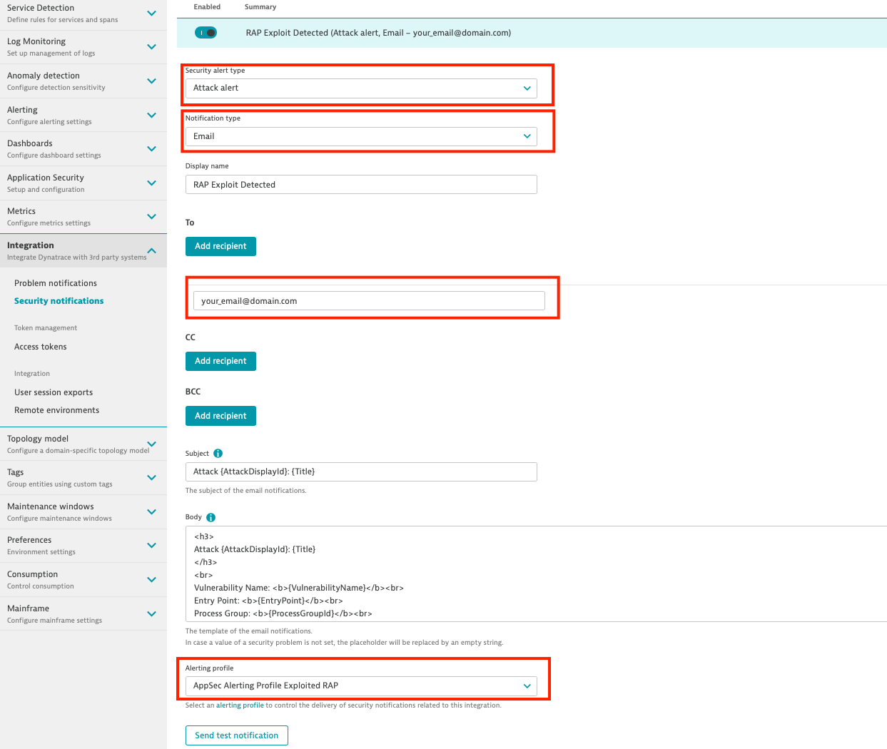

### Security alerting profiles and notifications

#### Alerting Profile

Security alerting profiles enable you to set up alert-filtering rules that are based on the risk level of detected security problems. This allows you to control which conditions result in security notifications and which don't.

As part of this exercise, we will be create 2 profiles, one for our open source (RVA) vulnerabilies, and one for any exploits we will create in a later exercise.

To create a security alerting profile navigate to `Settings` > `Alerting` > `Vulnerability  alerting profiles`. 

1. Create an alerting profile that will send an alert when a critical and/or high vulnerabiity is detected.

2. Create an alerting profile that will send an alert when an exploit is detected by navigating to `Settings` > `Alerting` > `Attack alerting profiles`.

#### Notification

You can integrate Dynatrace security notifications with your organization's existing incident-management system, team-collaboration channel, ticketing, and/or reporting workflows. Security alerting profiles are used within security integrations to filter the total number of alerts to a relevant subset.

Notifications are triggered upon detection.

Again, we will create 2 notifcations for both RVA vulnerabilities and detected attacks.

1. To create a security alerting profile navigate to `Settings` > `Integration` > `Security notification`. 
    - Alert type: Vulnerability alert
    - Notification type: Email
    - Send the email notification to your email
    - Send a test email

2. To create a security alerting profile for exploits navigate to `Settings` > `Integration` > `Security notification`. 
    - Alert type: Attack alert
    - Notification type: Email
    - Send the email notification to your email
    - Send a test email

