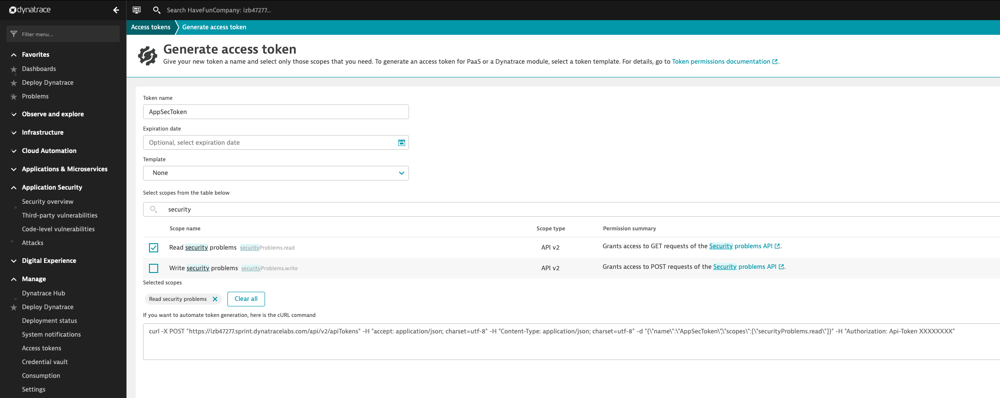

## Notifications and API

#### Security APIs

Alertts and notifications aren't the only way to get application security data out of Dynatrace.  Common use cases for using the security APIs are for reporting and other integrations where it doesn't make sense to use a webhook or other kind of notification.

To use the security APIs, you will need an authorization token that includes the `Read Security Problems` scope.  Click on your user icon in the upper left of the Dynatrace portal and click the `Personal Access Token` link.

Make sure to copy the generated token into place that you can access it later.

After creating the token and storing it in a place that can be accessed later, we will need to use the token to 

The security APIs can be accessed and tested out via Dynatrace's `Environment API v2' menu in the Dynatrace portal.

Authorize the API page with the token just created to use the security APIs.

1. Using the `Security Problems` API, get all security problems with the associated `riskAssessment` data for each problem. 
  

The response:

2. Using the `SecurityProblems/{id}` API, get the details of a specific security problem for the last 2 hours.  Make sure to include `relatedEntities` in the response.
- Use security problem id: *17149011943884502800*
- Add the `relatedEntities` data
- Filter for data from the last 2 hours

*Note:* You can also get the security problem id for the second exercise by going to the UI.
