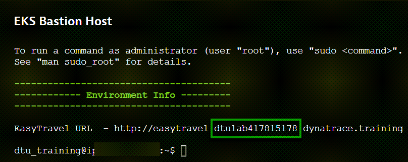
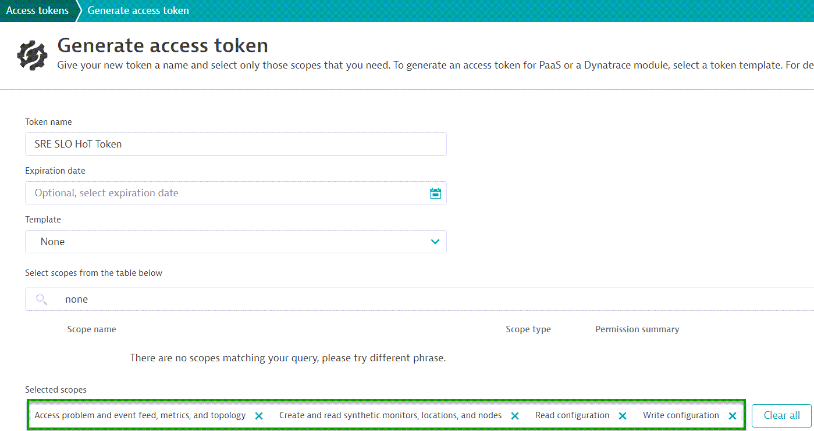

## Preparation

SLOs in Dynatrace provide you with a powerful way to tie business or technical KPIs with the deep-dive capabilties of Dynatrace monitoring and the automation of the DAVIS AI.

During this hands on session, you will learn how to:
1. Create SLOs in Dynatrace
2. Identify useful metrics and criteria for actionable SLOs
3. Create synthetic tests and evaluate their perform within the scope of an SLO (availability and performance)
4. Create advanced SLOs using custom metrics
5. Build a dashboard to monitor the state of defined SLOs

Projects used for this session
- [EasyTravel](https://github.com/Dynatrace/easyTravel-Docker)
- [JMeter Service](https://github.com/keptn/keptn/tree/master/jmeter-service#workloads)
- [Keptn](https://keptn.sh/)

Access your Dynatrace environment at www.dynatrace.com and click 'SaaS login'.

Use your HOT session credentials to login to your tenant.

### Setup
#### PRE-Deployment
- We'll execute a bashscript to deploy some pre-defined configurations.
1. Identify your DTUID. Navigate to 'Environment' tab in Dynatrace University.
> - Open the EKS Bastion Host </br>
> - Copy the ID between from the Easytravel URL.



2. Create an API-TOKEN
> Navigate to your Dynatrace Enviornment > Manage > Access Tokens

> The following permissions are required: </br>
> - Access problem and event feed, metrics and topology</br>
> - ExternalSyntheticIntegration</br>
> - Read configuration</br>
> - Write Configuration</br>



3. Retireve the predeploy repo:

```
git clone https://github.com/ajzenuni/sre_hot_predeploy
```

4. Navigate to the sre_hot_redeploy

```
cd sre_hot_predeploy/
```

5. Adjust permissions of the *deployment.sh*

```
chmod 777 deployment.sh
```

6. Execute the predeploy script. (Replace the parameters with your own):

```
./deployment.sh --environment-url "https://{your-environment-id}.live.dynatrace.com" --dtu-id "dtulab123456789" --api-token "TOKEN" --email "EMAIL"
```