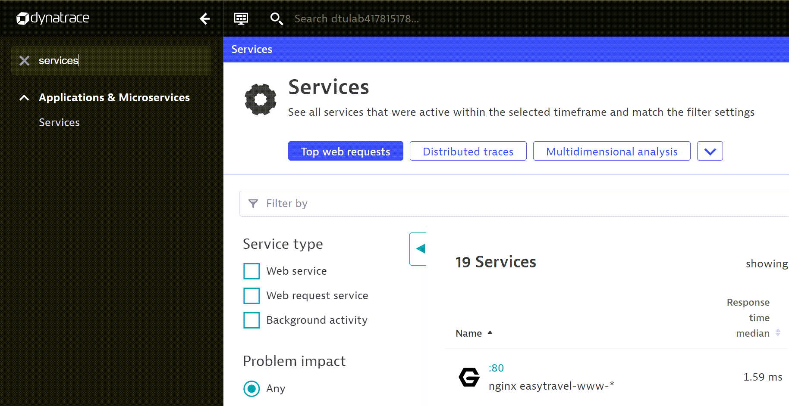
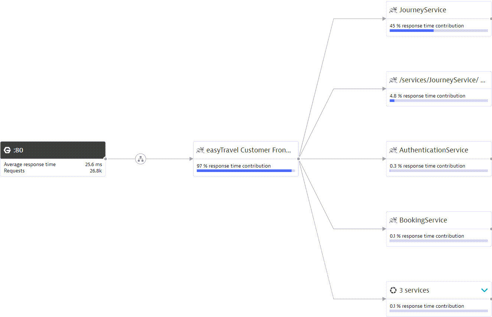
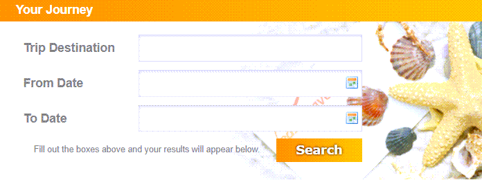
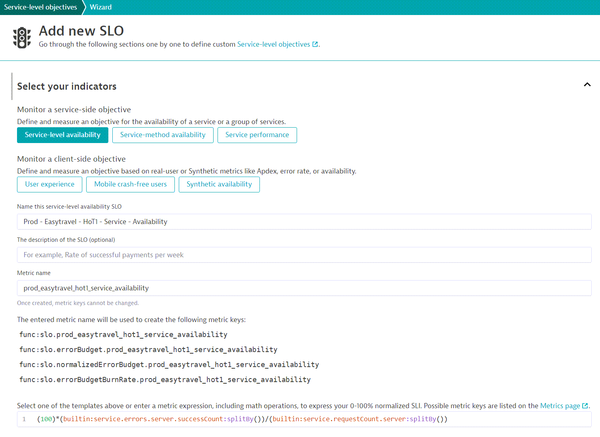
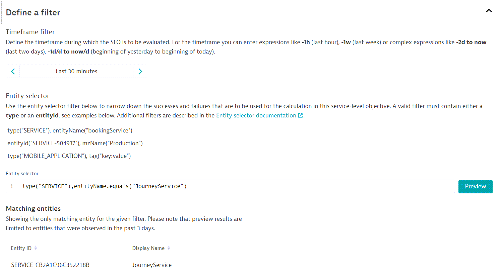
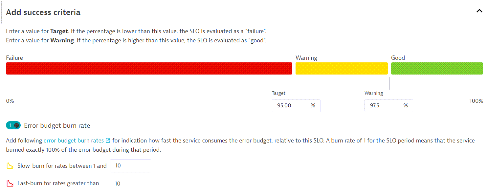
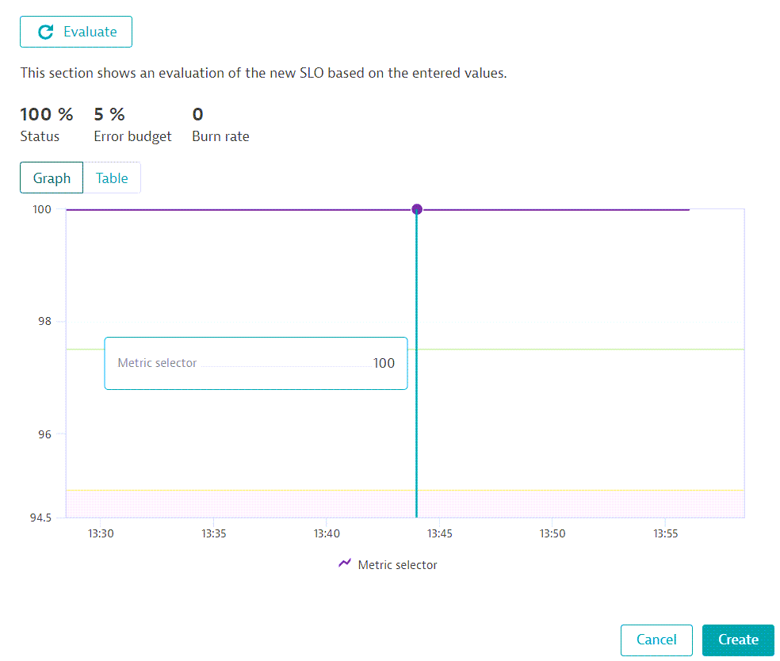
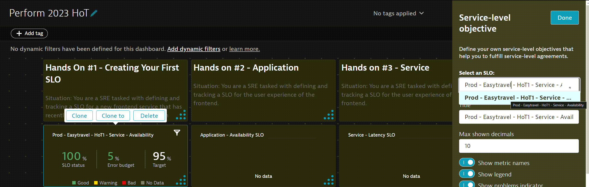

## Hands on #1 - Creating Your first SLO

#### Situation: You are a SRE tasked with defining and tracking a SLO for a new frontend service that has recently been introduced into the application.
<br/><br/>

### We'll utilize the *7-steps SLO Framework* to establish an effective SLO for understanding realiability of application.

1. Open conversation with all stakeholders; DevOps, SREs, Developers, and App Owners, about the terminology & app architecture. *Step 1 of SLO Framework*

2. In a new browser tab, open the Easytravel App. perform a couple interactions. (*Step 2 of SLO Framework*)

> - Easytravel URL can be found in the *DTU event > EKS Bastion Host > Open Terminal*. Should look like - http://easytravel.dtulabID.dynatrace.training/</br>
> - Identify the type of customer groups *Frontend Service* services.</br> 

3. In a new browser tab, navigate to Dynatrace environment and access *Services*. 



4. Navigate to the nginx service *:80*, then click on *View Service Flow*. (*Step 3 & 4 of the SLO Framework*)

> - This is the transaction flow processed by the *Frontend Service* </br>
> - We'll use this to identify services. 



5. Next, Navigate back to the Easytravel App, and focus on the *Your Journey* Feature. (*Step 5 of the SLO Framework*)

> - Key function of application. </br>
> - Apply the following statements to the *Your Journey* feature: 


> Availability – Is the service there when customers need it?</br>
> Correctness – Does the service function as intended?</br>
> Performance – Is the service stable, fast and able to meet demand?</br>




> - This will help identify our focused indicator.

6. Next, Navigate back to Dynatrace environment and access Service-level Objectives.
7. Click on add new SLO


> - We’ve now entered the Dynatrace SLO configuration wizard.

8. Provide a meaningful name/metric/description for the SLO. *{ENV}\_{APP NAME}\_{HoT#}\_{ENTITY TYPE}\_{TYPE}*


SLO Name : 
```
Prod - Easytravel - HoT1 - Service - Availability
```

SLO description:
```
95% Success Rate of Journey Function
```

SLO Metric : 
```
prod_easytravel_hot1_service_availability
```

9. Click on *Service-level Availability* Dynatrace will fill the metric expression with a templated SLI.(*Step 6 of the SLO Framework*) You should see a string similar to this:

```
(100)*(builtin:service.errors.server.successCount:splitBy())/(builtin:service.requestCount.server:splitBy())
```




10. Next, let's set the filters for the SLO. *Step 7 of the SLO Framework*

> - Time Frame - the evaluation period of SLO. *last 30 minutes* </br>
>- Entity Selector - the entities from where SLI is calculated. *JourneyService*</br>

timeFrame :
```
-30m
```

entitySelector :
```
type("SERVICE"),entityName.equals("JourneyService")
```



11. Next, let's set our SLO target. (*Step 7 of the SLO Framework*)

Target 

```
95.0
```

Warning

```
97.5
```



12. Finally, preview the SLO and hit 'Create'



13. Navigate to *Dashboards* and identify the following dashboard : *Perform 2023 HoT*

14. Edit the SLO tile of the current Hands-On, and select the SLO we just created: *Prod - Easytravel - HoT1 - Service - Availability*



#### Congratulations!, you've completed creating your first SLO. We applied the 7-Step SLO Framework to create an effective SLO.