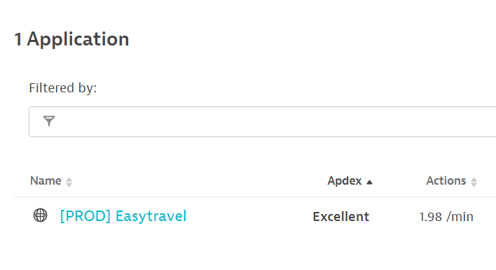
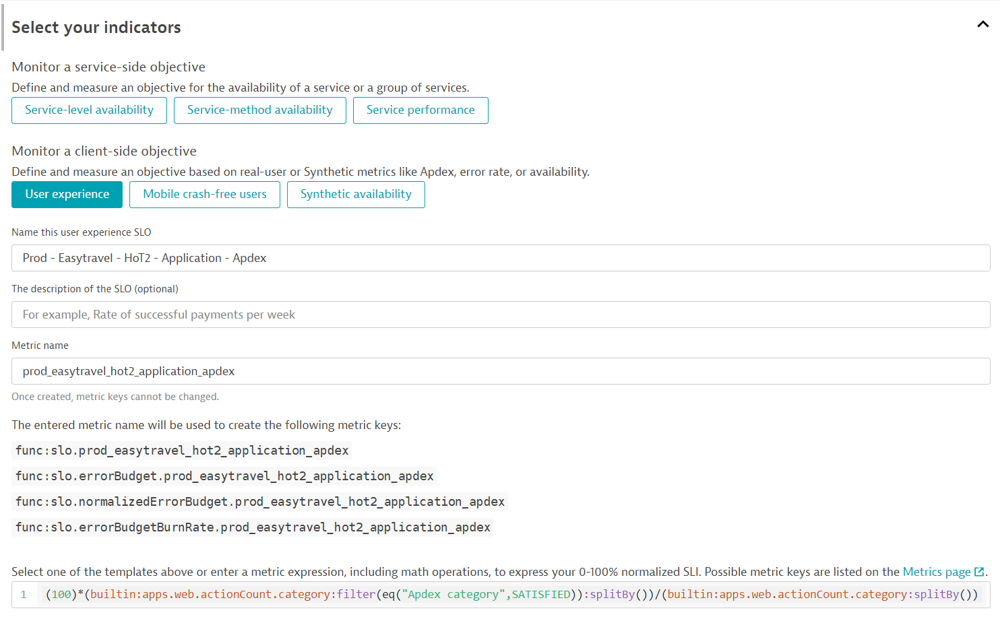
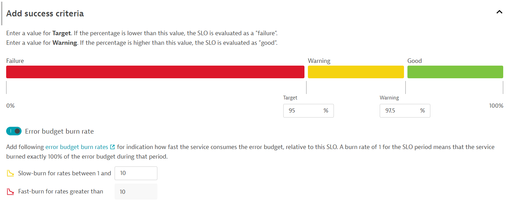

## Hands on #2 - Application

#### Situation: You are a SRE tasked with defining and tracking a SLO for the user experience of the frontend.

1. Under <b>'Digital Experience'</b> on the left-hand menu, find <b>'Web'</b> and navigate to the Applications screen.

2. You will note the <b>'[Prod] Easytravel'</b>
> - Remember this name, we will be using it later.



3. Navigate to the Service-level Objectives page and add a new SLO. 

4. Click the *User Experience* button to populate the metric selector field.

5. Provide a meaningful name/metric for the SLO. *{ENV}_{APP NAME}_{HoT#}_{ENTITY TYPE}_{TYPE}*

```
SLO Name : Prod - Easytravel - HoT2 - Application - Availability
SLO Metric : prod_easytravel_hot2_application_availability
```




6. Next, let's set the filters for the SLO.
> - Time Frame - the evaluation period of SLO. *last 30 minutes* </br>
> - Entity Selector - the entities from where SLI is calculated. *app:easytravel*</br>

```
timeFrame : -30m
entitySelector : type("Application"),tag("app:easytravel")
```


7. Next, let's set our SLO target.

```
Target - 95.00
Warning - 97.50
```



8. Finally, preview the SLO and hit 'Create'

9. Navigate to *Dashboards* and identify the following dashboard : *Perform 2023 HoT*

10. Edit the SLO tile of the current Hands-On, and select the SLO we just created: *Prod - Easytravel - HoT2 - Application - Availability*